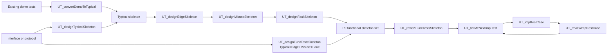

# P0 FuncTestsFlow

`P0 FuncTestsFlow` is the first slash-command flow to import because it covers the most common developer entry points for functional unit tests.

## Method Alignment

Slash flow `P0 FuncTestsFlow` uses the same priority as CaTDD method category `P0 Functional`:

```text
P0 Functional = ValidFunc + InvalidFunc
ValidFunc = Typical + Edge
InvalidFunc = Misuse + Fault
```

The flow commands connect existing CodeAgent invocation surfaces to execution steps; category meaning remains in `methodPrompts`.

When `SPEC_designUnitTests` identifies P0 Functional coverage for an active story, this flow provides the matching category-design contracts. `SPEC_designUnitTests` remains the story-level orchestration command, while `UT_designFuncTestsSkeleton` owns the full Typical, Edge, Misuse, and Fault skeleton design contract and the category-specific `UT_design*Skeleton` commands own their individual skeleton contracts. These commands are design steps; executable test bodies still belong to later implementation flow.

## Developer Stories

- As a Developer, when I have demo tests, I want to convert them into CaTDD functional skeletons so that existing examples become living verification design.
- As a Developer, when I have a defined interface or protocol, I want to use CaTDD to design the Typical skeleton so that core behavior is specified before implementation.
- As a Developer, when I already have Typical, Edge, Misuse, Fault, or later category skeletons, I want to select and implement the next test case so that TDD proceeds one TC at a time.

## Flow Diagram



## Command Sequence

1. Use [../commands/P0-FuncTestsFlow/UT_convertDemoToTypical.md](../commands/P0-FuncTestsFlow/UT_convertDemoToTypical.md) when the starting point is an existing demo test.
2. Use [../commands/P0-FuncTestsFlow/UT_designTypicalSkeleton.md](../commands/P0-FuncTestsFlow/UT_designTypicalSkeleton.md) when the starting point is an interface or protocol and the primary valid behavior should be designed first.
3. Use [../commands/P0-FuncTestsFlow/UT_designEdgeSkeleton.md](../commands/P0-FuncTestsFlow/UT_designEdgeSkeleton.md), [../commands/P0-FuncTestsFlow/UT_designMisuseSkeleton.md](../commands/P0-FuncTestsFlow/UT_designMisuseSkeleton.md), and [../commands/P0-FuncTestsFlow/UT_designFaultSkeleton.md](../commands/P0-FuncTestsFlow/UT_designFaultSkeleton.md) to complete the P0 functional skeleton set.
4. Use [../commands/P0-FuncTestsFlow/UT_designFuncTestsSkeleton.md](../commands/P0-FuncTestsFlow/UT_designFuncTestsSkeleton.md) when the full Typical, Edge, Misuse, and Fault skeleton set should be designed as one behavior.
5. Use [../commands/P0-FuncTestsFlow/UT_reviewFuncTestsSkeleton.md](../commands/P0-FuncTestsFlow/UT_reviewFuncTestsSkeleton.md) before implementation begins.
6. Use [../commands/P0-FuncTestsFlow/UT_tellMeNextImplTest.md](../commands/P0-FuncTestsFlow/UT_tellMeNextImplTest.md) to select the next TC.
7. Use [../commands/P0-FuncTestsFlow/UT_implTestCase.md](../commands/P0-FuncTestsFlow/UT_implTestCase.md) and [../commands/P0-FuncTestsFlow/UT_reviewImplTestCase.md](../commands/P0-FuncTestsFlow/UT_reviewImplTestCase.md) for TC-by-TC execution.

## Conflict Guard

- Existing demo tests are input material. They do not automatically belong to CaTDD `P3 Demo/Example`.
- `UT_convertDemoToTypical` extracts core behavior from demo tests into `P0 Functional / Typical` skeletons.
- Category semantics must come from `methodPrompts/CaTDD_methodPrompt4Cat-*.md`.
- Commands must stay language agnostic. Use C++ names such as `UT_FeatureX-Typical.cxx` only as examples.
- `UT_designFuncTestsSkeleton` and the category-specific `UT_design*Skeleton` commands own skeleton design, not executable implementation bodies.
