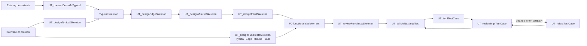

# P0 FuncTestsFlow

`P0 FuncTestsFlow` is the first slash-command flow to import because it covers the most common developer entry points for functional unit tests.

## Method Alignment

Slash flow `P0 FuncTestsFlow` uses the same priority as CaTDD method category `P0 Functional`:

```text
P0 Functional = ValidFunc + InvalidFunc
ValidFunc = Typical + Edge
InvalidFunc = Misuse + Fault
```

The flow commands connect existing CodeAgent invocation surfaces to execution steps; category meaning remains in `methodPrompts`.

When `SPEC_designUnitTests` identifies P0 Functional coverage for an active story, this flow provides the matching category-design contracts. `SPEC_designUnitTests` remains the story-level orchestration command, while `UT_designFuncTestsSkeleton` owns the full Typical, Edge, Misuse, and Fault skeleton design contract and the category-specific `UT_design*Skeleton` commands own their individual skeleton contracts. These commands are design steps; executable test bodies still belong to later implementation flow.

## Developer Stories

- As a Developer, when I have demo tests, I want to convert them into CaTDD functional skeletons so that existing examples become living verification design.
- As a Developer, when I have a defined interface or protocol, I want to use CaTDD to design the Typical skeleton so that core behavior is specified before implementation.
- As a Developer, when I already have Typical, Edge, Misuse, Fault, or later category skeletons, I want to select and implement the next test case so that TDD proceeds one TC at a time.
- As a Developer, when an implemented TC is GREEN but hard to read or maintain, I want to refactor that single test case without changing behavior or losing US/AC/TC traceability.

## Flow Diagram


```mermaid
flowchart LR
    Demo["Existing demo tests"] --> Convert["UT_convertDemoToTypical"]
    Protocol["Interface or protocol"] --> DesignTypical["UT_designTypicalSkeleton"]
    Protocol --> DesignFunc["UT_designFuncTestsSkeleton<br/>Typical+Edge+Misuse+Fault"]

    Convert --> Typical["Typical skeleton"]
    DesignTypical --> Typical
    Typical --> Edge["UT_designEdgeSkeleton"]
    Edge --> Misuse["UT_designMisuseSkeleton"]
    Misuse --> Fault["UT_designFaultSkeleton"]
    Fault --> FuncSet["P0 functional skeleton set"]
    DesignFunc --> FuncSet
    FuncSet --> ReviewSkeleton["UT_reviewFuncTestsSkeleton"]

    ReviewSkeleton --> NextTC["UT_tellMeNextImplTest"]
    NextTC --> Impl["UT_implTestCase"]
    Impl --> ReviewImpl["UT_reviewImplTestCase"]
    ReviewImpl --> NextTC
    ReviewImpl -. "cleanup when GREEN" .-> Refact["UT_refactTestCase"]
    Refact --> ReviewImpl
```

## Command Sequence

1. Use [UT_convertDemoToTypical](../commands/P0-FuncTestsFlow/UT_convertDemoToTypical.md) when the starting point is an existing demo test.
2. Use [UT_designTypicalSkeleton](../commands/P0-FuncTestsFlow/UT_designTypicalSkeleton.md) when the starting point is an interface or protocol and the primary valid behavior should be designed first.
3. Use [UT_designEdgeSkeleton](../commands/P0-FuncTestsFlow/UT_designEdgeSkeleton.md), [UT_designMisuseSkeleton](../commands/P0-FuncTestsFlow/UT_designMisuseSkeleton.md), and [UT_designFaultSkeleton](../commands/P0-FuncTestsFlow/UT_designFaultSkeleton.md) to complete the P0 functional skeleton set.
4. Use [UT_designFuncTestsSkeleton](../commands/P0-FuncTestsFlow/UT_designFuncTestsSkeleton.md) when the full Typical, Edge, Misuse, and Fault skeleton set should be designed as one behavior.
5. Use [UT_reviewFuncTestsSkeleton](../commands/P0-FuncTestsFlow/UT_reviewFuncTestsSkeleton.md) before implementation begins.
6. Use [UT_tellMeNextImplTest](../commands/P0-FuncTestsFlow/UT_tellMeNextImplTest.md) to select the next TC.
7. Use [UT_implTestCase](../commands/P0-FuncTestsFlow/UT_implTestCase.md) and [UT_reviewImplTestCase](../commands/P0-FuncTestsFlow/UT_reviewImplTestCase.md) for TC-by-TC execution.
8. Use [UT_refactTestCase](../commands/P0-FuncTestsFlow/UT_refactTestCase.md) only after a selected TC is GREEN and reviewed, then run [UT_reviewImplTestCase](../commands/P0-FuncTestsFlow/UT_reviewImplTestCase.md) again to prove no skeleton drift.

## Conflict Guard

- Existing demo tests are input material. They do not automatically belong to CaTDD `P3 Demo/Example`.
- `UT_convertDemoToTypical` extracts core behavior from demo tests into `P0 Functional / Typical` skeletons.
- Category semantics must come from `methodPrompts/CaTDD_methodPrompt4Cat-*.md`.
- Commands must stay language agnostic. Use C++ names such as `UT_FeatureX-Typical.cxx` only as examples.
- `UT_designFuncTestsSkeleton` and the category-specific `UT_design*Skeleton` commands own skeleton design, not executable implementation bodies.
- `UT_refactTestCase` is a no-behavior-change cleanup step for one GREEN TC. Missing behavior, missing coverage, or wrong category routing must go back to design or implementation commands instead of being added during refactor.
