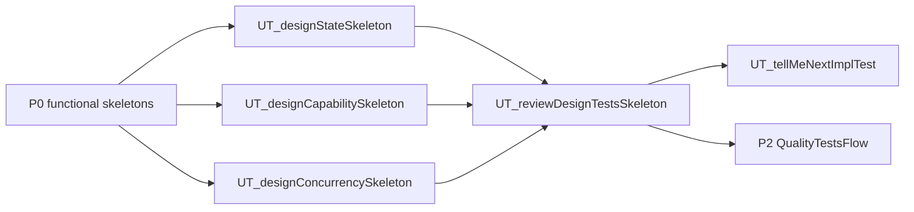

# P1 DesignTestsFlow

`P1 DesignTestsFlow` is the second slash-command flow priority. It starts after core functional behavior is stable enough to reason about design properties.

## Method Alignment

Slash flow `P1 DesignTestsFlow` uses the same priority as CaTDD method category `P1 Design`:

- State
- Capability
- Concurrency

The flow commands orchestrate execution; category meaning remains in `methodPrompts`.

## Entry Conditions

- P0 functional skeletons exist, especially Typical and Edge.
- The component has meaningful lifecycle, capacity, or concurrency behavior.
- The developer wants to design behavior beyond input/output correctness.
- A P1 design source is confirmed for each category being drafted; P1 MUST have DESIGN before skeleton drafting starts.

## Design Source Gate

P1 is design-gated. Before drafting any P1 skeleton, confirm the category design source and read it as the authority for design decisions. If the design source is missing, ask the developer where the design lives or stop before drafting.

- State: project-root `README_StateDesign.md` or a `State Design` chapter in project-root `README_ArchDesign.md`.
- Capability: project-root `README_DetailDesign.md`.
- Concurrency: project-root `README_ResourceDesign.md`.

## Developer Stories

- As a Developer, when functional behavior is stable, I want to design State skeletons so lifecycle and transition behavior become explicit before implementation.
- As a Developer, when a feature exposes modes or support boundaries, I want to design Capability skeletons so supported, limited, and unsupported behavior is testable.
- As a Developer, when behavior depends on ordering, async work, or shared ownership, I want to design Concurrency skeletons so race and reentrancy risks are visible before implementation.

## Flow Diagram

## Command Sequence

1. Use [../commands/P1-DesignTestsFlow/UT_designStateSkeleton.md](../commands/P1-DesignTestsFlow/UT_designStateSkeleton.md) when project-root `README_StateDesign.md` exists, or project-root `README_ArchDesign.md` contains a `State Design` chapter, and lifecycle, transition, ownership, persistence, or recovery behavior matters. If neither source exists, the command asks the developer where the state design lives or stops before drafting the State skeleton.
2. Use [../commands/P1-DesignTestsFlow/UT_designCapabilitySkeleton.md](../commands/P1-DesignTestsFlow/UT_designCapabilitySkeleton.md) when project-root `README_DetailDesign.md` exists and supported, limited, conditional, or unsupported capability boundaries matter. If `README_DetailDesign.md` is missing, the command warns and stops before drafting the Capability skeleton.
3. Use [../commands/P1-DesignTestsFlow/UT_designConcurrencySkeleton.md](../commands/P1-DesignTestsFlow/UT_designConcurrencySkeleton.md) when project-root `README_ResourceDesign.md` exists and ordering, interleaving, reentrancy, cancellation, or shared ownership matters. If `README_ResourceDesign.md` is missing, the command warns and stops before drafting the Concurrency skeleton.
4. Use [../commands/P1-DesignTestsFlow/UT_reviewDesignTestsSkeleton.md](../commands/P1-DesignTestsFlow/UT_reviewDesignTestsSkeleton.md) before moving to P2 quality coverage or TC-by-TC implementation, and verify every P1 skeleton is traceable to a confirmed design source.

## Conflict Guard

DesignTestsFlow must reference `methodPrompts/CaTDD_methodPrompt4Cat-State.md`, `Capability.md`, and `Concurrency.md` instead of redefining those category meanings here.
