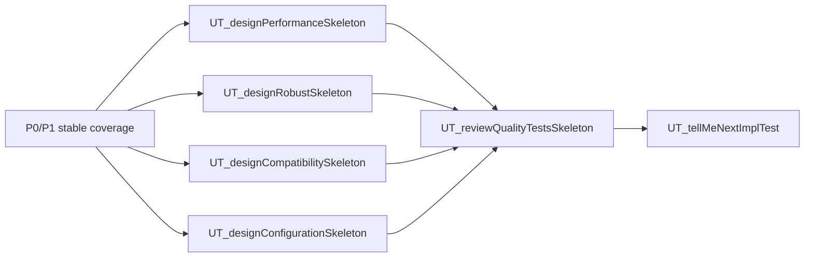

# P2 QualityTestsFlow

`P2 QualityTestsFlow` is the third slash-command flow priority. It starts when functional and design behavior are stable enough to test quality attributes.

## Method Alignment

Slash flow `P2 QualityTestsFlow` uses the same priority as CaTDD method category `P2 Quality`:

- Performance
- Robust
- Compatibility
- Configuration

The flow commands orchestrate execution; category meaning remains in `methodPrompts`.

## Entry Conditions

- P0 functional coverage exists.
- P1 design coverage exists when relevant.
- The component has quality risks, service-level goals, compatibility requirements, or configuration variations.

## Developer Stories

- As a Developer, when behavior has measurable timing, throughput, memory, CPU, power, or resource goals, I want to design Performance skeletons so quality expectations are explicit.
- As a Developer, when behavior must survive stress, partial failure, or environmental instability, I want to design Robust skeletons so resilience and recovery are testable.
- As a Developer, when behavior spans versions, platforms, protocols, formats, or integrations, I want to design Compatibility skeletons so support boundaries are clear.
- As a Developer, when behavior varies by runtime, build-time, deployment, environment, or feature-flag setting, I want to design Configuration skeletons so configuration combinations are intentional.

## Flow Diagram

## Command Sequence

1. Use [../commands/P2-QualityTestsFlow/UT_designPerformanceSkeleton.md](../commands/P2-QualityTestsFlow/UT_designPerformanceSkeleton.md) when project-root `README_PerfDesign.md` exists and latency, throughput, jitter, memory, CPU, power, or other measurable quality targets matter. If `README_PerfDesign.md` is missing, the command warns and stops before drafting the Performance skeleton.
2. Use [../commands/P2-QualityTestsFlow/UT_designRobustSkeleton.md](../commands/P2-QualityTestsFlow/UT_designRobustSkeleton.md) when project-root `README_ErrorDesign.md` exists and stress, degradation, recovery, retry, timeout, or stable failure behavior matters. If `README_ErrorDesign.md` is missing, the command warns and stops before drafting the Robust skeleton.
3. Use [../commands/P2-QualityTestsFlow/UT_designCompatibilitySkeleton.md](../commands/P2-QualityTestsFlow/UT_designCompatibilitySkeleton.md) when project-root `README_CompatDesign.md` exists and version, platform, protocol, format, toolchain, or integration compatibility matters. If `README_CompatDesign.md` is missing, the command warns and stops before drafting the Compatibility skeleton.
4. Use [../commands/P2-QualityTestsFlow/UT_designConfigurationSkeleton.md](../commands/P2-QualityTestsFlow/UT_designConfigurationSkeleton.md) when project-root `README_DetailDesign.md` exists and runtime, build-time, deployment, environment, or feature-flag configuration matters. If `README_DetailDesign.md` is missing, the command warns and stops before drafting the Configuration skeleton.
5. Use [../commands/P2-QualityTestsFlow/UT_reviewQualityTestsSkeleton.md](../commands/P2-QualityTestsFlow/UT_reviewQualityTestsSkeleton.md) before TC-by-TC implementation or release-risk review.

## Conflict Guard

QualityTestsFlow must reference `methodPrompts/CaTDD_methodPrompt4Cat-Performance.md`, `Robust.md`, `Compatibility.md`, and `Configuration.md` instead of redefining those category meanings here.
