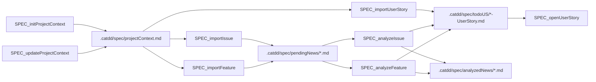
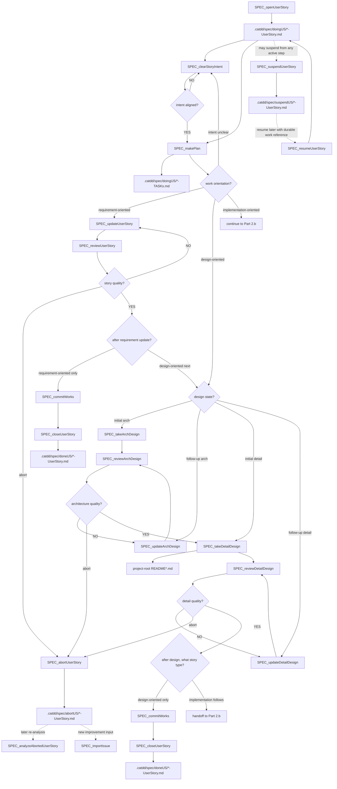
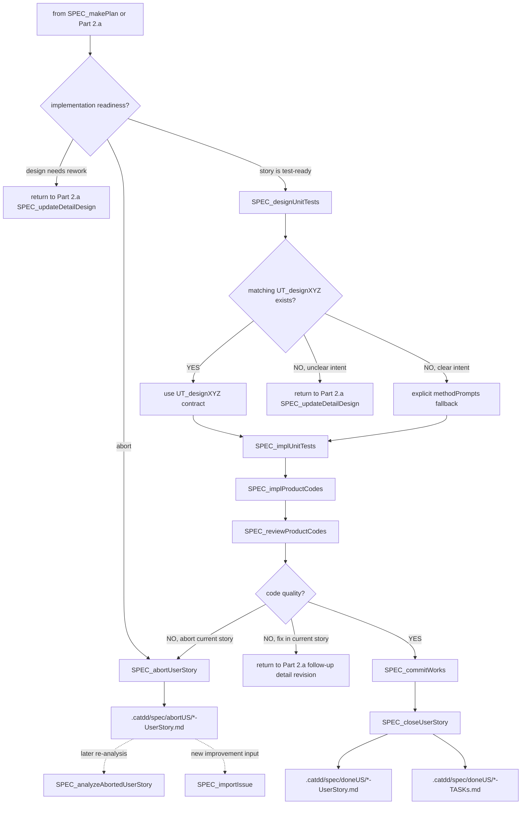

# Px SpecFlow

`Px SpecFlow` is the cross-priority SpecCoding flow for moving from incoming work to reviewed, tested, committed implementation.

`Px` means this flow is not a CaTDD category priority like `P0 Functional`, `P1 Design`, or `P2 Quality`. It is a process flow that orchestrates those method layers.

## Method Alignment

SpecFlow is based on `methodPrompts`, but it works above individual test categories.

```text
methodPrompts = CaTDD method and verification-design language
Px SpecFlow = repeatable SpecCoding lifecycle over that method
P0/P1/P2 flows = category-specific test design and implementation flows
```

`SPEC_*` commands own lifecycle orchestration: story state, readiness gates, cross-category coverage selection, traceability, review, commit, and closure. `UT_*` commands own category-level test mechanics: Typical, Edge, Misuse, Fault, State, Capability, Concurrency, Performance, Robust, Compatibility, and Configuration skeleton design or implementation steps. When a `SPEC_*` command such as `SPEC_designUnitTests` needs category skeletons, it should use matching `UT_designXYZ` command contracts when they exist and record that provenance instead of silently drafting category shapes from memory.

The governing spec is comment-alive verification design: project context, user stories, acceptance criteria, detailed design, US/AC/TC skeletons, test status, product code status, and review decisions.

## Model Tier Guidance

Use the smallest model tier that preserves decision quality for the current command. Developers and CodeAgents should reserve SOTA reasoning models for system-level architecture decisions, use high-performance models for multi-artifact reasoning and design/review work, and use flash-speed models for deterministic lifecycle movement or narrow implementation tasks.

| Default tier | Use for | Px-SpecFlow commands |
| --- | --- | --- |
| SOTA reasoning, such as GPT-5.5-xHigh | Architecture work that decides or approves system boundaries, dependency direction, runtime placement, quality trade-offs, and cross-module constraints. | `SPEC_takeArchDesign`, `SPEC_reviewArchDesign` |
| High Performance | Requirements analysis, intent alignment, planning, requirement updates, local design, review gates, test design, code review, correction routing, and controlled upstream patch-back where quality depends on reasoning across several artifacts. | `SPEC_initProjectContext`, `SPEC_updateProjectContext`, `SPEC_analyzeIssue`, `SPEC_analyzeFeature`, `SPEC_analyzeAbortedUserStory`, `SPEC_clearStoryIntent`, `SPEC_makePlan`, `SPEC_updateUserStory`, `SPEC_whatsNextTask`, `SPEC_takeArchDesign`, `SPEC_reviewArchDesign`, `SPEC_updateArchDesign`, `SPEC_takeDetailDesign`, `SPEC_reviewDetailDesign`, `SPEC_updateDetailDesign`, `SPEC_reviewUserStory`, `SPEC_designUnitTests`, `SPEC_reviewProductCodes`, `SPEC_patchOriginalCaTDD` |
| Flash Speed | Deterministic import, move, suspend, resume, abort, commit, close, or small test-driven implementation steps when the required input artifacts are already clear. | `SPEC_importIssue`, `SPEC_importFeature`, `SPEC_importUserStory`, `SPEC_openUserStory`, `SPEC_suspendUserStory`, `SPEC_resumeUserStory`, `SPEC_abortUserStory`, `SPEC_implUnitTests`, `SPEC_implProductCodes`, `SPEC_commitWorks`, `SPEC_closeUserStory` |

Escalate from High Performance or Flash Speed to SOTA when the command exposes architecture-significant uncertainty: competing non-functional requirements, safety/security risk, real-time or embedded constraints, concurrency boundaries, data migration, compatibility matrices, or irreversible module/API ownership decisions.

## Usage Example

For architecture work, choose a SOTA reasoning model before running:

```text
/SPEC_takeArchDesign
/SPEC_reviewArchDesign
```

For deterministic lifecycle movement, flash-speed models are usually enough:

```text
/SPEC_importIssue
/SPEC_importUserStory
/SPEC_openUserStory
/SPEC_abortUserStory
/SPEC_closeUserStory
```

## Refinements from GitHub Spec Kit

Use this list first when explaining or adopting `Px SpecFlow` refinements from GitHub's Spec Kit.

| Refinement | WHY | HOW in `Px SpecFlow` |
| --- | --- | --- |
| Govern work with constitution-level project context. | Spec Kit starts with project principles so later spec, plan, and task decisions do not drift. | Treat `.catdd/spec/projectContext.md` as the shared constitution-like guardrail. `SPEC_initProjectContext` and `SPEC_updateProjectContext` should record stable principles, constraints, quality gates, and team conventions before story work continues. |
| Analyze work into independently testable story slices. | Spec Kit's spec template asks for prioritized user stories plus an independent test, which makes MVP scope and user value explicit. | `SPEC_analyzeIssue` and `SPEC_analyzeFeature` should produce `.catdd/spec/todoUS/` stories that include actor, value, priority, independent-test intent, acceptance scenarios, edge cases, risks, and open questions instead of only a loose summary. `SPEC_importUserStory` is a direct queue for already structured US/AC input and writes `.catdd/spec/todoUS/` without analysis. Analysis should move issue/feature raw input from `.catdd/spec/pendingNews/` to `.catdd/spec/analyzedNews/` so traceability is preserved without leaving analyzed work in the pending inbox. |
| Clear developer and CodeAgent story intent before design. | A story can look complete while the developer and CodeAgent still infer different scope, non-goals, or success evidence. Clearing both sides before design prevents expensive architecture and detail-design drift. | Use `SPEC_clearStoryIntent` after `SPEC_openUserStory` when the active story still needs scope alignment. Record a `Mutual Intent Contract` in the active story before planning starts. The contract states developer intent, CodeAgent intent, in-scope work, out-of-scope work, success signal, assumptions, and open questions. If intent is not aligned, ask or revise the active story before `SPEC_makePlan` begins. |
| Separate `WHAT`/`WHY` from `HOW` with a lightweight plan step. | Spec Kit keeps product intent in `spec.md` and delays technical choices to `plan.md`, reducing premature design decisions. | Keep user-story intent in the story artifact, then use `SPEC_makePlan` to create a paired `.catdd/spec/doingUS/*-TASKs.md` artifact that expresses next work as Markdown checkbox tasks and decides whether the active story is intent-clearing, design-oriented, or implementation-oriented. For design-oriented work, distinguish initial architecture/detail design (`SPEC_take*Design`) from follow-up design revision (`SPEC_update*Design`). Detailed technical choices still land in project-root `README*` SPEC docs when later commands require them. |
| Run a clarify/analyze/checklist gate before implementation. | Spec Kit surfaces ambiguity, inconsistency, and missing coverage before coding so rework happens early. | Use `SPEC_reviewArchDesign` after architecture design and `SPEC_reviewDetailDesign` after detail design. Route failed architecture reviews to `SPEC_updateArchDesign`; route failed detail reviews to `SPEC_updateDetailDesign` instead of skipping ahead. |
| Make execution slices explicit, ordered, and parallel-aware. | Spec Kit's tasks template turns plans into visible tasks with dependencies, parallel markers, and validation checkpoints. | Before `SPEC_implUnitTests` or `SPEC_implProductCodes`, break the active story into explicit US/AC/TC slices and validation checkpoints in the doing story, verification design, and test files. Preserve P0-first order, but mark independent work that can run in parallel. |

## Developer Stories

- As a Developer, when I receive an issue or feature request, I want to import and analyze it into a user story so that work starts from a traceable spec artifact.
- As a Developer, when I receive an already structured user story, I want to queue it directly into todo stories so that I can open and execute it without redundant analysis.
- As a Developer, when I open a user story, I want to update requirement docs first when the plan is requirement-oriented, then either close after story review or hand off to design-oriented work.
- As a Developer, when I open a user story, I want to drive detail design, acceptance criteria, tests, implementation, review, CI, and closure through explicit commands so that no lifecycle step is hidden in chat.
- As a Developer, when a CodeAgent starts active story work, I want both sides to clear intent before design so that the agent does not optimize for the wrong scope or success signal.
- As a Developer, when an active story exposes a wrong scope, invalid assumptions, or quality problem that should not be patched in place, I want to abort the story into preserved history so the next improvement round can be analyzed deliberately.
- As a Developer, when I forget where I paused or I am new to SpecFlow, I want a command that tells me the next task from current artifacts so I can continue without guessing.

## Artifacts

- `.catdd/spec/projectContext.md`: project facts, constraints, conventions, and current operating context.
- `.catdd/spec/pendingNews/YYYYMMDD-*.md`: imported issues or feature requests waiting for analysis.
- `.catdd/spec/analyzedNews/YYYYMMDD-*.md`: raw issue or feature inputs already analyzed and preserved as source trace.
- `.catdd/spec/todoUS/YYYYMMDD-UserStory.md`: analyzed user stories and directly imported structured user stories waiting to be opened.
- `.catdd/spec/doingUS/YYYYMMDD-UserStory.md`: active user stories under design, test, implementation, or review.
- `.catdd/spec/doingUS/YYYYMMDD-TASKs.md`: team-shared task artifact paired with the active story, recording the next required `SPEC_*` steps and rationale as Markdown checkbox tasks.
- `.catdd/spec/suspendUS/YYYYMMDD-UserStory.md`: suspended active user stories preserved with a durable resume reference, such as a git branch or worktree, when the work is paused instead of continued in place.
- `.catdd/spec/suspendUS/YYYYMMDD-TASKs.md`: suspended task artifact preserved beside the suspended story when the story was planned through `SPEC_makePlan`.
- `Mutual Intent Contract`: a section inside the active doing story that records developer intent, CodeAgent intent, scope, non-goals, success signal, assumptions, and open questions before design begins.
- `.catdd/spec/abortUS/YYYYMMDD-UserStory.md`: aborted active user stories preserved for later analysis, re-import, or next-round improvement planning.
- `.catdd/spec/abortUS/YYYYMMDD-TASKs.md`: aborted task artifact preserved beside the aborted story when the story was planned through `SPEC_makePlan`.
- `.catdd/spec/doneUS/YYYYMMDD-UserStory.md`: completed user stories after review, commit, and CI.
- `.catdd/spec/doneUS/YYYYMMDD-TASKs.md`: completed task artifact preserved beside the closed story for later diagnosis.
- `<module-or-submodule>/README_UserStory.md`: canonical formalized requirement source for that module scope.
- `<module-or-submodule>/README_UserGuide.md`: paired usage context for the same module scope.
- `<module-or-submodule>/README_ArchDesign.md` and `<module-or-submodule>/README_DetailDesign.md`: design artifacts derived from and traceable to the module `README_UserStory.md` IDs.
- `README_UserStories.md`: mandatory project-level story ledger containing TODO and DONE story state plus acceptance-criteria trace summaries.
- `README*.md`: project-root SPEC docs created as needed for overview, architecture, stories, guide, detail design, and verification design.
- `.catdd/spec/WorkingProcessLog.md`: optional trace log for decisions, command transitions, and unresolved questions.

## Project-Root README SPEC Docs

Create project-root README SPEC docs only when the project needs that SPEC surface. Keep all `README*` SPEC docs in the target project root so developers and CodeAgents can find shared project and module knowledge quickly.

### 1. Architecture-Oriented (Managed by `SPEC_takeArchDesign`)

These document module-context architecture plus consuming-system context, along with global strategies, boundaries, reliability frameworks, and observability topologies.

| File | Purpose |
| --- | --- |
| `README_ArchDesign.md` | Module-context architecture, consuming-system context, module decomposition, dependencies, data flow, and key trade-offs. |
| `README_UsageDesign.md` | Public boundaries, CLI/API contracts, argument parsing rules, and run examples. |
| `README_ErrorDesign.md` | Fault-tolerance architecture, fail-safe states, watchdogs, and global error taxonomies. |
| `README_ResourceDesign.md` | Finite resource allocations, memory/CPU/power budgets, DMA, and watchdogs. |
| `README_PerfDesign.md` | Performance budgets, latency limits, and real-time media scheduling. |
| `README_CompatDesign.md` | Compatibility boundaries, platform matrices, toolchains, and protocol versions. |
| `README_DiagnosisDesign.md` | Observability architecture, logging levels, telemetry, and symptom trace maps. |
| `README_VerifyDesign.md` | Verification and testing topologies, mocking boundaries, and CI test loops. |

### 2. DetailDesign-Oriented (Managed by `SPEC_takeDetailDesign`)

These document local implementation details, code tactics, and class/API behavior for the active user story.

| File | Purpose |
| --- | --- |
| `README_DetailDesign.md` | Detailed class design, API signatures, and data structures for the story. |
| `README_StateDesign.md` | Local state machines, lifecycle transitions, lock synchronization, and thread concurrency. |

### 3. General & Requirements (Created by DEVELOPER first, later updated by `SPEC_updateUserStory` and `SPEC_reviewUserStory`)

| File | Purpose |
| --- | --- |
| `README.md` | Project overview, ownership, manual user statements, and master SPEC directories. |
| `README_UserStories.md` | Mandatory project-scoped ledger of TODO/DONE user stories with acceptance-criteria trace/status and links to SpecFlow story directories. |
| `README_UserGuide.md` | User-facing or developer-facing runtime usage guidance. |

Use matching templates from `slashCommands/templates/` when creating a README SPEC doc for the first time.

- `SpecTodoUserStoryTemplate.md` — reusable template for `.catdd/spec/todoUS/*-UserStory.md` artifacts, composed from `.github/skills/` requirements-analysis SKILLs.
  - `SPEC_analyzeFeature` and `SPEC_analyzeIssue` use a full 9-step SKILL pipeline and produce output following this template.
  - `SPEC_analyzeAbortedUserStory` uses this template for output format but follows a **selective re-analysis** pipeline (audit → diagnose → preserve → reject → selectively correct) since the input is already a structured user story.
For embedded software and digital video/audio domain work, use `README_ErrorDesign.md`, `README_ResourceDesign.md`, `README_StateDesign.md`, `README_PerfDesign.md`, `README_CompatDesign.md`, and `README_DiagnosisDesign.md` when hardware faults, finite resources, hardware state, real-time behavior, compatibility matrices, buffering, media pipeline timing, A/V sync constraints, or field-debug evidence matter.

## Artifact Persistence Policy

SpecCoding separates team knowledge from personal work-in-progress state.

SpecFlow lifecycle state lives under `.catdd/spec/`. Shared `README*` SPEC docs live in the target project root.

| Artifact | Scope | Git policy |
| --- | --- | --- |
| `.catdd/spec/projectContext.md` | Team-shared | Commit stable project context so teammates and CodeAgents use the same facts. |
| `.catdd/spec/pendingNews/` | Team-shared | Commit imported work items that should be visible to the team. |
| `.catdd/spec/analyzedNews/` | Team-shared | Commit raw imported issues or features after analysis so `pendingNews/` stays only for waiting input. |
| `.catdd/spec/todoUS/` | Team-shared | Commit analyzed user stories and directly imported structured user stories that are ready to be picked up. |
| `.catdd/spec/doingUS/` | Team-shared | Commit active user stories so in-progress work can move across machines and stay visible to teammates. |
| `.catdd/spec/doingUS/*-TASKs.md` | Team-shared | Commit the active task artifact paired with the opened user story so the next SPEC steps stay explicit, checkable, and diagnosable. |
| `.catdd/spec/suspendUS/` | Team-shared | Commit suspended active stories together with a durable resume reference when work is paused instead of continued in place. |
| `.catdd/spec/suspendUS/*-TASKs.md` | Team-shared | Commit the suspended task artifact beside the suspended story so the next resume step stays explicit and traceable. |
| `.catdd/spec/abortUS/` | Team-shared | Commit aborted active stories when the current scope or assumptions are no longer safe to continue in place. |
| `.catdd/spec/abortUS/*-TASKs.md` | Team-shared | Commit the aborted task artifact beside the aborted story for later analysis or next-round improvement planning. |
| `.catdd/spec/doneUS/` | Team-shared | Commit completed story records after review, verification, and close. |
| `.catdd/spec/doneUS/*-TASKs.md` | Team-shared | Commit the completed task artifact beside the closed user story for later diagnosis. |
| `README_UserStories.md` | Team-shared | Commit as the project-level source of truth for TODO/DONE story state and AC traceability status. |
| `README*.md` | Team-shared | Commit project-root SPEC docs such as README, architecture design, user stories, user guide, detail design, error design, resource design, state design, performance design, compatibility design, diagnosis design, and verify design as needed. |
| `slashCommands/templates/SpecTodoUserStoryTemplate.md` | Team-shared | Commit reusable per-story template for `.catdd/spec/todoUS/*-UserStory.md`. |
| `.catdd/spec/WorkingProcessLog.md` | Local work state | Gitignore personal command traces, temporary decisions, and unresolved local notes. |

Recommended target-project `.gitignore` rules:

```gitignore
/.catdd/spec/WorkingProcessLog.md
```

## Flow Diagram

### Part 1: Pre-Story (up to SPEC_openUserStory)



### Part 2.a: Post-Plan Requirement and Design Lanes

This diagram covers post-open planning, requirement-oriented updates, and design-oriented work. Requirement-oriented work updates project-level `README_UserStories.md` ledger and paired `README_UserGuide.md` (plus module `README_UserStory.md` when module-local requirement docs are used), then either closes after review or transfers to design-oriented next steps.

`SPEC_suspendUserStory` is a global interrupt in Part 2.a and Part 2.b: from any active post-open and pre-close step, you may suspend the story and later resume with `SPEC_resumeUserStory`. To keep the diagram readable, this interrupt is drawn once instead of repeating arrows from every node.



### Part 2.b: Implementation-Oriented Active Story Lifecycle

This diagram starts only after `SPEC_makePlan` classifies the story as implementation-oriented or Part 2.a marks `implementation follows`. If requirement readiness is uncertain, route back to Part 2.a for `SPEC_updateUserStory`; if design readiness is uncertain, route back to Part 2.a detail-design updates before test design.

Suspend remains available here as the same global interrupt rule defined in Part 2.a and is not re-drawn from every implementation node.



## Command Sequence

1. Use [SPEC_initProjectContext](../commands/Px-SpecFlow/SPEC_initProjectContext.md) to create the first project context.
2. Use [SPEC_updateProjectContext](../commands/Px-SpecFlow/SPEC_updateProjectContext.md) whenever project facts, constraints, or conventions change.
3. Use [SPEC_importIssue](../commands/Px-SpecFlow/SPEC_importIssue.md) or [SPEC_importFeature](../commands/Px-SpecFlow/SPEC_importFeature.md) to import issue or feature input into `.catdd/spec/pendingNews/`.
4. Use [SPEC_importUserStory](../commands/Px-SpecFlow/SPEC_importUserStory.md) to queue existing structured user-story input directly into `.catdd/spec/todoUS/`; prefer each module or submodule `README_UserStory.md` paired with `README_UserGuide.md` as the source.
5. Use [SPEC_analyzeIssue](../commands/Px-SpecFlow/SPEC_analyzeIssue.md) or [SPEC_analyzeFeature](../commands/Px-SpecFlow/SPEC_analyzeFeature.md) to convert pending issue/feature input into a user story in `.catdd/spec/todoUS/` and move the raw input to `.catdd/spec/analyzedNews/`.
   - These analysis commands use a composed pipeline of `.github/skills/` requirements-analysis SKILLs: `write-user-story`, `build-feature-tree`, `elicit-requirements-models`, `extract-business-rules`, `facilitate-example-mapping`, `validate-requirements-criteria`, `prioritize-requirements`.
   - Output follows `SpecTodoUserStoryTemplate.md`.
   - Use `SPEC_analyzeAbortedUserStory.md` for re-analyzing an aborted story that needs selective correction rather than full-scope analysis.
6. Use [SPEC_openUserStory](../commands/Px-SpecFlow/SPEC_openUserStory.md) to move a selected user story into `.catdd/spec/doingUS/`.
7. Optionally use [SPEC_clearStoryIntent](../commands/Px-SpecFlow/SPEC_clearStoryIntent.md) when developer intent and CodeAgent intent still need to be aligned before planning.
8. Use [SPEC_makePlan](../commands/Px-SpecFlow/SPEC_makePlan.md) to create the paired `.catdd/spec/doingUS/*-TASKs.md` artifact, express the work as Markdown checkbox tasks, distinguish intent-clearing, requirement-oriented, design-oriented, and implementation-oriented work, distinguish initial design from follow-up design revision, and choose the next required `SPEC_*` step for the opened story.
9. Use [SPEC_updateUserStory](../commands/Px-SpecFlow/SPEC_updateUserStory.md) when the plan is requirement-oriented and project-level `README_UserStories.md` plus paired `README_UserGuide.md` (and module surfaces when used) must be updated before downstream work.
10. Use [SPEC_reviewUserStory](../commands/Px-SpecFlow/SPEC_reviewUserStory.md) after requirement updates, and then either close requirement-oriented-only work (`SPEC_commitWorks` then `SPEC_closeUserStory`, followed by an immediate close-commit checkpoint if close generated file changes) or transfer to design-oriented next steps. `SPEC_reviewUserStory` must verify that `README_UserStories.md` TODO/DONE and AC trace status are consistent with active lifecycle artifacts.
11. Use [SPEC_whatsNextTask](../commands/Px-SpecFlow/SPEC_whatsNextTask.md) whenever you need a single next-step recommendation from current state.
12. Use [SPEC_takeArchDesign](../commands/Px-SpecFlow/SPEC_takeArchDesign.md) to produce initial high-level architecture design and module boundaries in `README_ArchDesign.md` when the plan says initial architecture work is needed.
13. Use [SPEC_reviewArchDesign](../commands/Px-SpecFlow/SPEC_reviewArchDesign.md) to gate architecture quality before detailed design begins.
14. Use [SPEC_updateArchDesign](../commands/Px-SpecFlow/SPEC_updateArchDesign.md) for follow-up architecture revision when architecture review, story-level feedback, or an opened update story identifies missing or weak architecture design.
15. Use [SPEC_takeDetailDesign](../commands/Px-SpecFlow/SPEC_takeDetailDesign.md) to produce initial detailed design and acceptance criteria, including other project-root `README*` SPEC docs as needed.
16. Use [SPEC_reviewDetailDesign](../commands/Px-SpecFlow/SPEC_reviewDetailDesign.md) to gate detailed design quality before implementation-oriented steps.
17. Use [SPEC_updateDetailDesign](../commands/Px-SpecFlow/SPEC_updateDetailDesign.md) for follow-up detail revision when detail review finds missing or weak design.
18. Use [SPEC_designUnitTests](../commands/Px-SpecFlow/SPEC_designUnitTests.md) to enter CaTDD test design, usually through P0/P1/P2 flows, when the plan says the story is test-ready.
19. Use [SPEC_implUnitTests](../commands/Px-SpecFlow/SPEC_implUnitTests.md), [SPEC_implProductCodes](../commands/Px-SpecFlow/SPEC_implProductCodes.md), and [SPEC_reviewProductCodes](../commands/Px-SpecFlow/SPEC_reviewProductCodes.md) for test-first execution and review.
20. Use [SPEC_suspendUserStory](../commands/Px-SpecFlow/SPEC_suspendUserStory.md) at any active post-open and pre-close point when work must pause without losing traceability and a durable resume reference, such as a git branch or worktree, already exists or can be created.
21. Use [SPEC_resumeUserStory](../commands/Px-SpecFlow/SPEC_resumeUserStory.md) to move a suspended story back into active work and continue from the preserved reference.
22. Use [SPEC_abortUserStory](../commands/Px-SpecFlow/SPEC_abortUserStory.md) from Part 2.a or Part 2.b when the active story has a blocking scope, assumption, design, test, or product-quality problem that should be preserved rather than continued in place. After aborting, either use `SPEC_analyzeAbortedUserStory` to analyze the aborted story for a later story round or use `SPEC_importIssue` to create a new improvement/refinement input.
23. Use [SPEC_commitWorks](../commands/Px-SpecFlow/SPEC_commitWorks.md) and [SPEC_closeUserStory](../commands/Px-SpecFlow/SPEC_closeUserStory.md) to finish the lifecycle, then enforce the close-commit checkpoint when close-generated lifecycle/meta files were changed.
24. Use [SPEC_patchOriginalCaTDD](../commands/Px-SpecFlow/SPEC_patchOriginalCaTDD.md) when an installed project has effective CaTDD meta-file improvements that should be patched back to the original CaTDD repository on a non-default branch.

## Conflict Guard

- `Px SpecFlow` defines lifecycle orchestration only; CaTDD method semantics remain in `methodPrompts`.
- `SPEC_*` commands may call `UT_*` commands, but they must not replace P0/P1/P2 category rules.
- Do not skip `SPEC_reviewUserStory` after `SPEC_updateUserStory` in requirement-oriented work.
- Do not treat story lifecycle as complete when `README_UserStories.md` TODO/DONE or AC trace status is stale.
- `SPEC_takeArchDesign` and `SPEC_reviewArchDesign` must keep architecture module-context focused and explicitly document consuming-system context.
- Do not start design when developer intent and CodeAgent intent are not cleared for the active story.
- Do not suspend a story without preserving a durable resume reference, such as a git branch or worktree, when the active work has changes that must be resumed later.
- After `SPEC_makePlan`, use `SPEC_take*Design` only for initial design work and `SPEC_update*Design` only for follow-up design revision against existing design evidence, review feedback, or story-level design gaps.
- Every design-producing step (`SPEC_takeArchDesign`, `SPEC_updateArchDesign`, `SPEC_takeDetailDesign`, `SPEC_updateDetailDesign`) must be followed by its review gate before downstream lifecycle steps.
- Use `SPEC_abortUserStory` instead of continuing an active story when the discovered problem changes the story's intent, invalidates its assumptions, or needs a new analysis/improvement round.
- Pre-close `SPEC_commitWorks` covers implementation/design artifacts; close-generated lifecycle/meta changes may require an immediate additional `SPEC_commitWorks` checkpoint before closure is complete.
- `SPEC_patchOriginalCaTDD` is downstream-to-upstream only (installed project to original CaTDD) and must not be used as an upstream-to-installed sync command.
- If product intent is unclear, keep the user story open and ask the developer instead of inventing requirements.
