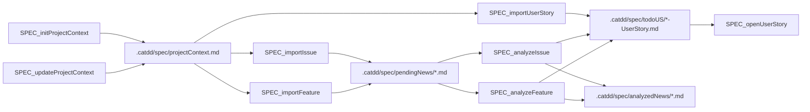
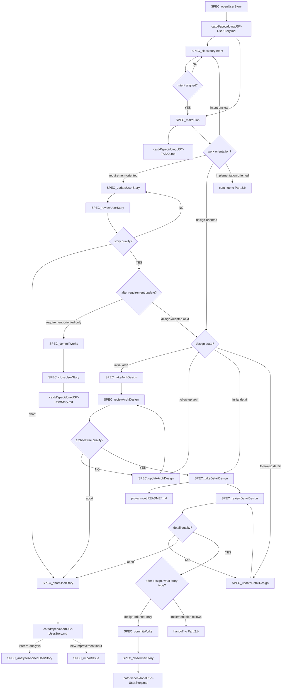
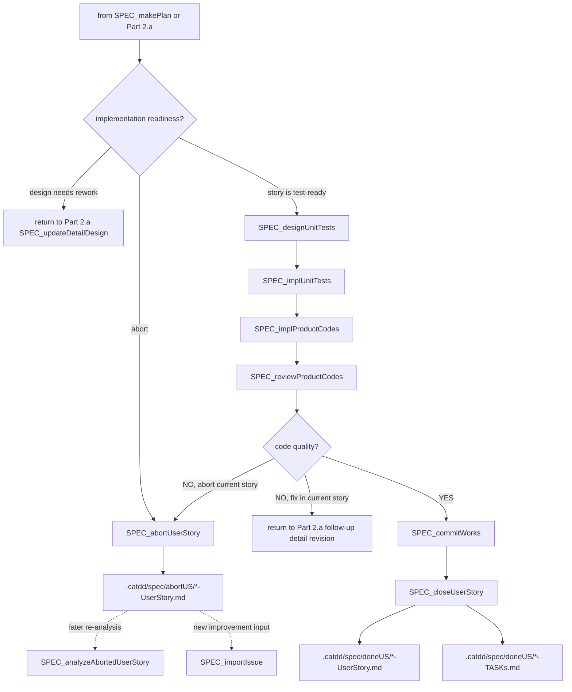

# Px SpecFlow

`Px SpecFlow` 是跨优先级的 SpecCoding 流程，用于从接收到的工作推进到经审查、经测试、已提交的实现。

`Px` 意指此流程不是 CaTDD 的类别优先级，比如 `P0 Functional`、`P1 Design` 或 `P2 Quality`。它是一个编排这些方法层次的过程流程。

## 方法对齐 (Method Alignment)

SpecFlow 基于 `methodPrompts`，但它工作在单个测试类别之上。

```text
methodPrompts = CaTDD method and verification-design language
Px SpecFlow = repeatable SpecCoding lifecycle over that method
P0/P1/P2 flows = category-specific test design and implementation flows
```

治理规格是注释鲜活的验证设计：项目上下文、用户故事、验收标准、详细设计、US/AC/TC 骨架、测试状态、生产代码状态以及审查决策。

## 模型层级指导 (Model Tier Guidance)

为当前命令使用能保持决策质量的最小型模型层级。开发者和 CodeAgents 应将 SOTA reasoning 模型保留给系统级架构决策，使用 High Performance 模型进行多制品推理和设计/审查工作，使用 Flash Speed 模型进行确定性生命周期移动或狭义的实现任务。

| 默认层级 | 使用场景 | Px-SpecFlow 命令 |
| --- | --- | --- |
| SOTA reasoning，如 GPT-5.5-xHigh | 涉及决定或审批系统边界、依赖方向、运行时放置、质量权衡以及跨模块约束的架构工作。 | `SPEC_takeArchDesign`、`SPEC_reviewArchDesign` |
| High Performance | 需求分析、意图对齐、规划、需求更新、局部设计、审查关卡、测试设计、代码审查以及质量取决于跨多个制品推理的修正路由。 | `SPEC_initProjectContext`、`SPEC_updateProjectContext`、`SPEC_analyzeIssue`、`SPEC_analyzeFeature`、`SPEC_analyzeAbortedUserStory`、`SPEC_clearStoryIntent`、`SPEC_makePlan`、`SPEC_updateUserStory`、`SPEC_whatsNextTask`、`SPEC_takeArchDesign`、`SPEC_reviewArchDesign`、`SPEC_updateArchDesign`、`SPEC_takeDetailDesign`、`SPEC_reviewDetailDesign`、`SPEC_updateDetailDesign`、`SPEC_reviewUserStory`、`SPEC_designUnitTests`、`SPEC_reviewProductCodes` |
| Flash Speed | 确定性的导入、移动、中止、提交、关闭，或当所需输入制品已明确时的小型测试驱动实现步骤。 | `SPEC_importIssue`、`SPEC_importFeature`、`SPEC_importUserStory`、`SPEC_openUserStory`、`SPEC_abortUserStory`、`SPEC_implUnitTests`、`SPEC_implProductCodes`、`SPEC_commitWorks`、`SPEC_closeUserStory` |

当命令暴露出架构级别的不确定性时，从 High Performance 或 Flash Speed 升级到 SOTA 级别：竞争性的非功能需求、安全/安保风险、实时或嵌入式约束、并发边界、数据迁移、兼容性矩阵或不可逆的模块/API 所有权决策。

## 使用示例

对于架构工作，在运行之前选择 SOTA reasoning 模型：

```text
/SPEC_takeArchDesign
/SPEC_reviewArchDesign
```

对于确定性的生命周期移动，Flash Speed 模型通常足够：

```text
/SPEC_importIssue
/SPEC_importUserStory
/SPEC_openUserStory
/SPEC_abortUserStory
/SPEC_closeUserStory
```

## 来自 GitHub Spec Kit 的改进 (Refinements)

在解释或采用来自 GitHub Spec Kit 的 `Px SpecFlow` 改进时，优先使用此列表。

| 改进 | 为什么 (WHY) | 在 `Px SpecFlow` 中的做法 (HOW) |
| --- | --- | --- |
| 以章程级别的项目上下文治理工作。 | Spec Kit 从项目原则开始，使后续的 spec、plan 和 task 决策不偏离。 | 将 `.catdd/spec/projectContext.md` 视为共享的章程式护栏。`SPEC_initProjectContext` 和 `SPEC_updateProjectContext` 应在故事工作继续前记录稳定的原则、约束、质量关卡和团队约定。 |
| 将工作分析为可独立测试的故事切片。 | Spec Kit 的 spec 模板要求提供带独立测试的、按优先级排序的用户故事，使 MVP 范围和用户价值显式化。 | `SPEC_analyzeIssue` 和 `SPEC_analyzeFeature` 应产出 `.catdd/spec/todoUS/` 故事，包含参与者、价值、优先级、独立测试意图、验收场景、边缘情况、风险和开放问题，而非仅是松散的摘要。`SPEC_importUserStory` 对已结构化的 US/AC 输入提供直接队列，不经分析直接写入 `.catdd/spec/todoUS/`。分析应将 issue/feature 原始输入从 `.catdd/spec/pendingNews/` 移动到 `.catdd/spec/analyzedNews/`，以便在保留可追溯性的同时，不在 pending 收件箱中留下已分析的工作。 |
| 在设计前澄清开发者与 CodeAgent 的故事意图。 | 一个故事可能看起来完整，但开发者与 CodeAgent 仍可推断出不同的范围、非目标或成功证据。在设计前澄清双方意图可防止昂贵的架构和详细设计偏差。 | 在 `SPEC_openUserStory` 之后使用 `SPEC_clearStoryIntent`，当活跃故事仍需要范围对齐时。在规划开始前在活跃故事中记录一个**相互意图契约**。契约陈述开发者意图、CodeAgent 意图、范围内工作、范围外工作、成功信号、假设及开放问题。如果意图未对齐，在 `SPEC_makePlan` 开始前询问或修订活跃故事。 |
| 通过轻量级计划步骤将 `WHAT`/`WHY` 与 `HOW` 分离。 | Spec Kit 将产品意图保留在 `spec.md`，将技术选择推迟到 `plan.md`，减少过早的设计决策。 | 将用户故事意图保留在故事制品中，然后使用 `SPEC_makePlan` 创建配对的 `.catdd/spec/doingUS/*-TASKs.md` 制品，将下一步工作以 Markdown 复选框任务的形式表达，并决定活跃故事是意图澄清型、设计导向型还是实现导向型。对于设计导向型工作，区分初始架构/详细设计（`SPEC_take*Design`）与后续设计修订（`SPEC_update*Design`）。详细的技术选择在后续命令需要时才体现在项目根 `README*` SPEC 文档中。 |
| 在实现前运行澄清/分析/检查清单关卡。 | Spec Kit 在编码前暴露模糊性、不一致性和缺失覆盖，使返工尽早发生。 | 在架构设计后使用 `SPEC_reviewArchDesign`，在详细设计后使用 `SPEC_reviewDetailDesign`。将失败的架构审查路由到 `SPEC_updateArchDesign`；将失败的详细审查路由到 `SPEC_updateDetailDesign`，而不是跳过直接前进。 |
| 使执行切片显式化、有序化、支持并行。 | Spec Kit 的 tasks 模板将计划转化为具有依赖关系、并行标记和验证检查点的可视化任务。 | 在 `SPEC_implUnitTests` 或 `SPEC_implProductCodes` 之前，将活跃故事分解为显式的 US/AC/TC 切片和验证检查点，体现在进行中的故事、验证设计和测试文件中。保持 P0 优先顺序，但标记可并行运行的独立工作。 |

## Developer Stories (开发者故事)

- 作为一名开发者，当我收到一个 issue 或 feature 请求时，我希望将其导入并分析为一个用户故事，以便工作从一个可追溯的规格制品开始。
- 作为一名开发者，当我收到一个已结构化的用户故事时，我希望直接将其排入待办故事中，以便我可以在不重复分析的情况下打开并执行它。
- 作为一名开发者，当我打开一个用户故事时，我希望在计划为需求导向型时首先更新需求文档，然后在故事审查后关闭或移交到设计导向型工作。
- 作为一名开发者，当我打开一个用户故事时，我希望通过显式的命令来推动详细设计、验收标准、测试、实现、审查、CI 和闭环，以便生命周期的每一步都不被隐藏在对话中。
- 作为一名开发者，当 CodeAgent 开始活跃故事工作时，我希望双方在设计前澄清意图，以便 agent 不会在错误的范围或成功信号上做优化。
- 作为一名开发者，当活跃故事暴露出错误的范围、无效的假设或不应就地修补的质量问题时，我希望将故事中止到保留的历史中，以便下一轮改进可以被仔细分析。
- 作为一名开发者，当我忘记在哪里暂停或初次使用 SpecFlow 时，我希望有一个命令能从当前制品告诉我下一步任务，以便我无需猜测即可继续。

## 制品 (Artifacts)

- `.catdd/spec/projectContext.md`：项目事实、约束、约定和当前运维上下文。
- `.catdd/spec/pendingNews/YYYYMMDD-*.md`：等待分析的已导入 issue 或 feature 请求。
- `.catdd/spec/analyzedNews/YYYYMMDD-*.md`：已分析并作为源追溯保留的原始 issue 或 feature 输入。
- `.catdd/spec/todoUS/YYYYMMDD-UserStory.md`：等待被开启的已分析用户故事和直接导入的结构化用户故事。
- `.catdd/spec/doingUS/YYYYMMDD-UserStory.md`：处于设计、测试、实现或审查阶段的活跃用户故事。
- `.catdd/spec/doingUS/YYYYMMDD-TASKs.md`：团队共享的任务制品，与活跃故事配对，以 Markdown 复选框任务的形式记录下一步所需的 `SPEC_*` 步骤和理由。
- `相互意图契约 (Mutual Intent Contract)`：活跃 doing 故事中的一个部分，在设计开始前记录开发者意图、CodeAgent 意图、范围、非目标、成功信号、假设和开放问题。
- `.catdd/spec/abortUS/YYYYMMDD-UserStory.md`：已中止的活跃用户故事，保留供后续分析、重新导入或下一轮改进规划。
- `.catdd/spec/abortUS/YYYYMMDD-TASKs.md`：当故事通过 `SPEC_makePlan` 制定了计划时，与中止故事并排保留的已中止任务制品。
- `.catdd/spec/doneUS/YYYYMMDD-UserStory.md`：完成审查、提交和 CI 后的用户故事。
- `.catdd/spec/doneUS/YYYYMMDD-TASKs.md`：与已关闭故事并排保留的已完成任务制品，供后续诊断。
- `README_UserStories.md`：项目级必选故事台账，记录 TODO/DOING/DONE 状态与 AC 追溯状态。
- `<module-or-submodule>/README_UserStory.md`：该模块范围的规范化正式需求来源。
- `<module-or-submodule>/README_UserGuide.md`：同一模块范围的配对使用上下文。
- `<module-or-submodule>/README_ArchDesign.md` 和 `<module-or-submodule>/README_DetailDesign.md`：派生自并可追溯到模块 `README_UserStory.md` ID 的设计制品。
- `README*.md`：按需创建的项目根 SPEC 文档，用于概述、架构、故事、指南、详细设计和验证设计。
- `.catdd/spec/WorkingProcessLog.md`：可选的过程日志，用于记录决策、命令转换和未解决的问题。

## 项目根 README SPEC 文档

仅在项目需要该 SPEC 维度时创建项目根 README SPEC 文档。将所有 `README*` SPEC 文档保持在目标项目根目录下，以便开发者和 CodeAgents 能够快速找到共享的项目和模块知识。

### 1. 面向架构 (Architecture-Oriented)（由 `SPEC_takeArchDesign` 管理）
这些文档记录全局策略、系统级边界、可靠性框架和可观测性拓扑。

| 文件 | 用途 |
| --- | --- |
| `README_ArchDesign.md` | 模块上下文架构、消费该模块的系统上下文、模块分解、依赖、数据流和关键权衡。 |
| `README_UsageDesign.md` | 公共边界、CLI/API 契约、参数解析规则和运行示例。 |
| `README_ErrorDesign.md` | 容错架构、故障安全状态、看门狗和全局错误分类。 |
| `README_ResourceDesign.md` | 有限资源分配、内存/CPU/功耗预算、DMA 和看门狗。 |
| `README_PerfDesign.md` | 性能预算、延迟限制和实时媒体调度。 |
| `README_CompatDesign.md` | 兼容性边界、平台矩阵、工具链和协议版本。 |
| `README_DiagnosisDesign.md` | 可观测性架构、日志级别、遥测和症状追溯映射。 |
| `README_VerifyDesign.md` | 验证和测试拓扑、mock 边界和 CI 测试循环。 |

### 2. 面向详细设计 (DetailDesign-Oriented)（由 `SPEC_takeDetailDesign` 管理）
这些文档记录活跃用户故事的本地实现细节、代码策略和类/API 行为。

| 文件 | 用途 |
| --- | --- |
| `README_DetailDesign.md` | 故事的详细类设计、API 签名和数据结构。 |
| `README_StateDesign.md` | 本地状态机、生命周期迁移、锁同步和线程并发。 |

### 3. 通用与需求 (General & Requirements)（首先由开发者创建，后续由 `SPEC_updateUserStory` 和 `SPEC_reviewUserStory` 更新）

| 文件 | 用途 |
| --- | --- |
| `README.md` | 项目概述、所有权、人工用户声明和主 SPEC 目录。 |
| `README_UserStories.md` | 项目级必选台账：维护 TODO/DOING/DONE 用户故事状态与验收标准追溯状态。 |
| `README_UserGuide.md` | 面向用户或面向开发者的运行时使用指南。 |

在首次创建 README SPEC 文档时，使用 `slashCommands/templates/` 中的匹配模板。
对于嵌入式软件以及数字视频/音频领域的工作，当硬件故障、有限资源、硬件状态、实时行为、兼容性矩阵、缓冲、媒体管线时序、音视频同步约束或现场诊断证据至关重要时，使用 `README_ErrorDesign.md`、`README_ResourceDesign.md`、`README_StateDesign.md`、`README_PerfDesign.md`、`README_CompatDesign.md` 和 `README_DiagnosisDesign.md`。

## 制品持久化策略

SpecCoding 将团队知识与个人的工作进度状态分离。

SpecFlow 生命周期状态位于 `.catdd/spec/` 下。共享的 `README*` SPEC 文档位于目标项目根目录。

| 制品 | 范围 | Git 策略 |
| --- | --- | --- |
| `.catdd/spec/projectContext.md` | 团队共享 | 提交稳定的项目上下文，使团队成员和 CodeAgents 使用相同的事实。 |
| `.catdd/spec/pendingNews/` | 团队共享 | 提交应对团队可见的已导入工作项。 |
| `.catdd/spec/analyzedNews/` | 团队共享 | 提交分析后的原始导入 issue 或 feature，使 `pendingNews/` 仅保留待处理的输入。 |
| `.catdd/spec/todoUS/` | 团队共享 | 提交已准备好被领取的已分析用户故事和直接导入的结构化用户故事。 |
| `.catdd/spec/doingUS/` | 团队共享 | 提交活跃用户故事，使进行中的工作可在不同机器间移动，并对团队成员保持可见。 |
| `.catdd/spec/doingUS/*-TASKs.md` | 团队共享 | 提交与已开启用户故事配对的活跃任务制品，使下一步 SPEC 步骤保持显式、可检查、可诊断。 |
| `.catdd/spec/abortUS/` | 团队共享 | 提交已中止的活跃故事，当当前范围或假设不再适合继续进行时。 |
| `.catdd/spec/abortUS/*-TASKs.md` | 团队共享 | 与中止故事并排提交已中止的任务制品，供后续分析或下一轮改进规划。 |
| `.catdd/spec/doneUS/` | 团队共享 | 提交审查、验证和关闭后的已完成故事记录。 |
| `.catdd/spec/doneUS/*-TASKs.md` | 团队共享 | 与已关闭用户故事并排提交已完成的任务制品，供后续诊断。 |
| `README_UserStories.md` | 团队共享 | 作为项目级用户故事状态与 AC 追溯状态的唯一共享台账提交。 |
| `README*.md` | 团队共享 | 按需提交项目根 SPEC 文档，如 README、架构设计、用户故事、用户指南、详细设计、错误设计、资源设计、状态设计、性能设计、兼容性设计、诊断设计和验证设计。 |
| `.catdd/spec/WorkingProcessLog.md` | 本地工作状态 | 通过 gitignore 忽略个人命令跟踪、临时决策和未解决的本地笔记。 |

推荐的目标项目 `.gitignore` 规则：

```gitignore
/.catdd/spec/WorkingProcessLog.md
```

## 流程示意图

### 第一部分：故事前（截至 SPEC_openUserStory）



### 第二部分 a：计划后需求与设计分支

本图涵盖计划打开后 (post-open) 的规划、面向需求的更新和面向设计的工作。面向需求的工作更新 `README_UserStory.md` 和配对的 `README_UserGuide.md`，然后在审查后关闭或转移到面向设计的下一步。



### 第二部分 b：面向实现的活跃故事生命周期

本图仅在 `SPEC_makePlan` 将故事分类为面向实现或第二部分 a 标记为 `implementation follows` 后才开始。如果需求就绪性不确定，在测试设计前路由回第二部分 a 的 `SPEC_updateUserStory`；如果设计就绪性不确定，在测试设计前路由回第二部分 a 的详细设计更新。



## 命令序列

1. 使用 [../commands/Px-SpecFlow/SPEC_initProjectContext.md](../commands/Px-SpecFlow/SPEC_initProjectContext.md) 创建初始项目上下文。
2. 在项目事实、约束或约定发生变更时，使用 [../commands/Px-SpecFlow/SPEC_updateProjectContext.md](../commands/Px-SpecFlow/SPEC_updateProjectContext.md)。
3. 使用 [../commands/Px-SpecFlow/SPEC_importIssue.md](../commands/Px-SpecFlow/SPEC_importIssue.md) 或 [../commands/Px-SpecFlow/SPEC_importFeature.md](../commands/Px-SpecFlow/SPEC_importFeature.md) 将 issue 或 feature 输入导入 `.catdd/spec/pendingNews/`。
4. 使用 [../commands/Px-SpecFlow/SPEC_importUserStory.md](../commands/Px-SpecFlow/SPEC_importUserStory.md) 将现有的结构化用户故事输入直接排入 `.catdd/spec/todoUS/`；优选每个模块或子模块的 `README_UserStory.md` 与配对的 `README_UserGuide.md` 作为来源。
5. 使用 [../commands/Px-SpecFlow/SPEC_analyzeIssue.md](../commands/Px-SpecFlow/SPEC_analyzeIssue.md) 或 [../commands/Px-SpecFlow/SPEC_analyzeFeature.md](../commands/Px-SpecFlow/SPEC_analyzeFeature.md) 将 pending 的 issue/feature 输入转换为 `.catdd/spec/todoUS/` 中的用户故事，并将原始输入移至 `.catdd/spec/analyzedNews/`。
6. 使用 [../commands/Px-SpecFlow/SPEC_openUserStory.md](../commands/Px-SpecFlow/SPEC_openUserStory.md) 将选定的用户故事移入 `.catdd/spec/doingUS/`。
7. 可选使用 [../commands/Px-SpecFlow/SPEC_clearStoryIntent.md](../commands/Px-SpecFlow/SPEC_clearStoryIntent.md)，当开发者意图与 CodeAgent 意图在规划前仍需对齐时。
8. 使用 [../commands/Px-SpecFlow/SPEC_makePlan.md](../commands/Px-SpecFlow/SPEC_makePlan.md) 创建配对的 `.catdd/spec/doingUS/*-TASKs.md` 制品，将工作以 Markdown 复选框任务的形式表达，区分意图澄清型、需求导向型、设计导向型和实现导向型工作，区分初始设计与后续设计修订，并为已开启的故事选择下一步所需的 `SPEC_*` 步骤。
9. 使用 [../commands/Px-SpecFlow/SPEC_updateUserStory.md](../commands/Px-SpecFlow/SPEC_updateUserStory.md)，当计划为需求导向型且项目级 `README_UserStories.md` 与配对 `README_UserGuide.md`（以及采用模块文档时的模块需求文档）必须在下游工作前更新时。
10. 使用 [../commands/Px-SpecFlow/SPEC_reviewUserStory.md](../commands/Px-SpecFlow/SPEC_reviewUserStory.md) 在需求更新之后，并验证 `README_UserStories.md` 的 TODO/DOING/DONE 与 AC 追溯状态是否与生命周期制品一致；然后或者关闭纯需求导向型工作（`SPEC_commitWorks` 然后 `SPEC_closeUserStory`，若关闭生成了文件变更则紧接一个 close-commit 检查点），或者转移到设计导向型的下一步。
11. 使用 [../commands/Px-SpecFlow/SPEC_whatsNextTask.md](../commands/Px-SpecFlow/SPEC_whatsNextTask.md)，当你需要从当前状态获得单个下一步推荐时。
12. 使用 [../commands/Px-SpecFlow/SPEC_takeArchDesign.md](../commands/Px-SpecFlow/SPEC_takeArchDesign.md)，当计划表明需要初始架构工作，在 `README_ArchDesign.md` 中产出初始高层架构设计和模块边界时。
13. 使用 [../commands/Px-SpecFlow/SPEC_reviewArchDesign.md](../commands/Px-SpecFlow/SPEC_reviewArchDesign.md) 在详细设计开始前把关架构质量。
14. 使用 [../commands/Px-SpecFlow/SPEC_updateArchDesign.md](../commands/Px-SpecFlow/SPEC_updateArchDesign.md) 进行后续架构修订，当架构审查、故事级反馈或已开启的更新故事识别出缺失或薄弱的架构设计时。
15. 使用 [../commands/Px-SpecFlow/SPEC_takeDetailDesign.md](../commands/Px-SpecFlow/SPEC_takeDetailDesign.md) 产出初始详细设计和验收标准，按需包括其他项目根 `README*` SPEC 文档。
16. 使用 [../commands/Px-SpecFlow/SPEC_reviewDetailDesign.md](../commands/Px-SpecFlow/SPEC_reviewDetailDesign.md) 在面向实现的步骤开始前把关详细设计质量。
17. 使用 [../commands/Px-SpecFlow/SPEC_updateDetailDesign.md](../commands/Px-SpecFlow/SPEC_updateDetailDesign.md) 进行后续详细设计修订，当详细审查发现缺失或薄弱的设计时。
18. 使用 [../commands/Px-SpecFlow/SPEC_designUnitTests.md](../commands/Px-SpecFlow/SPEC_designUnitTests.md) 进入 CaTDD 测试设计，通常通过 P0/P1/P2 流程，当计划表明故事已为测试准备好时。
19. 使用 [../commands/Px-SpecFlow/SPEC_implUnitTests.md](../commands/Px-SpecFlow/SPEC_implUnitTests.md)、[../commands/Px-SpecFlow/SPEC_implProductCodes.md](../commands/Px-SpecFlow/SPEC_implProductCodes.md) 和 [../commands/Px-SpecFlow/SPEC_reviewProductCodes.md](../commands/Px-SpecFlow/SPEC_reviewProductCodes.md) 进行测试优先的执行和审查。
20. 使用 [../commands/Px-SpecFlow/SPEC_abortUserStory.md](../commands/Px-SpecFlow/SPEC_abortUserStory.md)，从第二部分 a 或第二部分 b，当活跃故事存在阻塞性的范围、假设、设计、测试或产品质量问题，应被保留而非继续就地修补时。中止后，或者使用 `SPEC_analyzeAbortedUserStory` 分析已中止的故事以供后续故事轮次，或者使用 `SPEC_importIssue` 创建新的改进/细化输入。
21. 使用 [../commands/Px-SpecFlow/SPEC_commitWorks.md](../commands/Px-SpecFlow/SPEC_commitWorks.md) 和 [../commands/Px-SpecFlow/SPEC_closeUserStory.md](../commands/Px-SpecFlow/SPEC_closeUserStory.md) 完成生命周期，然后当关闭生成的元/生命周期文件发生变更时，强制进行 close-commit 检查点。

## 冲突防护 (Conflict Guard)

- `Px SpecFlow` 仅定义生命周期编排；CaTDD 方法语义保留在 `methodPrompts` 中。
- `SPEC_*` 命令可以调用 `UT_*` 命令，但不得替代 P0/P1/P2 类别规则。
- `SPEC_designUnitTests` 与 `UT_design*Skeleton` 设计结果必须满足追溯闭合：每个 US 至少有 1 个 AC，每个 AC 至少有 1 个 TC。
- `SPEC_designUnitTests` 与 `UT_design*Skeleton` 设计结果必须在测试文件 Overview 中显式声明 SUT。
- 在需求导向型工作中，`SPEC_updateUserStory` 之后不得跳过 `SPEC_reviewUserStory`。
- 当 `README_UserStories.md` 的 TODO/DOING/DONE 或 AC 追溯状态未同步时，不得认为故事生命周期完成。
- `SPEC_takeArchDesign` 与 `SPEC_reviewArchDesign` 必须以模块上下文为核心，并显式描述消费该模块的系统上下文。
- 当开发者意图与 CodeAgent 意图未对活跃故事澄清时，不得开始设计。
- 在 `SPEC_makePlan` 之后，仅在初始设计工作时使用 `SPEC_take*Design`，仅在依赖现有设计证据、审查反馈或故事级设计差距的后续设计修订时使用 `SPEC_update*Design`。
- 每个设计产出步骤（`SPEC_takeArchDesign`、`SPEC_updateArchDesign`、`SPEC_takeDetailDesign`、`SPEC_updateDetailDesign`）之后必须经过其审查关卡，然后才能进行下游生命周期步骤。
- 当发现的问题改变了故事的意图、使其假设无效或需要新的分析/改进轮次时，使用 `SPEC_abortUserStory` 而非继续活跃故事。
- 关闭前的 `SPEC_commitWorks` 涵盖实现/设计制品；关闭生成的生命周期/元变更可能需要在关闭完成前立即追加一个 `SPEC_commitWorks` 检查点。
- 如果产品意图不明确，保持用户故事开启并询问开发者，而非编造需求。
