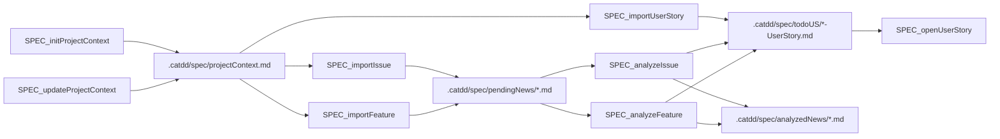
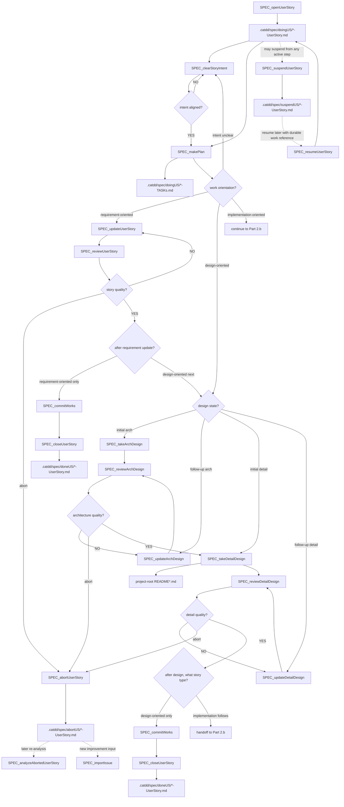
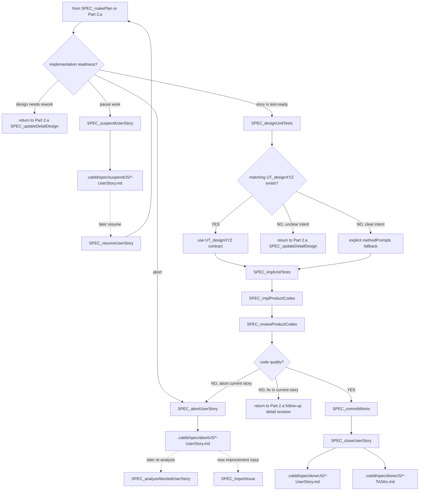

# Px SpecFlow

`Px SpecFlow` 是跨优先级的 SpecCoding 流程，用于将传入的工作推进到经过审查、测试和提交的实现。

`Px` 表示该流程并非像 `P0 Functional`、`P1 Design` 或 `P2 Quality` 那样的 CaTDD 类别优先级。它是一个编排这些方法层次的流程。

## 方法对齐

SpecFlow 基于 `methodPrompts`，但在单个测试类别之上工作。

```text
methodPrompts = CaTDD 方法和验证设计语言
Px SpecFlow = 在该方法上的可重复 SpecCoding 生命周期
P0/P1/P2 flows = 特定类别的测试设计和实现流程
```

`SPEC_*` 命令拥有生命周期编排职责：故事状态、就绪关卡、跨类别覆盖选择、可追溯性、审查、提交和关闭。`UT_*` 命令拥有类别级测试机制：Typical、Edge、Misuse、Fault、State、Capability、Concurrency、Performance、Robust、Compatibility 和 Configuration 骨架设计或实现步骤。当 `SPEC_*` 命令（如 `SPEC_designUnitTests`）需要类别骨架时，应优先使用匹配的 `UT_designXYZ` 命令契约，并记录该来源，而不是直接从内存中草拟类别形态。

治理规范是基于注释的验证设计：项目上下文、用户故事、验收标准、详细设计、US/AC/TC 骨架、测试状态、产品代码状态和审查决策。

## 模型层级指南

使用能保持当前命令决策质量的最小模型层级。开发者和 CodeAgent 应将 SOTA 推理模型保留用于系统级架构决策，对跨制品推理和设计/审查工作使用高性能模型，对确定性的生命周期移动或狭窄实现任务使用极速模型。

| 默认层级 | 使用场景 | Px-SpecFlow 命令 |
| --- | --- | --- |
| SOTA reasoning，如 GPT-5.5-xHigh | 涉及决定或审批系统边界、依赖方向、运行时放置、质量权衡以及跨模块约束的架构工作。 | `SPEC_takeArchDesign`、`SPEC_reviewArchDesign` |
| High Performance | 需求分析、意图对齐、规划、需求更新、局部设计、审查关卡、测试设计、代码审查、修正路由，以及依赖跨制品推理的受控上游回补。 | `SPEC_initProjectContext`、`SPEC_updateProjectContext`、`SPEC_analyzeIssue`、`SPEC_analyzeFeature`、`SPEC_analyzeAbortedUserStory`、`SPEC_clearStoryIntent`、`SPEC_makePlan`、`SPEC_updateUserStory`、`SPEC_whatsNextTask`、`SPEC_takeArchDesign`、`SPEC_reviewArchDesign`、`SPEC_updateArchDesign`、`SPEC_takeDetailDesign`、`SPEC_reviewDetailDesign`、`SPEC_updateDetailDesign`、`SPEC_reviewUserStory`、`SPEC_designUnitTests`、`SPEC_reviewProductCodes`、`SPEC_patchOriginalCaTDD` |
| Flash Speed | 确定性的导入、移动、挂起、恢复、中止、提交、关闭，或当所需输入制品已明确时的小型测试驱动实现步骤。 | `SPEC_importIssue`、`SPEC_importFeature`、`SPEC_importUserStory`、`SPEC_openUserStory`、`SPEC_suspendUserStory`、`SPEC_resumeUserStory`、`SPEC_abortUserStory`、`SPEC_implUnitTests`、`SPEC_implProductCodes`、`SPEC_commitWorks`、`SPEC_closeUserStory` |

当命令暴露出架构级别的不确定性时，从 High Performance 或 Flash Speed 升级到 SOTA 级别：竞争性的非功能需求、安全/安保风险、实时或嵌入式约束、并发边界、数据迁移、兼容性矩阵或不可逆的模块/API 所有权决策。

## 使用示例

对于架构工作，选择 SOTA 推理模型后再运行：

```text
/SPEC_takeArchDesign
/SPEC_reviewArchDesign
```

对于确定性的生命周期移动，极速模型通常足够：

```text
/SPEC_importIssue
/SPEC_importUserStory
/SPEC_openUserStory
/SPEC_abortUserStory
/SPEC_closeUserStory
```

## GitHub Spec Kit 的改进

在解释或采用来自 GitHub Spec Kit 的 `Px SpecFlow` 改进时，首选此列表。

| 改进 | 原因 | 在 `Px SpecFlow` 中的做法 |
| --- | --- | --- |
| 以宪法级别的项目上下文治理工作 | Spec Kit 以项目原则开始，使后续的规范、计划和任务决策不会漂移。 | 将 `.catdd/spec/projectContext.md` 视为类似宪法的防护栏。`SPEC_initProjectContext` 和 `SPEC_updateProjectContext` 应在故事工作继续之前记录稳定的原则、约束、质量关卡和团队惯例。 |
| 将工作分析为独立可测试的故事切片 | Spec Kit 的规范模板要求优先级的用户故事及独立测试，使 MVP 范围和用户价值显式化。 | `SPEC_analyzeIssue` 和 `SPEC_analyzeFeature` 应生成包含参与者、价值、优先级、独立测试意图、验收场景、边界情况、风险和开放问题的 `.catdd/spec/todoUS/` 故事，而不仅仅是一个松散的摘要。`SPEC_importUserStory` 是已结构化 US/AC 输入的直接队列，将其写入 `.catdd/spec/todoUS/` 而无需分析。分析应将议题/特性的原始输入从 `.catdd/spec/pendingNews/` 移动到 `.catdd/spec/analyzedNews/`，以保持可追溯性而不将已分析的工作留在待处理收件箱中。 |
| 在设计前明确开发者和 CodeAgent 故事意图 | 一个故事可能看起来完整，而开发者和 CodeAgent 仍然推断出不同的范围、非目标或成功证据。在设计前明确双方意图可防止昂贵的架构和详细设计漂移。 | 当活跃故事仍需要范围对齐时，在 `SPEC_openUserStory` 后使用 `SPEC_clearStoryIntent`。在规划开始前，在活跃故事中记录一份`相互意图契约 (Mutual Intent Contract)`。该契约声明开发者意图、CodeAgent 意图、范围内工作、范围外工作、成功信号、假设和开放问题。如果意图未对齐，在 `SPEC_makePlan` 开始前询问或修改活跃故事。 |
| 通过轻量级计划步骤分离 `WHAT`/`WHY` 与 `HOW` | Spec Kit 将产品意图保留在 `spec.md` 中，将技术选择推迟到 `plan.md`，减少过早的设计决策。 | 将用户故事意图保留在故事制品中，然后使用 `SPEC_makePlan` 创建一个配对的 `.catdd/spec/doingUS/*-TASKs.md` 制品，以 Markdown 复选框任务形式表达下一步工作，并确定活跃故事是意图澄清型、设计导向型还是实现导向型。对于设计导向型工作，区分初始架构/详细设计 (`SPEC_take*Design`) 和后续设计修订 (`SPEC_update*Design`)。详细技术选择在后续命令需要时仍存放到项目根目录的 `README*` SPEC 文档中。 |
| 在实现前执行 clarify/analyze/checklist 关卡 | Spec Kit 在编码前暴露歧义、不一致和缺失的覆盖，使返工尽早发生。 | 在架构设计后使用 `SPEC_reviewArchDesign`，在详细设计后使用 `SPEC_reviewDetailDesign`。将未通过的架构审查路由到 `SPEC_updateArchDesign`；将未通过的详细审查路由到 `SPEC_updateDetailDesign`，而不是跳过。 |
| 使执行切片显式化、有序化并具有并行意识 | Spec Kit 的任务模板将计划转化为显式任务，包含依赖、并行标记和验证检查点。 | 在 `SPEC_implUnitTests` 或 `SPEC_implProductCodes` 之前，在 doings 故事、验证设计和测试文件中将活跃故事分解为显式的 US/AC/TC 切片和验证检查点。保持 P0 优先顺序，但标记可以并行运行的独立工作。 |

## 开发者故事

- 作为一名开发者，当我收到一个议题或特性请求时，我希望将其导入并分析成一个用户故事，以便工作从可追溯的规范制品开始。
- 作为一名开发者，当我收到一个已经结构化的用户故事时，我希望直接将其排入待办故事队列，这样我无需重复分析即可开启并执行。
- 作为一名开发者，当我开启一个用户故事时，我希望在计划为需求导向型时首先更新需求文档，然后在故事审查后关闭或移交给设计导向型工作。
- 作为一名开发者，当我开启一个用户故事时，我期望通过显式的命令驱动详细设计、验收标准、测试、实现、审查、CI 和关闭，以便没有生命周期步骤隐藏在聊天中。
- 作为一名开发者，当 CodeAgent 开始活跃故事工作时，我希望双方在设计前明确意图，以便代理不会针对错误的范围或成功信号进行优化。
- 作为一名开发者，当活跃故事暴露出错误的范围、无效的假设或不应就地修补的质量问题时，我希望将故事中止到保留的历史中，以便下一个改进轮次可以经过审慎的分析。
- 作为一名开发者，当我忘记暂停的位置或我是 SpecFlow 新手时，我希望有一个命令能从当前制品告诉我下一步任务，这样我无需猜测即可继续。

## 制品

- `.catdd/spec/projectContext.md`：项目事实、约束、惯例和当前操作的上下文。
- `.catdd/spec/pendingNews/YYYYMMDD-*.md`：待分析的已导入议题或特性请求。
- `.catdd/spec/analyzedNews/YYYYMMDD-*.md`：已分析并作为源追溯保留的原始议题或特性输入。
- `.catdd/spec/todoUS/YYYYMMDD-UserStory.md`：等待被开启的已分析用户故事和直接导入的结构化用户故事。
- `.catdd/spec/doingUS/YYYYMMDD-UserStory.md`：处于设计、测试、实现或审查阶段的活跃用户故事。
- `.catdd/spec/doingUS/YYYYMMDD-TASKs.md`：团队共享的任务制品，与活跃故事配对，以 Markdown 复选框任务的形式记录下一步所需的 `SPEC_*` 步骤和理由。
- `.catdd/spec/suspendUS/YYYYMMDD-UserStory.md`：已挂起的活跃用户故事，保留可恢复的持久工作引用（例如 git 分支或 worktree）。
- `.catdd/spec/suspendUS/YYYYMMDD-TASKs.md`：当故事通过 `SPEC_makePlan` 制定了计划时，与挂起故事并排保留的挂起任务制品。
- `相互意图契约 (Mutual Intent Contract)`：活跃 doing 故事中的一个部分，在设计开始前记录开发者意图、CodeAgent 意图、范围、非目标、成功信号、假设和开放问题。
- `.catdd/spec/abortUS/YYYYMMDD-UserStory.md`：已中止的活跃用户故事，保留供后续分析、重新导入或下一轮改进规划。
- `.catdd/spec/abortUS/YYYYMMDD-TASKs.md`：当故事通过 `SPEC_makePlan` 制定了计划时，与中止故事并排保留的已中止任务制品。
- `.catdd/spec/doneUS/YYYYMMDD-UserStory.md`：完成审查、提交和 CI 后的用户故事。
- `.catdd/spec/doneUS/YYYYMMDD-TASKs.md`：与已关闭故事并排保留的已完成任务制品，供后续诊断。
- `README_UserStories.md`：项目级必选故事台账，记录 TODO/DOING/DONE 状态与 AC 追溯状态。
- `<module-or-submodule>/README_UserStory.md`：该模块范围的规范化正式需求来源。
- `<module-or-submodule>/README_UserGuide.md`：同一模块范围的配对使用上下文。
- `<module-or-submodule>/README_ArchDesign.md` 和 `<module-or-submodule>/README_DetailDesign.md`：派生自并可追溯到模块 `README_UserStory.md` ID 的设计制品。
- `README*.md`：按需创建的项目根 SPEC 文档，用于概述、架构、故事、指南、详细设计和验证设计。
- `.catdd/spec/WorkingProcessLog.md`：用于决策、命令转换和未解决问题的可选跟踪日志。

## 项目根 README SPEC 文档

仅当项目需要某个 SPEC 层面时才创建项目根 README SPEC 文档。将所有 `README*` SPEC 文档保留在目标项目根目录，使开发者和 CodeAgent 能够快速找到共享的项目和模块知识。

### 1. 架构导向（由 `SPEC_takeArchDesign` 管理）

这些文档记录模块上下文架构以及消费该模块的系统上下文，连同全局策略、边界、可靠性框架和可观测性拓扑。

| 文件 | 用途 |
| --- | --- |
| `README_ArchDesign.md` | 模块上下文架构、消费该模块的系统上下文、模块分解、依赖、数据流和关键权衡。 |
| `README_UsageDesign.md` | 公共边界、CLI/API 契约、参数解析规则和运行示例。 |
| `README_ErrorDesign.md` | 容错架构、故障安全状态、看门狗和全局错误分类。 |
| `README_ResourceDesign.md` | 有限资源分配、内存/CPU/功耗预算、DMA 和看门狗。 |
| `README_PerfDesign.md` | 性能预算、延迟限制和实时媒体调度。 |
| `README_CompatDesign.md` | 兼容性边界、平台矩阵、工具链和协议版本。 |
| `README_DiagnosisDesign.md` | 可观测性架构、日志级别、遥测和症状跟踪图。 |
| `README_VerifyDesign.md` | 验证和测试拓扑、模拟边界和 CI 测试循环。 |

### 2. 详细设计导向（由 `SPEC_takeDetailDesign` 管理）

这些文档记录活跃用户故事的本地实现细节、代码策略和类/API 行为。

| 文件 | 用途 |
| --- | --- |
| `README_DetailDesign.md` | 故事的详细类设计、API 签名和数据结构。 |
| `README_StateDesign.md` | 本地状态机、生命周期转换、锁同步和线程并发。 |

### 3. 通用与需求（由开发者首先创建，之后由 `SPEC_updateUserStory` 和 `SPEC_reviewUserStory` 更新）

| 文件 | 用途 |
| --- | --- |
| `README.md` | 项目概述、所有权、人工用户声明和主 SPEC 目录。 |
| `README_UserStories.md` | 项目级必选台账：维护 TODO/DOING/DONE 用户故事状态与验收标准追溯状态。 |
| `README_UserGuide.md` | 面向用户或面向开发者的运行时使用指南。 |

在首次创建 README SPEC 文档时，使用 `slashCommands/templates/` 中的匹配模板。

- `SpecTodoUserStoryTemplate.md` — 用于 `.catdd/spec/todoUS/*-UserStory.md` 制品的可重用模板，由 `.github/skills/` 需求分析 SKILLs 组合而成。
  - `SPEC_analyzeFeature` 和 `SPEC_analyzeIssue` 使用完整的 9 步 SKILL 流水线，并按此模板生成输出。
  - `SPEC_analyzeAbortedUserStory` 在输出格式上遵循此模板，但采用**选择性再分析**流水线（审计 → 诊断 → 保留 → 拒绝 → 选择性纠正），因为输入已经是结构化的用户故事。
对于嵌入式软件和数字视频/音频领域的工作，当涉及硬件故障、有限资源、硬件状态、实时行为、兼容性矩阵、缓冲、媒体流水线时序、A/V 同步约束或现场调试证据时，使用 `README_ErrorDesign.md`、`README_ResourceDesign.md`、`README_StateDesign.md`、`README_PerfDesign.md`、`README_CompatDesign.md` 和 `README_DiagnosisDesign.md`。

## 制品持久化策略

SpecCoding 将团队知识与个人进行中的工作状态分开。

SpecFlow 生命周期状态位于 `.catdd/spec/` 下。共享的 `README*` SPEC 文档位于目标项目根目录。

| 制品 | 范围 | Git 策略 |
| --- | --- | --- |
| `.catdd/spec/projectContext.md` | 团队共享 | 提交稳定的项目上下文，使队友和 CodeAgent 使用相同的事实。 |
| `.catdd/spec/pendingNews/` | 团队共享 | 提交应对团队可见的已导入工作项。 |
| `.catdd/spec/analyzedNews/` | 团队共享 | 分析后提交原始导入的议题或特性，使 `pendingNews/` 仅保留等待输入。 |
| `.catdd/spec/todoUS/` | 团队共享 | 提交已准备好被领取的已分析用户故事和直接导入的结构化用户故事。 |
| `.catdd/spec/doingUS/` | 团队共享 | 提交活跃用户故事，使进行中的工作可在不同机器间移动，并对团队成员保持可见。 |
| `.catdd/spec/doingUS/*-TASKs.md` | 团队共享 | 提交与已开启用户故事配对的活跃任务制品，使下一步 SPEC 步骤保持显式、可检查、可诊断。 |
| `.catdd/spec/suspendUS/` | 团队共享 | 提交挂起的活跃故事，并保留可恢复的持久引用。 |
| `.catdd/spec/suspendUS/*-TASKs.md` | 团队共享 | 与挂起故事并排提交挂起任务制品，确保恢复路径可追溯。 |
| `.catdd/spec/abortUS/` | 团队共享 | 提交已中止的活跃故事，当当前范围或假设不再适合继续进行时。 |
| `.catdd/spec/abortUS/*-TASKs.md` | 团队共享 | 与中止故事并排提交已中止的任务制品，供后续分析或下一轮改进规划。 |
| `.catdd/spec/doneUS/` | 团队共享 | 提交审查、验证和关闭后的已完成故事记录。 |
| `.catdd/spec/doneUS/*-TASKs.md` | 团队共享 | 与已关闭用户故事并排提交已完成的任务制品，供后续诊断。 |
| `README_UserStories.md` | 团队共享 | 作为项目级用户故事状态与 AC 追溯状态的唯一共享台账提交。 |
| `README*.md` | 团队共享 | 按需提交项目根 SPEC 文档，如 README、架构设计、用户故事、用户指南、详细设计、错误设计、资源设计、状态设计、性能设计、兼容性设计、诊断设计和验证设计。 |
| `slashCommands/templates/SpecTodoUserStoryTemplate.md` | 团队共享 | 提交用于 `.catdd/spec/todoUS/*-UserStory.md` 的可重用每故事模板。 |
| `.catdd/spec/WorkingProcessLog.md` | 本地工作状态 | 通过 gitignore 忽略个人命令跟踪、临时决策和未解决的本地笔记。 |

推荐的目标项目 `.gitignore` 规则：

```gitignore
/.catdd/spec/WorkingProcessLog.md
```

## 流程图

### 第一部分：故事前阶段（到 SPEC_openUserStory）



### 第二部分 a：计划后需求与设计通道

本图覆盖计划后的规划、需求导向型更新和设计导向型工作。需求导向型工作更新项目级 `README_UserStories.md` 台账和配对的 `README_UserGuide.md`（以及当使用模块本地需求文档时的模块 `README_UserStory.md`），然后在审查后关闭或转移到设计导向型的下一步。

`SPEC_suspendUserStory` 在第二部分 a 和第二部分 b 中是一个全局中断：从任何活跃的开启后、关闭前的步骤，您可以挂起故事，之后通过 `SPEC_resumeUserStory` 恢复。为使图表可读，此中断只绘制一次，而非从每个节点重复箭头。



### 第二部分 b：实现导向型活跃故事生命周期

此图仅在 `SPEC_makePlan` 将故事分类为实现导向型，或第二部分 a 标记了 `implementation follows` 后开始。如果需求准备度不确定，返回第二部分 a 进行 `SPEC_updateUserStory`；如果设计准备度不确定，返回第二部分 a 在测试设计前进行详细设计更新。

挂起在此处同样可用，遵循第二部分 a 中定义的相同全局中断规则，并且不从每个实现节点重新绘制。



## 命令序列

1. 使用 [SPEC_initProjectContext](../commands/Px-SpecFlow/SPEC_initProjectContext.md) 创建第一个项目上下文。
2. 使用 [SPEC_updateProjectContext](../commands/Px-SpecFlow/SPEC_updateProjectContext.md) 当项目事实、约束或惯例发生变化时。
3. 使用 [SPEC_importIssue](../commands/Px-SpecFlow/SPEC_importIssue.md) 或 [SPEC_importFeature](../commands/Px-SpecFlow/SPEC_importFeature.md) 将议题或特性输入导入到 `.catdd/spec/pendingNews/`。
4. 使用 [SPEC_importUserStory](../commands/Px-SpecFlow/SPEC_importUserStory.md) 将已存在的结构化用户故事输入直接排入 `.catdd/spec/todoUS/` 队列；优先使用每个模块或子模块的 `README_UserStory.md` 和 `README_UserGuide.md` 作为来源。
5. 使用 [SPEC_analyzeIssue](../commands/Px-SpecFlow/SPEC_analyzeIssue.md) 或 [SPEC_analyzeFeature](../commands/Px-SpecFlow/SPEC_analyzeFeature.md) 将待处理的议题/特性输入转换为 `.catdd/spec/todoUS/` 中的用户故事，并将原始输入移动到 `.catdd/spec/analyzedNews/`。
   - 这些分析命令使用由 `.github/skills/` 中的需求分析 SKILLs 组合而成的流水线：`write-user-story`、`build-feature-tree`、`elicit-requirements-models`、`extract-business-rules`、`facilitate-example-mapping`、`validate-requirements-criteria`、`prioritize-requirements`。
   - 输出遵循 `SpecTodoUserStoryTemplate.md`。
   - 对于需要对已中止故事进行选择性纠正而非全范围重新分析的中止故事，使用 `SPEC_analyzeAbortedUserStory.md`。
6. 使用 [SPEC_openUserStory](../commands/Px-SpecFlow/SPEC_openUserStory.md) 将选定的用户故事移入 `.catdd/spec/doingUS/`。
7. 可选使用 [SPEC_clearStoryIntent](../commands/Px-SpecFlow/SPEC_clearStoryIntent.md)，当开发者意图与 CodeAgent 意图在规划前仍需对齐时。
8. 使用 [SPEC_makePlan](../commands/Px-SpecFlow/SPEC_makePlan.md) 创建配对的 `.catdd/spec/doingUS/*-TASKs.md` 制品，将工作以 Markdown 复选框任务的形式表达，区分意图澄清型、需求导向型、设计导向型和实现导向型工作，区分初始设计与后续设计修订，并为已开启的故事选择下一步所需的 `SPEC_*` 步骤。
9. 使用 [SPEC_updateUserStory](../commands/Px-SpecFlow/SPEC_updateUserStory.md)，当计划为需求导向型且项目级 `README_UserStories.md` 与配对 `README_UserGuide.md`（以及采用模块文档时的模块需求文档）必须在下游工作前更新时。
10. 使用 [SPEC_reviewUserStory](../commands/Px-SpecFlow/SPEC_reviewUserStory.md) 在需求更新之后，并验证 `README_UserStories.md` 的 TODO/DOING/DONE 与 AC 追溯状态是否与生命周期制品一致；然后或者关闭纯需求导向型工作（`SPEC_commitWorks` 然后 `SPEC_closeUserStory`，若关闭生成了文件变更则紧接一个 close-commit 检查点），或者转移到设计导向型的下一步。
11. 使用 [SPEC_whatsNextTask](../commands/Px-SpecFlow/SPEC_whatsNextTask.md)，当你需要从当前状态获得单个下一步推荐时。
12. 使用 [SPEC_takeArchDesign](../commands/Px-SpecFlow/SPEC_takeArchDesign.md)，当计划表明需要初始架构工作，在 `README_ArchDesign.md` 中产出初始高层架构设计和模块边界时。
13. 使用 [SPEC_reviewArchDesign](../commands/Px-SpecFlow/SPEC_reviewArchDesign.md) 在详细设计开始前把关架构质量。
14. 使用 [SPEC_updateArchDesign](../commands/Px-SpecFlow/SPEC_updateArchDesign.md) 进行后续架构修订，当架构审查、故事级反馈或已开启的更新故事识别出缺失或薄弱的架构设计时。
15. 使用 [SPEC_takeDetailDesign](../commands/Px-SpecFlow/SPEC_takeDetailDesign.md) 产出初始详细设计和验收标准，包括按需创建其他项目根 `README*` SPEC 文档。
16. 使用 [SPEC_reviewDetailDesign](../commands/Px-SpecFlow/SPEC_reviewDetailDesign.md) 在实现导向型步骤之前把关详细设计质量。
17. 使用 [SPEC_updateDetailDesign](../commands/Px-SpecFlow/SPEC_updateDetailDesign.md) 进行后续详细设计修订，当详细审查发现缺失或薄弱的设计时。
18. 使用 [SPEC_designUnitTests](../commands/Px-SpecFlow/SPEC_designUnitTests.md) 进入 CaTDD 测试设计，通常通过 P0/P1/P2 流程，当计划表明故事已为测试准备好时。
19. 使用 [SPEC_implUnitTests](../commands/Px-SpecFlow/SPEC_implUnitTests.md)、[SPEC_implProductCodes](../commands/Px-SpecFlow/SPEC_implProductCodes.md) 和 [SPEC_reviewProductCodes](../commands/Px-SpecFlow/SPEC_reviewProductCodes.md) 进行测试优先的执行和审查。
20. 使用 [SPEC_suspendUserStory](../commands/Px-SpecFlow/SPEC_suspendUserStory.md)，当活跃工作需要暂停且必须保留可恢复的持久引用（例如 git 分支或 worktree）时。
21. 使用 [SPEC_resumeUserStory](../commands/Px-SpecFlow/SPEC_resumeUserStory.md) 将挂起故事恢复到活跃工作态并继续执行。
22. 使用 [SPEC_abortUserStory](../commands/Px-SpecFlow/SPEC_abortUserStory.md)，从第二部分 a 或第二部分 b，当活跃故事存在阻塞性的范围、假设、设计、测试或产品质量问题，应被保留而非继续就地修补时。中止后，或者使用 `SPEC_analyzeAbortedUserStory` 分析已中止的故事以供后续故事轮次，或者使用 `SPEC_importIssue` 创建新的改进/细化输入。
23. 使用 [SPEC_commitWorks](../commands/Px-SpecFlow/SPEC_commitWorks.md) 和 [SPEC_closeUserStory](../commands/Px-SpecFlow/SPEC_closeUserStory.md) 完成生命周期，然后当关闭生成的元/生命周期文件发生变更时，强制进行 close-commit 检查点。
24. 使用 [SPEC_patchOriginalCaTDD](../commands/Px-SpecFlow/SPEC_patchOriginalCaTDD.md)，当已安装 CaTDD 的项目产生了有效的元文件改进并需要在非默认分支上回补到原始 CaTDD 仓库时。

## 冲突守卫

- `Px SpecFlow` 仅定义生命周期编排；CaTDD 方法语义保留在 `methodPrompts` 中。
- `SPEC_*` 命令可以调用 `UT_*` 命令，但不得替换 P0/P1/P2 类别规则。
- 在需求导向型工作中，不得跳过 `SPEC_reviewUserStory` 在 `SPEC_updateUserStory` 之后。
- 当 `README_UserStories.md` 的 TODO/DONE 或 AC 追溯状态过期时，不得将故事生命周期视为完成。
- `SPEC_takeArchDesign` 和 `SPEC_reviewArchDesign` 必须使架构保持以模块上下文为中心，并显式记录消费该模块的系统上下文。
- 当活跃故事的开发者意图和 CodeAgent 意图未明确时，不得开始设计。
- 当活跃工作有必须稍后恢复的变更时，不得在未保留可恢复的持久工作引用（如 git 分支或 worktree）时挂起故事。
- 在 `SPEC_makePlan` 之后，仅将 `SPEC_take*Design` 用于初始设计工作，将 `SPEC_update*Design` 仅用于针对现有设计证据、审查反馈或故事级设计缺口的后续设计修订。
- 每个产生设计的步骤（`SPEC_takeArchDesign`、`SPEC_updateArchDesign`、`SPEC_takeDetailDesign`、`SPEC_updateDetailDesign`）必须在后续生命周期步骤之前跟随其审查关卡。
- 当发现的问题改变了故事意图、使假设失效或需要新的分析/改进轮次时，使用 `SPEC_abortUserStory` 而不是继续活跃故事。
- 关闭前的 `SPEC_commitWorks` 覆盖实现/设计制品；由关闭生成的生命周期/元文件变更可能需要在关闭完成前进行立即的额外 `SPEC_commitWorks` 检查点。
- `SPEC_patchOriginalCaTDD` 是仅下游到上游的（已安装项目到原始 CaTDD），不得用作上游到已安装的同步命令。
- 如果产品意图不明确，保持用户故事开启并向开发者询问，而不是编造需求。
