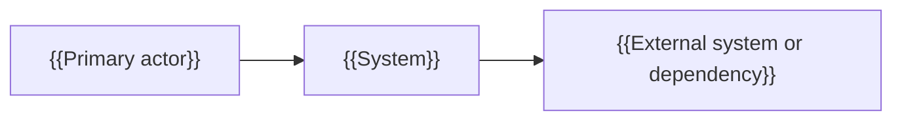
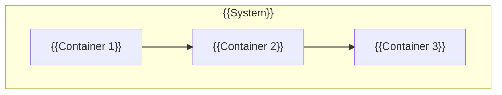
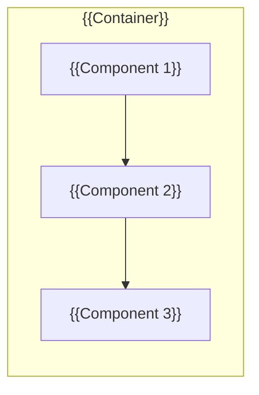
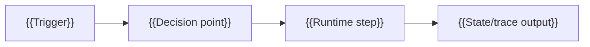
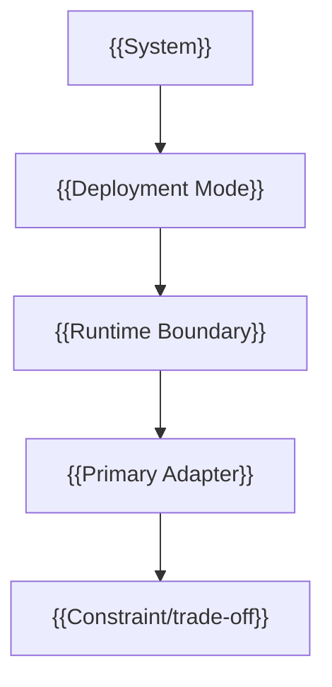

# {{ProjectName}} Architecture Design

This is the SpecCoding template for project-root `README_ArchDesign.md`. Create or update it from `SPEC_takeArchDesign` when a story changes module-context architecture, consuming-system context, architecture views, module boundaries, dependencies, data flow, runtime placement, or key decisions.

## Context

- Story link: {{.catdd/spec/doingUS/YYYYMMDD-UserStory.md or todo/done link}}
- Related overview: [README.md](README.md)
- Related detail design: [README_DetailDesign.md](README_DetailDesign.md)

## Module Context

| Item | Description |
| --- | --- |
| Target module | {{Module name}} |
| Module mission | {{What this module owns and why it exists}} |
| Public surface | {{API/commands/events exposed by this module}} |
| Out-of-module responsibilities | {{What this module explicitly does not own}} |

## Consuming-System Context

| Consumer System | Interaction | Contract Boundary | Failure/Trust Boundary |
| --- | --- | --- | --- |
| {{System A}} | {{How it uses this module}} | {{API/protocol/version boundary}} | {{error propagation, retry, ownership}} |
| {{System B}} | {{How it uses this module}} | {{API/protocol/version boundary}} | {{error propagation, retry, ownership}} |

## Architecture Goals

- {{Goal 1}}
- {{Goal 2}}
- {{Constraint}}

## Px-SpecFlow Architecture-Oriented Coverage

Declare how this architecture design handles the architecture-oriented SPEC surfaces defined by Px-SpecFlow. Mark each concern as covered here, delegated to an existing document, deferred to a later SPEC doc, or not applicable.

| Surface | Handling | Follow-up Trigger |
| --- | --- | --- |
| `README_UsageDesign.md` | {{covered/delegated/deferred/not applicable}} | {{When to create or update}} |
| `README_ErrorDesign.md` | {{covered/delegated/deferred/not applicable}} | {{When to create or update}} |
| `README_ResourceDesign.md` | {{covered/delegated/deferred/not applicable}} | {{When to create or update}} |
| `README_PerfDesign.md` | {{covered/delegated/deferred/not applicable}} | {{When to create or update}} |
| `README_CompatDesign.md` | {{covered/delegated/deferred/not applicable}} | {{When to create or update}} |
| `README_DiagnosisDesign.md` | {{covered/delegated/deferred/not applicable}} | {{When to create or update}} |
| `README_VerifyDesign.md` | {{covered/delegated/deferred/not applicable}} | {{When to create or update}} |
| `README_StateDesign.md` or ArchDesign state chapter | {{covered/delegated/deferred/not applicable}} | {{When to create or update}} |

## Architecture Views

Use Mermaid-renderable C4-style views or an equivalent explicit view model. Keep views high-level; detailed class/interface design belongs in `README_DetailDesign.md`.

### C4 Level 1: System Context View



### C4 Level 2: Container View



### C4 Level 3: Component View



### Runtime Execution View



### Deployment View



## Module Boundaries

| Module | Responsibility | Public Surface | Owned Data |
| --- | --- | --- | --- |
| {{Module}} | {{Responsibility}} | {{API/command/file}} | {{Data/state}} |

## Dependencies

| Dependency | Direction | Reason | Risk |
| --- | --- | --- | --- |
| {{Dependency}} | {{A -> B}} | {{Why needed}} | {{Risk or mitigation}} |

## Data Flow

```text
{{Input}} -> {{Component}} -> {{Output}}
```

## Embedded and Digital Media Architecture Points

Embedded software points:

- Hardware boundary: {{MCU/SoC/peripheral/driver boundary}}
- RTOS/task boundary: {{task/thread/ISR/timer ownership}}
- DMA/cache/bus path: {{DMA buffer, cache coherency, bus bandwidth risk}}
- Power/clock domain: {{sleep, wake, clock, reset, watchdog constraints}}

digital video/audio points:

- Media pipeline: {{capture/demux/decode/process/encode/render path}}
- Buffer topology: {{ring buffer, frame queue, audio queue, ownership handoff}}
- Format boundary: {{codec, sample format, pixel format, color space, container}}
- Sync boundary: {{PTS/DTS, clock source, A/V sync, jitter tolerance}}

## Key Decisions

| Decision | Rationale | Alternatives Considered | Status |
| --- | --- | --- | --- |
| {{Decision}} | {{Why}} | {{Alternative}} | {{Proposed/Accepted/Superseded}} |

## Risks and Constraints

- {{Risk or constraint}}
- {{Mitigation or follow-up}}

## Usage Example

Run from the repository root to instantiate this architecture template into a temporary file:

```bash
TMP_DOC="$(mktemp -d)/README_ArchDesign.md"
cp slashCommands/templates/README_ArchDesignTemplate.md "$TMP_DOC"
sed -n '1,100p' "$TMP_DOC"
```

Expected result: the temporary file shows architecture sections for views, boundaries, dependencies, data flow, and decisions.

## Review Checklist

- Architecture decisions are traceable to a user story or project constraint.
- Mermaid-renderable C4-style context, container, component, runtime, and deployment views are present or explicitly marked not applicable.
- Px-SpecFlow architecture-oriented surfaces are covered, delegated, deferred, or marked not applicable.
- Module boundaries are explicit enough for implementation and review.
- Dependency direction and risks are visible.
