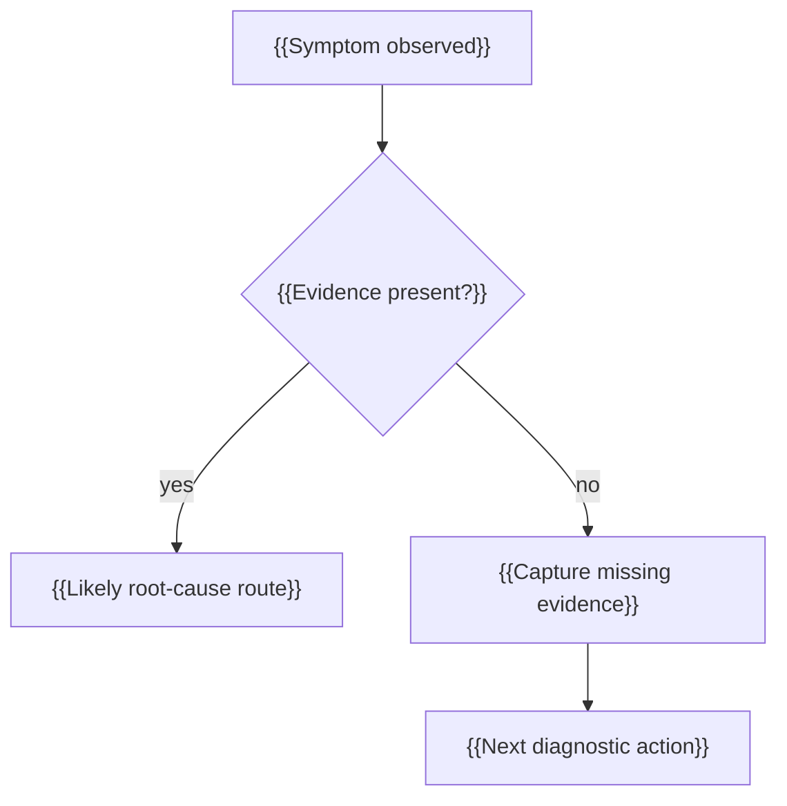

# {{ProjectName}} Diagnosis Design

This is the SpecCoding template for project-root `README_DiagnosisDesign.md`. Create or update it from `SPEC_takeDetailDesign` when a story, bug, field issue, CI failure, or quality failure needs diagnostic evidence, runtime symptoms, logs, counters, traces, debug hooks, or root-cause routing.

## Story or Issue Context

- Story or issue: {{US identifier, bug id, field issue id, or CI failure}}
- Source artifact: {{.catdd/spec/doingUS path, issue link, log bundle, or reproduction link}}
- Related detail design: [README_DetailDesign.md](README_DetailDesign.md)
- Related state design: [README_StateDesign.md](README_StateDesign.md)
- Related performance design: [README_PerfDesign.md](README_PerfDesign.md)
- Related verification design: [README_VerifyDesign.md](README_VerifyDesign.md)

## Symptom Model

| Symptom | User/System Observation | Severity | Frequency | Trigger | First Triage Question |
| --- | --- | --- | --- | --- | --- |
| {{Symptom}} | {{Observable behavior}} | {{Severity}} | {{Always/intermittent/rare}} | {{Trigger condition}} | {{question that separates likely causes}} |

## Symptom to Evidence Map

<!-- How: A diagnosis design is useful only if symptoms route to evidence and next action.
	Avoid adding logs without stating which question each log answers. -->

| Symptom | Hypothesis | Evidence Needed | Evidence Proves / Disproves | Missing Evidence Risk |
| --- | --- | --- | --- | --- |
| {{symptom}} | {{likely cause}} | {{log/counter/trace/snapshot/repro}} | {{what conclusion becomes possible}} | {{what remains unknowable}} |

## Evidence to Capture

| Evidence | Source | Capture Method | Retention | Privacy/Safety Note |
| --- | --- | --- | --- | --- |
| {{Log/counter/trace/snapshot}} | {{Module/device/tool}} | {{How to capture}} | {{Duration/location}} | {{Redaction or safety concern}} |

## Diagnostic Hooks

| Hook | Signal | Capture Trigger | Correlation Key | Cost / Safety Limit |
| --- | --- | --- | --- | --- |
| Logging hook | {{log category, level, timestamp source}} | {{when emitted}} | {{correlation id}} | {{redaction/rate limit}} |
| Counter hook | {{counter name, increment condition, reset policy}} | {{when updated}} | {{scope labels}} | {{cardinality limit}} |
| Trace hook | {{tracepoint, span, event id, sampling rule}} | {{when sampled}} | {{trace/span id}} | {{sampling/cost limit}} |
| Snapshot hook | {{state/register/buffer/crash dump}} | {{trigger condition}} | {{artifact id}} | {{privacy/safety/storage limit}} |
| Reproduction hook | {{script, captured input, stream segment, seed, config}} | {{when captured}} | {{repro id}} | {{retention/safety limit}} |

## Root-Cause Routing

| Evidence Pattern | Likely Area | Next Command or Action | Owner |
| --- | --- | --- | --- |
| {{Pattern}} | {{Design/test/code/config/hardware/media path}} | {{SPEC_updateDetailDesign/SPEC_designUnitTests/SPEC_abortUserStory/SPEC_importIssue}} | {{Owner}} |

## Diagnosis Decision Tree



## CaTDD Verification Handoff

| Feature Token | Category Token | Suggested Test File | Diagnosis Concern | Notes |
| --- | --- | --- | --- | --- |
| `{{feature_token}}` | `funcInvalidFault` | `test_{{feature_token}}_funcInvalidFault.{{ext}}` | {{fault emits diagnosable evidence}} | {{TC seeds or `@[NoTestPoints]: <reason>`}} |
| `{{feature_token}}` | `qualityRobust` | `test_{{feature_token}}_qualityRobust.{{ext}}` | {{repeated/intermittent issue remains diagnosable}} | {{TC seeds or `@[NoTestPoints]: <reason>`}} |
| `{{feature_token}}` | `qualityConfiguration` | `test_{{feature_token}}_qualityConfiguration.{{ext}}` | {{diagnostic hook config, sampling, or redaction behavior}} | {{TC seeds or `@[NoTestPoints]: <reason>`}} |

## Embedded and Digital Media Diagnosis Points

Embedded software points:

- Reset evidence: {{reset reason, watchdog status, boot count, brownout flag}}
- Hardware snapshot: {{registers, GPIO, peripheral status, DMA descriptor state}}
- Timing evidence: {{ISR timestamp, timer drift, task runtime, scheduling gap}}
- Resource evidence: {{stack watermark, heap high-water mark, DMA buffer watermark}}

digital video/audio points:

- Media timeline evidence: {{PTS/DTS, clock source, discontinuity, drift sample}}
- Buffer evidence: {{queue depth, frame drop counter, underrun/overrun counter}}
- Quality evidence: {{glitch, stutter, lip-sync error, artifact classification}}
- Stream evidence: {{codec/container metadata, captured segment, seek/flush point}}

## Usage Example

Run from the repository root to instantiate this diagnosis-design template into a temporary file:

```bash
TMP_DOC="$(mktemp -d)/README_DiagnosisDesign.md"
cp slashCommands/templates/README_DiagnosisDesignTemplate.md "$TMP_DOC"
sed -n '1,120p' "$TMP_DOC"
```

Expected result: the temporary file shows symptom, evidence, diagnostic hook, and root-cause routing sections.

## Review Checklist

- Each important symptom has explicit evidence to capture.
- Each diagnostic signal answers a specific triage question or hypothesis.
- Diagnostic hooks are actionable in development, CI, or field debugging.
- Diagnostic hooks include correlation, cost, privacy, and safety limits.
- Root-cause routing has a decision tree or equivalent explicit routing model.
- CaTDD handoff maps diagnosability behavior to Fault, Robust, or Configuration categories.
- Embedded software hardware evidence and digital video/audio media evidence are covered when relevant.
