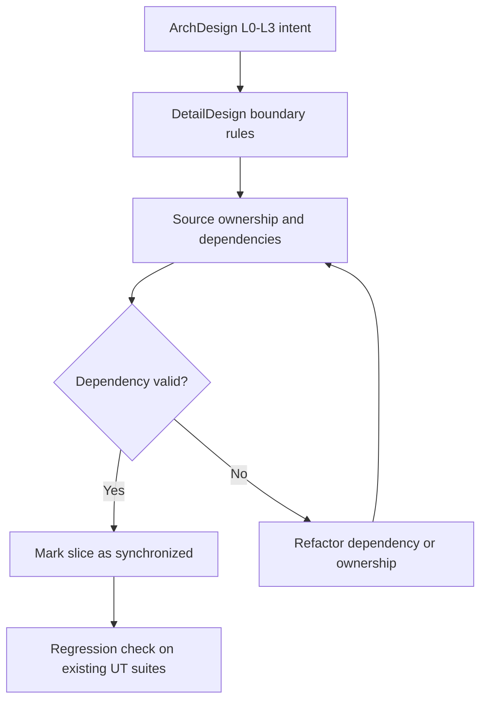

# Synchronize Layered Architecture Across Arch, Detail Design, and Source Implementation

> **Story ID:** US-8 | **State:** aborted | **Priority:** P1
> **Source:** `.catdd/spec/analyzedNews/20260709-sync-ArchDesign2DetailDesign2SrcImpl-Issue.md`
> **Related Closed Story:** `.catdd/spec/doneUS/20260704-reArchDesign-LayeredArchitecture-UserStory.md`
> **CaTDD Class:** P1 Design
> **Primary Category:** Capability
> **Created:** 2026-08-02
> **Opened On:** 2026-08-02 by `SPEC_openUserStory`
> **Aborted On:** 2026-08-07 by `SPEC_abortUserStory`

---

## Active Work Status

- Lifecycle state: aborted
- Open checkpoint: moved from `.catdd/spec/todoUS/` to `.catdd/spec/doingUS/` by `SPEC_openUserStory`
- Abort checkpoint: moved from `.catdd/spec/doingUS/` to `.catdd/spec/abortUS/` by `SPEC_abortUserStory`
- Branch checkpoint: dedicated branch created and switched: `spec/us8-sync-arch-detail-srcimpl` (2026-08-02)

---

## Abort Decision Record

- primary_gap_type: implementation-gap
- problem_summary: codeAgent misunderstand my refactor architecture design purpose
- evidence_refs:
  - UT_UT8*
- unsafe_if_continue: totally misunderstand my purpose
- followup_intent: undecided

### Follow-up Intent Note

- Developer follow-up intent is currently undecided.
- Per command guard default, evidence-first follow-up should start from `SPEC_analyzeAbortedUserStory` unless developer later chooses `SPEC_importIssue`.

### Unresolved Questions

- Which exact US-8 TC set should be rewritten first to align strictly with refined architecture implementation behavior?
- Should README-driven checks be fully removed from US-8 UT files or moved into a separate governance-only suite?

---

## Story Statement

**As a** maintainer of IOC architecture and implementation,
**I want** the L0-L3 layering decisions in architecture and detail design to be synchronized with current source boundaries,
**So that** the implemented codebase reflects the approved layered design and future test/design work can rely on consistent dependency rules.

---

## Mode Decision

- `analysis_mode`: BRAINSTORM (default)
- `analysis_depth`: detailed
- Why this mode: no explicit `AUTONOMOUS` request was provided.
- Clarification status: developer confirmed concrete layer/file families, core object model anchors, and merge intent for architecture/detail/source synchronization.
- Resulting decision: story updated with explicit scope and completion checks; ready for open.

---

## Story Readiness Snapshot

| Lens | Answer | Evidence |
| --- | --- | --- |
| User value is explicit | yes | reducing architecture/implementation drift for maintainers |
| Observable outcome exists | yes | layer ownership and dependency checks are defined for header-to-source families and core/proto/plat files |
| Concrete examples exist | yes | explicit examples: `IOC_SrvAPI.h -> IOC_SrvAPI.c`, core files (`_Core_*`), protocol files (`_Proto_*`), platform files (`_Plat_*`) |
| Blocking questions remain | no | prior blockers answered by developer clarification |
| Story size is acceptable | yes | bounded to layered sync and evidence merge for current hierarchy |
| Ready decision | Ready | scope and completion checks are explicit enough for lifecycle opening |

---

## Priority

| Dimension | Score (1-9) | Rationale |
| --- | --- | --- |
| Business Value | 8 | protects maintainability and lowers regression risk from architecture drift |
| User Value | 7 | developers gain consistent design-to-code traceability |
| Cost / Effort | 6 | cross-artifact and source-boundary synchronization may touch multiple files |
| Risk / Complexity | 6 | boundary mistakes can break layering intent or existing tests |

**Priority Score:** (8 + 7) / (6 + 6) = **1.25** | **Priority:** **P1**

---

## Issue Analysis & Insights

### Evidence Inventory

| Source | Key Fact | Confidence | Gap |
| --- | --- | --- | --- |
| `.catdd/spec/analyzedNews/20260706-reArchImpl-LayeredArch-Issue.md` | Prior implementation-sync attempt existed and was later aborted as US-6 | high | exact retained-vs-rejected details not in this issue |
| `.catdd/spec/pendingNews/20260709-sync-ArchDesign2DetailDesign2SrcImpl-Issue.md` | asks to sync ArchDesign, DetailDesign, and source implementation | high | none after clarification |
| `README_ArchDesign.md` | layered L0-L3 architecture exists as reference intent | high | none for baseline boundary rules |
| `README_DetailDesign.md` | detail-level contracts exist and should align with implementation | medium | detailed mismatch list still to be enumerated during open story execution |
| Developer clarification (2026-08-02) | file-family ownership rules and structural object anchors are explicit (`_IOC_SrvObject_T`, `_IOC_LinkObject_T`, `_IOC_ProtoObject_T`) | high | none for readiness gate |

### Observed vs Expected Delta

- Observed: architecture documents define layered intent, but source is reported as transitional/mixed.
- Expected: source boundaries and dependencies follow documented L0-L3 layering decisions.

### Root-Cause Hypotheses and Disconfirming Checks

| Hypothesis | Confidence | Disconfirming Check |
| --- | --- | --- |
| Previous refactor closed at design level but source migration criteria remained under-specified | medium | verify whether `README_DetailDesign.md` includes file-level migration completion criteria |
| Layer ownership map exists but is not fully bound to current source tree | medium | compare ownership map entries against `Source/` current responsibilities |
| Story scope is oversized and needs sequential slices | high | split by module boundary and verify each slice independently |

### Insight Map

| Insight Type | Insight | Confidence | Route |
| --- | --- | --- | --- |
| Requirement | "synchronized" needs explicit pass criteria | high | Initial Acceptance Question |
| Architecture/design | L0-L3 dependency direction must be re-verified at source level | medium | Acceptance Criteria + tests |
| Test | need a deterministic layering-verification checklist in `README_VerifyDesign.md` | medium | sub-UserStory candidate |
| Risk | broad sync can cause hidden behavior regressions | medium | split and prioritize slices |
| Process | prior abort evidence implies need for scoped, checkable increments | high | split recommendation |

---

## Example Mapping

| Card | ID | Content | Trace / Decision |
| --- | --- | --- | --- |
| Yellow Story | US-8 | Sync layered architecture intent from docs into source boundaries | pending issue 20260709 |
| Blue Rule | RULE-1 | Source dependency direction must satisfy documented L0-L3 constraints | AC seed |
| Blue Rule | RULE-2 | Source ownership should map to architecture/design responsibilities | AC seed |
| Blue Rule | RULE-3 | File-family layering must follow naming boundaries (`_Core_*`, `_Proto_*`, `_Plat_*`) and interface-to-implementation pairing | AC seed |
| Green Example | EX-1 | Source file in higher layer does not directly depend on lower-forbidden concrete implementation | Scenario 1 |
| Green Example | EX-2 | Interface header to source pair consistency such as `IOC_SrvAPI.h -> IOC_SrvAPI.c` | Scenario 2 |
| Green Counter-Example | CEX-1 | Cross-layer direct include/call bypasses approved boundary | Fault seed |
| Pink Question | Q-1 | Which exact files/modules are in-scope for the first synchronization slice? | answered |
| Pink Question | Q-2 | What objective condition marks this story "synchronized" and done? | answered |

**Example Mapping Decision:** Ready

---

## Visual Model

### Model Gap Analysis

| # | Gap Found | Question |
| --- | --- | --- |
| 1 | detailed file-by-file mismatch inventory is not yet listed | Enumerate current source files per layer during `SPEC_openUserStory` kickoff and mark mismatches |

---

## Acceptance Criteria

### Scenario 1: Layer Dependency Direction Compliance

**Example Trace:** EX-1  
**Rule:** RULE-1  
**Given** architecture and detail design declare allowed L0-L3 dependency directions  
**When** source dependencies are inspected for the selected synchronization slice  
**Then** no forbidden cross-layer dependency remains in that slice

| Concrete Examples | Counter-Examples |
| --- | --- |
| L3 orchestration depends on documented interfaces rather than bypassing lower-layer contracts | L3 directly invokes a forbidden L0 concrete operation |

**Open Questions:** None.

### Scenario 2: Ownership Mapping Consistency

**Example Trace:** EX-2  
**Rule:** RULE-2  
**Given** architecture/design define responsibilities per layer  
**When** each in-scope source file is mapped to one layer ownership role  
**Then** ownership classification is explicit and conflicts are resolved

| Concrete Examples | Counter-Examples |
| --- | --- |
| each touched source file has one documented layer owner and header-to-source pairing (for example `IOC_SrvAPI.h -> IOC_SrvAPI.c`) is preserved | file responsibilities overlap layers without approved boundary rationale |

**Open Questions:** None.

### Scenario 3: File-Family Layer Contract Is Enforced

**Example Trace:** EX-3  
**Rule:** RULE-3  
**Given** the layered source hierarchy uses family naming and object anchors  
**When** implementation files are reviewed against family conventions and object ownership  
**Then** `_Core_Service.c`, `_Core_Event.c`, `_Core_Objects.c` remain core layer, `_Proto_FIFO.c`, `_Proto_UDP.c` remain protocol layer, `_Plat_Filesystem.c`, `_Plat_Network.c`, `_Plat_ProcessThread.c` remain platform layer, and ownership stays consistent with `_IOC_SrvObject_T`, `_IOC_LinkObject_T`, `_IOC_ProtoObject_T`

| Concrete Examples | Counter-Examples |
| --- | --- |
| `_Proto_UDP.c` only depends on allowed protocol/platform seams | `_Core_Event.c` directly hosts protocol-specific behavior that should be in `_Proto_*` |

**Open Questions:** None.

---

## Business Rules

| ID | Rule | Type | Implied Functional Requirement |
| --- | --- | --- | --- |
| BR-1 | Layer dependency direction must follow documented architecture constraints | Constraint | source dependency checks must reject forbidden layer bypasses |
| BR-2 | Implementation ownership must remain traceable to design-level responsibilities | Fact | each changed source artifact needs explicit layer mapping |
| BR-2a | Public interface sets should map to corresponding implementation source pairs | Constraint | interface-to-implementation pairing checks are part of sync verification |
| BR-3 | Synchronization changes must preserve existing validated behavior | ActionEnabler | run regression-focused verification after each sync slice |
| BR-4 | Layer families and object anchors define primary ownership boundaries (`_Core_*`, `_Proto_*`, `_Plat_*`; `_IOC_SrvObject_T`, `_IOC_LinkObject_T`, `_IOC_ProtoObject_T`) | Fact | source ownership review must include family and object-anchor consistency |

**Business Rule Decision:** thresholds clarified by developer; proceed to open story.

---

## Sub-UserStory Candidates

| Candidate | CaTDD Class / Category | Why It Is Not In Main AC | Recommendation | Status |
| --- | --- | --- | --- | --- |
| Layering verification checklist standardization | P1 Design / Capability | process artifact can be delivered separately from first source sync slice | create sub-UserStory if manual guard drift appears | deferred |
| Dependency-graph automated check in CI | P2 Quality / Robust | automation is valuable but not required to define first manual sync acceptance | ask acceptance question | open |

**Split Decision:** keep as one openable story with explicit layered scope and evidence merge.

---

## Scope

**In scope:**

- synchronize architecture/detail/source layering using explicit file families and object anchors
- verify header-to-source pairing consistency for public IOC interface sets
- verify ownership and dependency direction for core (`_Core_*`), protocol (`_Proto_*`), and platform (`_Plat_*`) source groups
- merge architecture/detail/source evidence into one consistent layered story baseline

**Non-goals:**

- complete whole-repository layering migration in one story
- redesign architecture semantics beyond already approved L0-L3 intent

---

## Risks & Assumptions

| # | Risk / Assumption | Severity | Mitigation / Clarification Needed |
| --- | --- | --- | --- |
| 1 | refactor may still expose hidden ownership collisions despite clarified families | Medium | enforce scenario 2 and 3 checks during open-story execution |
| 2 | some legacy files may contain mixed responsibilities | Medium | record mismatch inventory and decide migrate vs defer explicitly |
| 3 | fixing layering may inadvertently alter runtime behavior | Medium | require regression verification on touched behavior |

---

## Initial Acceptance Questions

| # | Question | Raised By | Blocks Ready? | Owner / Next Evidence | Status |
| --- | --- | --- | --- | --- | --- |
| 1 | Which concrete file/module set is in scope for the first synchronization slice? | Example Mapping Q-1 | no | developer clarified interface/core/proto/plat families | answered |
| 2 | What objective criteria define "sync complete" for this story? | Example Mapping Q-2 | no | dependency-direction + ownership + pairing checks satisfied and evidence merged | answered |
| 3 | Should this story start from the US-6 abort evidence route instead? | process insight | no | developer confirmed merge direction for this story | answered |

**Gate:** This story is **READY** for `SPEC_openUserStory`.

---

## Ambiguity Warnings

| # | Ambiguous Term | Found In Section | Clarifying Question |
| --- | --- | --- | --- |
| 1 | "sync" | raw issue title/content | Resolved as dependency-direction compliance, ownership mapping consistency, interface-source pairing, and merged architecture/detail/source evidence |

---

## Traceability

| From → To | Link |
| --- | --- |
| This story → Raw input | `.catdd/spec/analyzedNews/20260709-sync-ArchDesign2DetailDesign2SrcImpl-Issue.md` |
| Project story index | `README_UserStories.md` |
| Related closed story | `.catdd/spec/doneUS/20260704-reArchDesign-LayeredArchitecture-UserStory.md` |
| This story ID | `US-8` |
