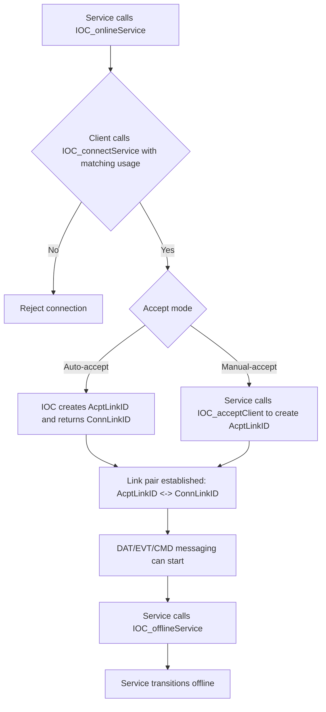

# Establish IOC Link Between Service and Client

> **Story ID:** US-1 | **State:** doing-open | **Priority:** P1
> **Source:** `.catdd/spec/analyzedNews/20260617-EstablishedLink-Feature.md`
> **Created:** 2026-06-19

---

## Active Work Status

- Current status: opened in `.catdd/spec/doingUS/` via `SPEC_openUserStory`.
- Next recommended command: `SPEC_implUnitTests`.
- Paired task artifact: `.catdd/spec/doingUS/20260618-TASKs.md`.
- Requirement artifacts updated by `SPEC_updateUserStory`:
	- `README_UserStories.md`
	- `README_UserGuide.md`
- Detail design artifacts updated by `SPEC_takeDetailDesign`:
	- `README_DetailDesign.md`
	- `README_StateDesign.md`

### Detail Design Review Result

**Review finding:** `PASS`

**Evidence summary:**

- Detail design traces AC-1/AC-2/AC-3 to explicit interface and behavior paths (`IOC_onlineService`, `IOC_connectService`, `IOC_acceptClient`, `IOC_offlineService`) and includes timeout/incompatible-usage handling.
- State design defines lifecycle transitions, guards, failure behavior, and shared-state synchronization for service state, pending queue, and link-pair mapping.
- Design remains aligned with project context boundaries (C static-library target, Service/Link model, DAT/EVT/CMD semantics) and does not introduce cross-module architecture changes.
- Acceptance criteria are testable and ready for CaTDD US/AC/TC skeleton design.

**Residual risks (non-blocking):**

- Pending-request selection policy in manual mode (strict FIFO vs policy-based selection) should be fixed before implementation detail hardening.
- KEEP_ACCEPTED_LINK follow-up operational policy remains open and should be clarified in implementation/test design notes.

**Follow-up command executed:** `SPEC_designUnitTests`

### Unit-Test Design Result

**Design finding:** `READY`

**Evidence summary:**

- Project-root verification strategy was created in `README_VerifyDesign.md` with P0-first gating, selective P1 promotion, and deferred P2 rationale.
- CaTDD split skeleton test files were created in `Test/UT_US1_Service_*.cxx` with explicit SUT declaration and US/AC/TC mappings.
- P0 Functional skeleton set (Typical, Edge, Misuse, Fault) is complete for US-1.
- P1 State and Capability skeletons are included using `README_StateDesign.md` and `README_DetailDesign.md` as design sources.
- Concurrency and P2 quality categories are explicitly deferred with rationale due to missing design surfaces and US-2 ownership.

**Next recommended command:** `SPEC_implUnitTests`

---

## Requirement Update Checklist

- [x] Create/update project `README_UserStories.md` ledger with TODO/DOING/DONE and AC trace/status.
- [x] Align paired `README_UserGuide.md` with active story requirement intent and scope.
- [x] Preserve US/AC traceability to active story and analyzed source.
- [x] Review requirement updates via `SPEC_reviewUserStory` before design progression.

**Review Result:** `PASS`

## Review Notes

- `README_UserStories.md` reflects the active story and lifecycle state.
- `README_UserGuide.md` matches the requirement intent and usage scope for US-1.
- US-1 is requirement-stable and ready to proceed to detail design.

## Detail Design Notes

- `README_DetailDesign.md` now defines AC-to-design impacts, interface behavior, lifecycle behavior flow, and error/edge handling for US-1.
- `README_StateDesign.md` now defines service lifecycle transitions, pending-connect resolution, and shared-state ownership/synchronization for link establishment.
- Open design questions were preserved without blocking progression to detail-design review.

---

## Mutual Intent Contract

| Field | Agreement |
|---|---|
| Developer intent | Clear story intent first, then run `SPEC_makePlan` for this active story. Deliver the P0 functional Established Link scope as currently defined in US-1. |
| CodeAgent intent | Keep execution constrained to US-1 in `doingUS`, preserve current acceptance/boundary decisions, and route planning through `SPEC_makePlan` before design or implementation. |
| In-scope work | Service/client link establishment flow: `IOC_onlineService` -> `IOC_connectService` -> `IOC_acceptClient` (manual path) -> `IOC_offlineService` effects, including timeout semantics already captured in this story. |
| Out-of-scope work | Reconnection strategy, P1/P2 follow-up slices (including concurrency design story US-2), and payload-level DAT/EVT/CMD behavior beyond link establishment scope. |
| Success signal | Story intent remains stable and unambiguous, with planning ready to produce explicit next SPEC steps and task artifact via `SPEC_makePlan`. |
| Assumptions | Header contracts under `Include/IOC/*.h` remain the source of truth; previously answered acceptance questions in this story remain valid. |
| Open questions | None that block planning for US-1. Follow-up design questions are tracked in US-2. |

**Review Result:** `CLEARED`

---

## Story Statement

<!-- Technique: write-user-story -->

**As a** developer integrating IOC Service and Client applications,
**I want** IOC to establish a bidirectional link pair (`AcptLinkID <-> ConnLinkID`) from service-online to client-connect, where accept mode is determined by `SrvArgs` during `IOC_onlineService`,
**So that** both endpoints can reliably start DAT/EVT/CMD messaging on valid link IDs.

---

## Priority

<!-- Technique: prioritize-requirements -->

| Dimension | Score (1-9) | Rationale |
|---|---|---|
| Business Value | 9 | Link establishment is the prerequisite capability for all IOC communication roles. |
| User Value | 8 | Integrators cannot exercise DAT/EVT/CMD APIs until link setup succeeds. |
| Cost / Effort | 4 | Core control-path behavior; moderate implementation and test effort. |
| Risk / Complexity | 4 | Remaining uncertainty is mainly timeout handling. |

**Priority Score:** (9 + 8) / (4 + 4) = **2.13** | **Priority:** **P1**

---

## Visual Model

<!-- Technique: elicit-requirements-models -->

### Model Gap Analysis

| # | Gap Found | Question |
|---|---|---|
| 1 | Reject path behavior details are partially specified. | For usage mismatch, should tests assert specifically `IOC_RESULT_INCOMPATIBLE_USAGE`? |
| 2 | KEEP and CLOSE flag semantics need edge-condition detail. | For KEEP mode, are links preserved until peer disconnect only, or can service later force-close them without re-online? |
| 3 | Retry branch is still product-level policy. | Timeout is supported via `IOC_OPTID_TIMEOUT`; should retry remain out of scope for this story? |

---

## Acceptance Criteria

<!-- Techniques: write-user-story + facilitate-example-mapping -->

### Scenario 1: Auto-Accept Establishment

**Rule:** Accept mode is determined by `SrvArgs` when `IOC_onlineService` is called. If mode is auto-accept and usage is compatible, IOC must establish a link pair without explicit service accept call.
**Given** Service App calls `IOC_onlineService()` successfully with valid `SrvID` and compatible usage capability
**When** Client App calls `IOC_connectService()` with matching usage
**Then** IOC establishes valid link pair (`AcptLinkID <-> ConnLinkID`) and returns success (`ConnLinkID`) to client

| Concrete Examples | Counter-Examples |
|---|---|
| Service online as DAT receiver, client connects as DAT sender, callback configured, both IDs returned | Service online without compatible usage, client requests unsupported usage, connection rejected |

**Open Questions:** None.

### Scenario 2: Manual-Accept Establishment

**Rule:** In manual-accept mode, IOC must not finalize link pair until service explicitly accepts pending client.
**Given** Service App is online in manual-accept mode and client has requested connection
**When** Service App calls `IOC_acceptClient(SrvID, &AcptLinkID, pOption)` for that pending client
**Then** IOC establishes valid link pair (`AcptLinkID <-> ConnLinkID`) and both sides can invoke messaging APIs on their link IDs

| Concrete Examples | Counter-Examples |
|---|---|
| Pending client exists, service accepts once, link pair becomes active | Service never calls accept, client remains pending and cannot send DAT/EVT/CMD |

**Open Questions:** None. Connection wait is bounded by `IOC_connectService` timeout configuration via `IOC_OPTID_TIMEOUT`.

### Scenario 3: Service Offline Lifecycle Transition

**Rule:** Service flags configured in `SrvArgs` at `IOC_onlineService` (notably `IOC_SRVFLAG_KEEP_ACCEPTED_LINK`) determine whether established links are kept or closed when `IOC_offlineService` is called, and service offline operation must stop new connection establishment for that service.
**Given** At least one service instance exists and service may have established link(s)
**When** Service App calls `IOC_offlineService(SrvID)`
**Then** no new `IOC_connectService()` should succeed for that service until it is online again

| Concrete Examples | Counter-Examples |
|---|---|
| Service offlines with KEEP flag, existing links stay valid and new connects fail | Service offlines but new connect still succeeds |
| Service offlines with CLOSE flag, existing links are closed and new connects fail | Service offlines but links stay open despite CLOSE flag |

**Open Questions:** None.

---

## Business Rules

<!-- Technique: extract-business-rules -->

| ID | Rule | Type | Implied Functional Requirement |
|---|---|---|---|
| BR-1 | Service must be online before client can establish link. | Constraint | IOC shall reject connect attempts to offline service. |
| BR-2 | Client usage must match service capability. | Constraint | IOC shall validate usage compatibility during connect. |
| BR-3 | Auto-accept mode creates accepted link automatically. | Action Enabler | IOC shall allocate `AcptLinkID` without explicit service accept call in auto mode. |
| BR-4 | Manual-accept mode requires service acceptance for finalization. | Constraint | IOC shall keep client pending until `IOC_acceptClient` succeeds. |
| BR-5 | Link IDs are paired for bidirectional communication. | Fact | IOC shall expose both endpoint IDs as correlated pair for message operations. |
| BR-6 | Service offline ends availability for new connections. | Constraint | IOC shall block new connection establishment once service is offline. |
| BR-7 | Service offline keep-or-close behavior is controlled by service flags set at online time. | Action Enabler | IOC shall preserve or close established links according to `SrvArgs.Flags` (notably `IOC_SRVFLAG_KEEP_ACCEPTED_LINK`) when `IOC_offlineService` is executed. |
| BR-8 | Connect timeout is configurable through options. | Action Enabler | IOC shall support timeout-controlled connect attempts via `IOC_OPTID_TIMEOUT` and report timeout result. |
| BR-9 | Usage compatibility follows complementary mapping rules. | Constraint | IOC shall reject incompatible usage combinations according to documented service/client mapping. |

---

## P0 Functional Category Mapping

<!-- CaTDD P0 Functional = ValidFunc(Typical + Edge) + InvalidFunc(Misuse + Fault) -->

### Typical (ValidFunc)

| # | Condition | Expected Behavior | AC Seed | TC Seed |
|---|---|---|---|---|
| T1 | Service online, compatible usage, AUTO_ACCEPT enabled | Link pair established and client receives success `ConnLinkID` | AS-1 | verifyConnect_byAutoAcceptCompatibleUsage_expectSuccess |
| T2 | Service online, compatible usage, manual accept path | Link pair established after `IOC_acceptClient` | AS-2 | verifyConnect_byManualAcceptPendingClient_expectSuccess |

### Edge (ValidFunc)

| # | Condition | Expected Behavior | AC Seed | TC Seed |
|---|---|---|---|---|
| E1 | AUTO_ACCEPT enabled but callback not configured | Link establishment still succeeds without callback delivery | AS-1 | verifyConnect_byAutoAcceptWithoutCallback_expectSuccess |
| E2 | Connect timeout option set and service response exceeds timeout | `IOC_connectService` returns `IOC_RESULT_TIMEOUT` | AS-1/AS-2 | verifyConnect_byTimeoutOptionExceeded_expectTimeout |
| E3 | Service offline with KEEP flag | Existing links remain valid; new connects fail | AS-3 | verifyOffline_byKeepAcceptedLinkFlag_expectKeepExistingRejectNew |
| E4 | Service offline with CLOSE flag | Existing links close; new connects fail | AS-3 | verifyOffline_byCloseAcceptedLinkDefault_expectCloseExistingRejectNew |

### Misuse (InvalidFunc)

| # | Condition | Expected Behavior | AC Seed | TC Seed |
|---|---|---|---|---|
| M1 | Client requests usage incompatible with service capabilities | Connection rejected with `IOC_RESULT_INCOMPATIBLE_USAGE` | AS-1 | verifyConnect_byIncompatibleUsage_expectIncompatibleUsage |
| M2 | Client connects before service online | Connection rejected and no link ID allocated | AS-1 | verifyConnect_byServiceOffline_expectConnectionFailed |

### Fault (InvalidFunc)

| # | Condition | Expected Behavior | AC Seed | TC Seed |
|---|---|---|---|---|
| F1 | Service transitions offline while client is pending manual accept | Pending request is resolved by deterministic failure/cleanup path | AS-2/AS-3 | verifyPendingAccept_byServiceOfflineTransition_expectResolvedFailure |
| F2 | Dependency/runtime failure occurs while handling connect request context under valid caller behavior | Request fails cleanly with deterministic cleanup/diagnostic behavior | AS-1/AS-2 | verifyConnect_byRuntimeFailureDuringConnect_expectGracefulFailure |

---

## Scope

**In scope:**

- `IOC_onlineService` + `IOC_connectService` path to establish paired link IDs.
- Auto-accept and manual-accept mode behavior for initial link establishment.
- Service offline effect on future connection establishment.

**Non-goals:**

- DAT/EVT/CMD payload semantics after link establishment.
- Retry/backoff design and timeout policy finalization.
- Reconnection behavior and strategy.
- Concurrency/race-condition design tests, which belong in a separate P2/P3 design slice.
- Performance and multi-client fairness optimization.

---

## Risks & Assumptions

| # | Risk / Assumption | Severity | Mitigation / Clarification Needed |
|---|---|---|---|
| 1 | Accept mode selection must be implemented exactly from `SrvArgs` at service-online time. | Medium | Add tests for both mode configurations from `SrvArgs`. |
| 2 | Offline flag semantics must be implemented consistently across all established links. | Medium | Add tests for both KEEP and CLOSE paths in offline transition. |
| 3 | Retry policy after timeout/failure is not fixed. | Medium | Keep retry out of scope for this story unless explicitly requested. |
| 4 | Assume IOC header contracts stay stable in `Include/IOC/*.h`. | Medium | Revalidate story against header changes before implementation. |

---

## Initial Acceptance Questions

<!-- Gate: story is NOT ready for SPEC_openUserStory if any question is open -->

| # | Question | Raised By | Status |
|---|---|---|---|
| 1 | Which mode is default for first implementation target: auto-accept or manual-accept? Answer: mode is determined by `SrvArgs` during `IOC_onlineService`. | developer decision | answered |
| 2 | What is required behavior for already-established links after `IOC_offlineService()`? Answer: behavior is determined by offline flag (keep or close). | developer decision | answered |
| 3 | Must connection timeout and retry semantics be defined in this story? Answer: timeout semantics are in scope via `IOC_OPTID_TIMEOUT` and `IOC_RESULT_TIMEOUT`; retry policy remains deferred. | header evidence + scope decision | answered |
| 4 | Is reconnection behavior part of this story or a follow-up story? Answer: reconnection is out of scope for this story and deferred to a follow-up story. | developer decision | answered |

**Gate:** This story is **READY** for `SPEC_openUserStory` because all initial acceptance questions are answered.

---

## Ambiguity Warnings

<!-- Technique: validate-requirements-criteria -->

| # | Ambiguous Term | Found In Section | Clarifying Question |
|---|---|---|---|
| 1 | "valid SrvID" | Acceptance Criteria | What exact validity checks define valid `SrvID`? |
| 2 | "matching usage" | Acceptance Criteria | Use documented complementary capability mapping from `IOC_ConnArgs` contract; no strict-equality interpretation. |
| 3 | "success" | Acceptance Criteria | For connect path, success is `IOC_RESULT_SUCCESS`; for timeout path, expected is `IOC_RESULT_TIMEOUT`. |
| 4 | "pending" | Scenario 2 | Is there a timeout window and lifecycle state model for pending clients? |

---

## Traceability

| From → To | Link |
|---|---|
| This story → Raw input | `.catdd/spec/analyzedNews/20260617-EstablishedLink-Feature.md` |
| Project story index | `README_UserStories.md` |
| This story ID | `US-1` |
