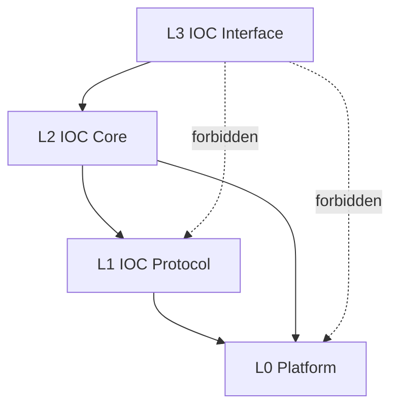

# Re-architect IOC into Explicit L0-L3 Layers

> **Story ID:** US-4 | **State:** doing-open | **Priority:** P1
> **Source:** `.catdd/spec/analyzedNews/20260624-reArchDesign-Issue.md`
> **CaTDD Class:** P1 Design
> **Primary Category:** Capability
> **Created:** 2026-07-04

---

## Active Work Status

- Current status: opened in `.catdd/spec/doingUS/` via `SPEC_openUserStory`.
- Architecture baseline created: `README_ArchDesign.md` via `SPEC_takeArchDesign`.
- Architecture review result: `PASS` after re-gate `SPEC_reviewArchDesign`.
- Architecture revision applied: `README_ArchDesign.md` updated via `SPEC_updateArchDesign`.
- Next recommended command: `SPEC_takeDetailDesign`.

---

## Mutual Intent Contract (SPEC_clearStoryIntent)

### Developer Intent

- Re-architect IOC into explicit L0-L3 layers with strict dependency direction.
- Keep extension growth isolated (new protocol/platform variants should not force L2/L3 churn).
- Preserve already validated US-1 service/link behavior during migration.

### CodeAgent Intent

- Produce planning/design artifacts first (before implementation) that define layer ownership and dependency rules.
- Use migration slices that preserve behavior evidence after each slice.
- Avoid changing public IOC interface semantics unless a later story explicitly authorizes it.

### In Scope (Intent-Cleared)

- Define and document L0/L1/L2/L3 responsibilities and allowed dependency edges.
- Decide first-pass dependency-check method for boundary enforcement.
- Prepare migration-plan-ready inputs for architecture/design commands.

### Out of Scope (Intent-Cleared)

- Full protocol matrix implementation (FIFO/TCP/UDP/HTTP) in this story.
- Full cross-platform porting execution in this story.
- Non-design implementation expansion beyond what is required for migration planning.

### Success Signal

- A reviewable architecture/design baseline exists with explicit layer map + dependency direction rules.
- Forbidden dependency jumps are checkable by an agreed mechanism.
- US-1 baseline behavior remains the regression guardrail for migration slices.

### Assumptions

- `Include/IOC/*.h` semantic compatibility is preserved unless a future story changes the contract.
- This command clears intent only; design-path selection is delegated to `SPEC_makePlan`.

### Open Questions (Non-Blocking for Planning)

1. Decision: require both artifacts for first-pass layer mapping evidence (ownership table + dependency diagram).
2. Decision: use manual review checklist first, then add scripted dependency scan as the next hardening step.

### Review Result

- `CLEARED` with the open questions above tracked as planning decisions.

---

## Story Statement

<!-- Technique: write-user-story -->

**As a** maintainer of IOC architecture,
**I want** IOC to be restructured into explicit layers (L0 Platform, L1 Protocol, L2 Core, L3 Interface) with clear dependency direction,
**So that** platform and protocol expansion can evolve without coupling regressions in Core and Interface behavior.

---

## Priority

<!-- Technique: prioritize-requirements -->

| Dimension | Score (1-9) | Rationale |
|---|---|---|
| Business Value | 8 | Layering is foundational for long-term extensibility and maintainability. |
| User Value | 7 | Integrators gain stable interface behavior despite internal platform/protocol growth. |
| Cost / Effort | 7 | Architectural refactor spans boundaries and requires staged migration decisions. |
| Risk / Complexity | 8 | Incorrect boundary placement can break behavior and inflate migration cost. |

**Priority Score:** (8 + 7) / (7 + 8) = **1.00** | **Priority:** **P1**

---

## Visual Model

<!-- Technique: elicit-requirements-models -->

### Model Gap Analysis

| # | Gap Found | Question |
|---|---|---|
| 1 | Current repository does not yet label file ownership by target layer. | Should we define a first-pass file-to-layer mapping table in README_ArchDesign.md before moving code? |
| 2 | Migration order is unspecified. | Should migration be done top-down (L3 to L0 contracts first) or bottom-up (L0/L1 seams first)? |

---

## Acceptance Criteria

<!-- Techniques: write-user-story + facilitate-example-mapping -->

### Scenario 1: Layer Contract Is Defined and Enforced

**Rule:** L3 may depend only on L2; L2 may depend on L1 and L0 (POSIX); L1 may depend on L0.
**Given** IOC architecture documentation and source ownership map
**When** each module/file is classified into one of L0-L3
**Then** dependency edges must satisfy: L3->L2 only, L2->L1/L0 allowed, L1->L0 allowed, and L2 protocol behavior must be invoked through ProtoObject ProtoMethods whose corresponding behavior is defined by L0

| Concrete Examples | Counter-Examples |
|---|---|
| IOC interface API wrappers call core abstractions only | Interface code directly calling platform-specific APIs |

**Open Questions:** None.

### Scenario 2: Protocol/Platform Expansion Is Isolated

**Rule:** Adding a protocol or platform variant should localize changes to L1/L0 adapters plus registration seams.
**Given** a new protocol adapter (example: TCP) or platform adapter (example: RTOS)
**When** integrating the adapter into IOC
**Then** L2 Core behavior contracts and L3 Interface signatures remain unchanged

| Concrete Examples | Counter-Examples |
|---|---|
| Add protocol adapter under L1 with unchanged public IOC interface headers | Public IOC interface changes required just to add protocol variant |

**Open Questions:** None.

### Scenario 3: Migration Safety Preserves Existing US-1 Behavior

**Rule:** Re-architecture must not regress already-closed US-1 behavior contracts.
**Given** existing US-1 verification baseline
**When** layering refactor patches are applied
**Then** US-1 behavior checks remain passing and traceable

| Concrete Examples | Counter-Examples |
|---|---|
| US-1 service/link lifecycle tests remain green after boundary refactor | Refactor introduces behavior changes in online/connect/offline semantics |

**Open Questions:** None.

---

## Business Rules

<!-- Technique: extract-business-rules -->

| ID | Rule | Type | Implied Functional Requirement |
|---|---|---|---|
| BR-1 | IOC architecture must separate Platform, Protocol, Core, and Interface concerns. | Constraint | Design artifacts shall define explicit L0-L3 ownership and dependency direction. |
| BR-2 | L3 cannot bypass L2; L2 can access L0 (POSIX) and L1, but protocol behavior from L2 must go through ProtoObject ProtoMethods backed by L0-defined behavior. | Constraint | Build/review checks shall detect forbidden dependencies (L3->L1/L0), and detect any L2 protocol call path that bypasses ProtoObject ProtoMethods. |
| BR-3 | Extending protocol/platform support should not force public interface churn. | Action Enabler | Adapter integration shall preserve L3 public API signatures by default. |
| BR-4 | Refactor must preserve existing validated behavior. | Constraint | Regression evidence shall include existing US-1 baseline checks. |

---

## P1 Design Tests

### Capability (Design)

| # | Condition | Expected Behavior | AC Seed | TC Seed |
|---|---|---|---|---|
| C1 | File/module ownership is mapped to L0-L3 | Every file is assigned a layer with explicit dependency rule | Scenario 1 | verifyLayerMap_byOwnershipClassification_expectValidDependencyDirection |
| C2 | Dependency analysis is run on layered map | Forbidden dependency edges are reported deterministically | Scenario 1 | verifyLayerRules_byDependencyScan_expectNoForbiddenEdges |
| C3 | New protocol/platform adapter is introduced in design | L2 and L3 contracts remain stable across adapter extension | Scenario 2 | verifyLayerIsolation_byAdapterExtension_expectStableCoreAndInterfaceContracts |

---

## Sub-UserStory Candidates

| Candidate | CaTDD Class / Category | Why It Is Not In Main AC | Recommendation | Status |
|---|---|---|---|---|
| Layered refactor performance impact | P2 Quality / Performance | This story targets boundary correctness, not runtime benchmarking | Defer to dedicated performance story after boundary stabilization | deferred |
| Cross-platform compatibility matrix | P2 Quality / Compatibility | Matrix breadth is large and independent from first boundary definition | Create follow-up compatibility story after first layering pass | deferred |

---

## Scope

**In scope:**

- Define and verify L0-L3 boundary contracts and dependency direction.
- Produce a first migration-safe architectural mapping plan tied to current IOC codebase.

**Non-goals:**

- Full implementation of every target protocol (FIFO/TCP/UDP/HTTP) in this story.
- Full cross-platform porting implementation in this story.

---

## Risks & Assumptions

| # | Risk / Assumption | Severity | Mitigation / Clarification Needed |
|---|---|---|---|
| 1 | Layer assignment may conflict with current file organization. | High | Start with explicit mapping table and phased migration checkpoints. |
| 2 | Over-refactor may destabilize currently passing behavior. | High | Enforce US-1 baseline regression checks in each migration slice. |
| 3 | Dependency scanning approach is not yet fixed. | Medium | Decide static analysis method before implementation-heavy moves. |

---

## Initial Acceptance Questions

| # | Question | Raised By | Status |
|---|---|---|---|
| 1 | Which artifact should be mandatory for initial layer mapping: README_ArchDesign.md table, diagram-only, or both? | model gap | resolved: both table and diagram required |
| 2 | Which dependency-check mechanism should be used first: manual review checklist or scripted dependency scan? | model gap | resolved: manual checklist first, scripted scan hardening next |

**Gate:** Architecture review is **PASS**; this story is ready for `SPEC_takeDetailDesign`.

---

## Ambiguity Warnings

| # | Ambiguous Term | Found In Section | Clarifying Question |
|---|---|---|---|
| 1 | "clear module boundaries" | Story Statement | What concrete acceptance signal proves a boundary is sufficiently clear: ownership table, dependency graph, or both? |
| 2 | "isolated" | Scenario 2 | Which files are allowed to change when adding a protocol/platform adapter in the first migration pass? |

---

## Traceability

| From → To | Link |
|---|---|
| This story → Raw input | `.catdd/spec/analyzedNews/20260624-reArchDesign-Issue.md` |
| Project story index | `README_UserStories.md` |
| This story ID | US-4 |
