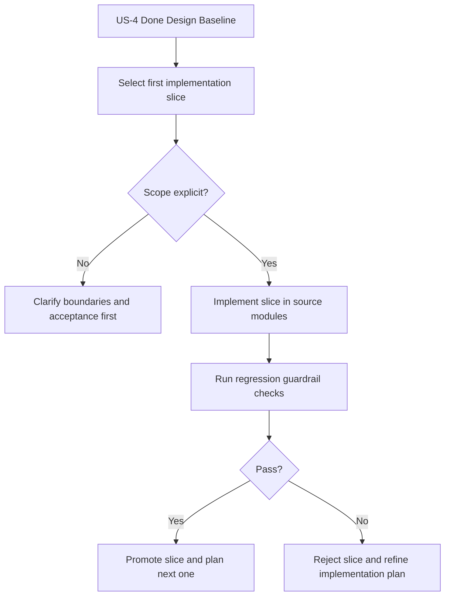

# Implement Layered Architecture Slice After US-4 Design Closure

> **Story ID:** US-6 | **State:** doing-open | **Priority:** P1
> **Source:** `.catdd/spec/analyzedNews/20260706-reArchImpl-LayeredArch-Issue.md`
> **Parent Story:** `.catdd/spec/doneUS/20260704-reArchDesign-LayeredArchitecture-UserStory.md`
> **CaTDD Class:** P1 Design
> **Primary Category:** Capability
> **Created:** 2026-07-06

---

## Active Work Status

- Current status: opened in `.catdd/spec/doingUS/` via `SPEC_openUserStory`.
- Entry gate status: `READY` confirmed from initial acceptance questions.
- Next recommended command: `SPEC_makePlan`.

---

## Mutual Intent Contract (SPEC_clearStoryIntent)

### Developer Intent

- Start reArch implementation from IOC service/link lifecycle APIs first.
- Keep first implementation slice constrained to `IOC_SrvAPI` path and do not widen scope to all layers at once.
- Require deterministic regression evidence before promoting the slice.

### CodeAgent Intent

- Preserve US-4 design decisions while converting them into an implementation-ready first slice.
- Keep scope explicit: `Include/IOC/IOC_SrvAPI.h` and `Source/IOC_SrvAPI.c` first, then validate via named US-1 service regression suites.
- Route immediately to planning so lifecycle order remains intact before implementation commands.

### In Scope (Intent-Cleared)

- First-slice boundary definition for `IOC_onlineService`, `IOC_offlineService`, `IOC_acceptClient`, `IOC_connectService`, and `IOC_closeLink` path.
- Regression gate declaration and pass criteria for `UT_US1_Service_Typical`, `UT_US1_Service_Edge`, `UT_US1_Service_Misuse`, `UT_US1_Service_Fault`, `UT_US1_Service_State`, and `UT_US1_Service_Capability`.

### Out of Scope (Intent-Cleared)

- Full multi-slice layered rearchitecture rollout in this first slice.
- Contract-breaking API semantics beyond the closed US-4 baseline.
- Non-IOC_SrvAPI implementation areas until first-slice gates are satisfied.

### Success Signal

- The first-slice implementation plan is explicit and reviewable.
- Required US-1 regression suites are declared as mandatory promotion gates and pass.
- The story advances through planning without lifecycle-step skipping.

### Assumptions

- Existing IOC public API semantics remain compatible unless a later story explicitly changes the contract.
- US-1 regression executables are available as slice-promotion evidence in this repository flow.

### Open Questions (Non-Blocking)

1. Should follow-up slice #2 prioritize protocol-object extraction (L1 seam) or core dependency hardening (L2 boundary guards) first?

### Review Result

- `CLEARED`
- Next command: `SPEC_makePlan`

---

## Story Statement

<!-- Technique: write-user-story -->

**As a** maintainer implementing IOC layering changes,
**I want** a concrete implementation slice plan and acceptance boundary derived from the closed US-4 design,
**So that** layered architecture can move from design intent into controlled implementation without breaking existing behavior guarantees.

---

## Priority

<!-- Technique: prioritize-requirements -->

| Dimension | Score (1-9) | Rationale |
|---|---|---|
| Business Value | 8 | Converts completed architecture design into executable implementation progress. |
| User Value | 7 | Maintainers gain clear, enforceable implementation boundaries and regression expectations. |
| Cost / Effort | 6 | Requires implementation slicing, dependency-rule enforcement, and regression safeguards. |
| Risk / Complexity | 7 | High coupling risk if implementation scope is ambiguous across layers and migration order. |

**Priority Score:** (8 + 7) / (6 + 7) = **1.15** | **Priority:** **P1**

---

## Visual Model

<!-- Technique: elicit-requirements-models -->

### Model Gap Analysis

| # | Gap Found | Question |
|---|---|---|
| 1 | First implementation slice boundaries were initially implicit. | Resolved: first slice is IOC service/link lifecycle APIs in `Include/IOC/IOC_SrvAPI.h` and their implementation path in `Source/IOC_SrvAPI.c`. |
| 2 | Regression gate was initially conceptual. | Resolved: run US-1 service regression executables (`UT_US1_Service_Typical`, `UT_US1_Service_Edge`, `UT_US1_Service_Misuse`, `UT_US1_Service_Fault`, `UT_US1_Service_State`, `UT_US1_Service_Capability`) with all tests passing before slice promotion. |

---

## Acceptance Criteria

<!-- Techniques: write-user-story + facilitate-example-mapping -->

### Scenario 1: First Implementation Slice Scope Is Explicit

**Rule:** Implementation must start with a bounded slice that is traceable to closed US-4 design artifacts.
**Given** the closed US-4 design story and related architecture/detail/state artifacts
**When** defining the first reArchImpl slice
**Then** in-scope modules, out-of-scope modules, and acceptance boundaries are explicit and reviewable

| Concrete Examples | Counter-Examples |
|---|---|
| First slice targets `IOC_onlineService`, `IOC_offlineService`, `IOC_acceptClient`, `IOC_connectService`, `IOC_closeLink` API path in `IOC_SrvAPI` | "Implement layered architecture" with no API/module boundary |

**Open Questions:** None.

### Scenario 2: Implementation Slice Includes Deterministic Regression Gate

**Rule:** Slice promotion requires explicit regression evidence preserving prior behavior contracts.
**Given** an implementation slice candidate
**When** regression gates are executed
**Then** promotion decisions are deterministic and traceable to named verification evidence

| Concrete Examples | Counter-Examples |
|---|---|
| Named UT suites and expected outcomes documented before merge/promotion | Promotion based on ad-hoc manual confidence without declared gate criteria |

**Open Questions:** None.

---

## Business Rules

<!-- Technique: extract-business-rules -->

| ID | Rule | Type | Implied Functional Requirement |
|---|---|---|---|
| BR-1 | US-4 design outputs are the baseline contract for reArch implementation slices. | Constraint | Slice definitions must trace to closed design artifacts before code changes. |
| BR-2 | Every implementation slice must declare explicit in-scope/out-of-scope boundaries. | Constraint | Implementation planning artifacts must include deterministic module/file boundary declarations. |
| BR-3 | Slice promotion must be gated by declared regression evidence. | Action Enabler | Verification plan must map required tests and expected pass criteria per slice. |

---

## Scope

**In scope:**

- Implement-first slice is constrained to IOC service/link lifecycle API path:
  - Public API surface: `Include/IOC/IOC_SrvAPI.h`
  - Primary implementation path: `Source/IOC_SrvAPI.c`
  - First API set: `IOC_onlineService`, `IOC_offlineService`, `IOC_acceptClient`, `IOC_connectService`, `IOC_closeLink`
- Apply and verify deterministic regression gates before slice promotion:
  - `UT_US1_Service_Typical`
  - `UT_US1_Service_Edge`
  - `UT_US1_Service_Misuse`
  - `UT_US1_Service_Fault`
  - `UT_US1_Service_State`
  - `UT_US1_Service_Capability`

**Non-goals:**

- Full multi-slice rearchitecture implementation in one story.
- Contract-breaking API changes beyond the closed US-4 design baseline.

---

## Risks & Assumptions

| # | Risk / Assumption | Severity | Mitigation / Clarification Needed |
|---|---|---|---|
| 1 | Ambiguous slice boundaries can cause uncontrolled implementation spread. | High | Require explicit module/file inclusion and exclusion lists before opening execution. |
| 2 | Regression gate ambiguity can allow unsafe promotions. | High | Declare concrete required tests and expected outcomes before slice implementation starts. |

---

## Initial Acceptance Questions

| # | Question | Raised By | Status |
|---|---|---|---|
| 1 | Which exact first-slice modules/files are mandatory for `reArchImpl-LayeredArch`? | model gap | answered: `Include/IOC/IOC_SrvAPI.h` + `Source/IOC_SrvAPI.c` for service/link lifecycle API path |
| 2 | Which exact regression gate set is mandatory for first-slice promotion? | model gap | answered: all US-1 service regression suites listed in Scope must pass |
| 3 | Should this story first run a planning command to convert US-4 design outputs into an implementation task artifact before opening execution? | lifecycle guard | answered: yes, follow `SPEC_openUserStory` then `SPEC_makePlan` before implementation commands |

**Gate:** Story is already opened and intent-cleared; run `SPEC_makePlan` next.

---

## Ambiguity Warnings

<!-- Technique: validate-requirements-criteria -->

| # | Ambiguous Term | Found In Section | Clarifying Question |
|---|---|---|---|
| 1 | "reArchImpl-LayeredArch" | Raw issue wording | Does this refer to only first implementation slice or the full end-to-end rearchitecture rollout? |
| 2 | "as designed" | Raw issue wording | Which exact US-4 design sections are normative for implementation acceptance? |

---

## Traceability

| From → To | Link |
|---|---|
| This story → Raw input | `.catdd/spec/analyzedNews/20260706-reArchImpl-LayeredArch-Issue.md` |
| Project story index | `README_UserStories.md` |
| Parent story | `.catdd/spec/doneUS/20260704-reArchDesign-LayeredArchitecture-UserStory.md` |
| This story ID | US-6 |
