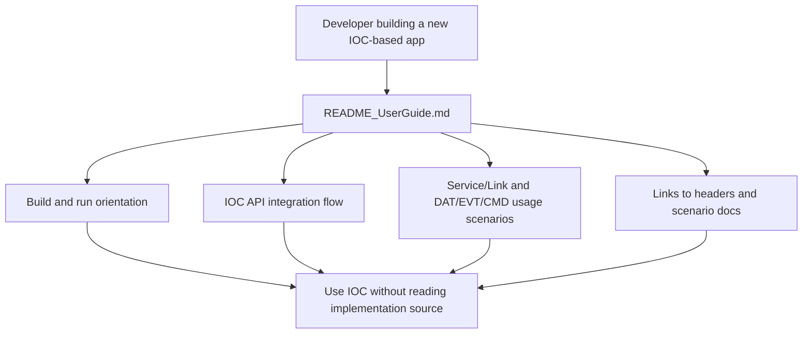

# Rewrite README_UserGuide for Developers Building IOC-Based Apps

> **Story ID:** US-7 | **State:** doing | **Priority:** P3
> **Source:** `.catdd/spec/analyzedNews/20260707-reWrite-README_UserGuide-fromUser_whoWillUseIOC_toDevNewApps-Issue.md`
> **CaTDD Class:** P3 Addons
> **Primary Category:** DemoExample
> **Created:** 2026-07-07

---

## Active Work Status

- Current status: opened from `.catdd/spec/todoUS/` via `SPEC_openUserStory`.
- Entry gate status: `READY` (no blocking Initial Acceptance Questions).
- Planning status: `SPEC_makePlan` completed and paired tasks artifact exists.
- Next recommended command: `SPEC_commitWorks`.

---

## Mutual Intent Contract (SPEC_clearStoryIntent)

### Developer Intent

- Rewrite `README_UserGuide.md` for app developers who build new IOC-based applications.
- Keep the guide centered on three journeys: build/run onboarding, API integration flow, and usage scenarios.
- Ensure a reader can use IOC correctly without reading implementation source files.

### CodeAgent Intent

- Execute a usage-first rewrite that preserves current public API semantics and existing design-document boundaries.
- Keep claims traceable to `Include/IOC/*.h` and `Doc/IOC_UsageScenarios.md`.
- Route directly into planning so the next command can choose requirement/design/implementation orientation explicitly.

### In Scope (Intent-Cleared)

- Restructure and rewrite `README_UserGuide.md` to support first-time IOC app developers.
- Explain service/link integration sequence at usage level (`IOC_onlineService`, `IOC_connectService`, `IOC_acceptClient`, `IOC_offlineService`).
- Summarize DAT/EVT/CMD role semantics and point to deeper references.
- Link to build/run guidance, public headers, scenario docs, and design docs where appropriate.

### Out of Scope (Intent-Cleared)

- Changing IOC API contracts or implementation behavior.
- Defining a new canonical build/toolchain policy not already established in project context.
- Rewriting `README_ArchDesign.md`, `README_DetailDesign.md`, or `README_StateDesign.md`.

### Success Signal

- A developer can follow `README_UserGuide.md` and identify how to build/run, which APIs to integrate first, and where scenario-level behavior is defined, without reading `Source/*.c`.

### Assumptions

- Current build/run references may be linked from existing project docs while canonical toolchain policy remains open.
- Usage guidance remains aligned with current public headers and documented IOC usage scenarios.

### Open Questions (Non-Blocking)

1. Should this rewrite include a compact quickstart code snippet, or remain reference-oriented with links only?
     - answered: include a compact quickstart snippet in `README_UserGuide.md`.

### Review Result

- `CLEARED`
- Next recommended command: `SPEC_makePlan`

---

## Requirement Update Result (SPEC_updateUserStory)

- Update outcome: `APPLIED`
- Updated project requirement ledger in `README_UserStories.md`:
  - US-7 synchronized to `doing` with `doingUS` trace link.
  - US-6 reconciled into aborted-state trace section.
  - Added AC-7.1 to AC-7.4 ledger rows with initial `drafted` trace status.
- Updated paired usage guide in `README_UserGuide.md`:
  - Rewritten for app-developer onboarding, service/link API integration flow, and DAT/EVT/CMD usage semantics.
  - Preserved cross-document boundaries by linking architecture/detail/state decisions to design docs.
- Next recommended command: `SPEC_reviewUserStory`

---

## User Story Review Result (SPEC_reviewUserStory)

- Review outcome: `PASS`
- Requirement ledger consistency:
  - `README_UserStories.md` lifecycle state is consistent with active artifacts (`US-7` in doing, `US-6` in aborted).
  - AC trace/status for US-7 (`AC-7.1` to `AC-7.4`) is present and reviewable.
- Usage-guide consistency:
  - `README_UserGuide.md` covers onboarding, API integration flow, and DAT/EVT/CMD usage semantics.
  - Guide remains usage-facing and routes internal design concerns to architecture/detail/state docs.
- Transfer decision:
  - This is requirement-oriented-only work; route to lifecycle closure checkpoint.
- Next recommended command: `SPEC_commitWorks`

---

## Mode Decision

| Field | Value |
|---|---|
| analysis_mode | `BRAINSTORM` |
| Why selected | Default mode for `SPEC_analyzeIssue`; the imported issue lacked concrete outline and acceptance boundaries. |
| Clarified interactively | Primary journey covers build/run onboarding, API integration, and usage scenarios; scope is one full rewrite story; acceptance means a reader can use IOC correctly without reading source. |
| Good-enough gate | Passed: affected user, observed gap, expected behavior, repair capability, scope, and acceptance signal are explicit enough for a todo story. |

---

## Issue Analysis & Insights

### Evidence Inventory

| Source | Facts Found | Confidence | Gaps |
|---|---|---|---|
| `.catdd/spec/pendingNews/20260707-reWrite-README_UserGuide-fromUser_whoWillUseIOC_toDevNewApps-Issue.md` | The requested rewrite targets developers who will use IOC to develop new applications. | High | Original import did not define outline or acceptance boundaries. |
| `README_UserGuide.md` | Current guide is centered on US-1 link establishment and internal validation workflow. | High | It does not yet serve as a complete app-developer guide for build/run, API integration, and usage scenarios. |
| `.catdd/spec/projectContext.md` | IOC domain centers on Service, Link, and DAT/EVT/CMD roles; public headers live under `Include/IOC`. | High | Target platform/build-policy details remain open in project context. |
| Developer clarification | The guide should let a user use IOC correctly without reading source. | High | None blocking for story creation. |

### Observed vs Expected Delta

| Observed | Expected |
|---|---|
| `README_UserGuide.md` is a narrow practical guide for US-1 link-establishment validation. | `README_UserGuide.md` should be a developer-facing guide for building new applications with IOC. |
| Current content references lifecycle artifacts and validation scope that require repository context. | A reader should understand build/run entry points, IOC API integration flow, and core usage scenarios without reading implementation source. |
| Current scope notes exclude broader DAT/EVT/CMD behavior. | The rewritten guide should explain how Service/Link concepts connect to DAT/EVT/CMD usage at a scenario level. |

### Root-Cause Hypotheses

| Hypothesis | Evidence | Disconfirming Check |
|---|---|---|
| The guide was written for current internal story execution rather than external app-developer onboarding. | Current guide names US-1 implementation/validation and lifecycle artifacts. | If target readers are only maintainers, the rewrite scope should shrink back to internal validation guidance. |
| App developers lack a single HOW path from setup to API usage to scenarios. | Developer clarified that users should not need to read source to use IOC correctly. | If existing docs already contain a complete app-developer path, the guide can link and summarize instead of rewriting. |

### Insight Map

| Insight Type | Insight | Evidence | Confidence | Story Impact |
|---|---|---|---|---|
| Requirement insight | The guide must be organized around user journeys, not only lifecycle artifacts. | Developer selected build/run, API integration, and usage scenarios. | High | Acceptance criteria require all three journeys. |
| Design insight | The guide should stay usage-facing and avoid becoming architecture/detail design documentation. | Project docs separate user guide from architecture/detail design. | High | Non-goals exclude internal implementation and design internals. |
| Test insight | Acceptance can be checked by doc review against concrete reader tasks. | Developer acceptance signal is correct usage without source reading. | Medium | ACs use documentation-review examples and counter-examples. |
| Risk insight | A full rewrite can become too broad if it tries to define missing platform/toolchain policy. | Project context has open build/toolchain questions. | Medium | Scope allows current documented commands/links and marks unresolved platform policy as non-goal. |
| Process insight | Future documentation issues should name target reader journey and acceptance signal at import time. | Import required BRAINSTORM clarification. | High | Trace note preserved in analyzed issue. |

### ToT Candidate Decision

| Candidate | Interpretation | Evidence Strength | Risk | Decision |
|---|---|---|---|---|
| A | One full README_UserGuide rewrite covering build/run, API integration, and usage scenarios. | High: developer selected 1,2,3 and one full rewrite story. | Medium: broad documentation surface. | Selected. |
| B | Split into separate docs stories for build/run, API integration, and scenarios. | Medium: journeys are separable. | Medium: may delay useful integrated guide. | Rejected for now; keep as follow-up candidate if story becomes too large. |
| C | Only rewrite API integration section. | Medium: import emphasized app developers integrating IOC APIs. | High: would miss build/run and scenario clarity selected by developer. | Rejected. |
| D | Treat as aborted UserStory analysis. | None: input is a pending issue, not abortUS evidence. | High: wrong command boundary. | Rejected. |

---

## Story Statement

<!-- How: Extract role, capability, business value. If any missing, stop and ask — do not invent.
     (→ SKILL: write-user-story) -->

**As a** developer building a new application with IOC,
**I want** `README_UserGuide.md` rewritten around build/run onboarding, IOC API integration, and usage scenarios,
**So that** I can use IOC correctly without reading the implementation source.

---

## Priority

<!-- How: Score Business Value, User Value, Cost, Risk 1-9 each. Score = (BV+UV)/(Cost+Risk).
     Score ≥18 elevates to P0. Rationale required. (→ SKILL: prioritize-requirements) -->

| Dimension | Score (1-9) | Rationale |
|---|---|---|
| Business Value | 8 | A usable guide makes IOC easier to adopt for app developers and reduces support/review friction. |
| User Value | 9 | Developers get a single path for setup, API usage, and scenarios without reading source. |
| Cost / Effort | 5 | Requires substantial doc restructuring, examples, and trace review, but not product-code changes. |
| Risk / Complexity | 5 | Risk comes from missing build/toolchain policy and avoiding drift from public API contracts. |

**Priority Score:** (8 + 9) / (5 + 5) = **1.70** | **Priority:** **P3**

---

## Visual Model

<!-- How: Choose state diagram (status changes over time), flow diagram (action sequences),
     or context diagram (external actors). Render as Mermaid.js. Then trace: dead-end states?
     decisions with only one outcome? unhandled failure paths? List each gap as a question —
     do not invent paths. (→ SKILL: elicit-requirements-models) -->

### Model Gap Analysis

| # | Gap Found | Question |
|---|---|---|
| 1 | Project context still has open canonical build/toolchain questions. | Should this story document only existing build/run commands and link to build docs, avoiding new build policy? Answer: yes, treat build policy as non-goal unless already documented. |
| 2 | Current guide may need to reference scenarios without duplicating all design semantics. | Should usage scenarios be summarized and linked rather than fully redefining DAT/EVT/CMD contracts? Answer: yes, keep the guide usage-facing and trace to source docs/headers. |

---

## Acceptance Criteria

<!-- How: For a P0 Functional main UserStory, use this section for Typical behavior first:
     the main acceptance criteria and core scenarios that prove the user-visible capability works.
     Keep 3-7 scenarios, one behavior per scenario. Happy path first, then important alternate
     Typical paths. Put P0 Edge/Misuse/Fault in the second-part AC section below.
     If a concern is P1 Design or P2 Quality, do not force it into this AC list: create a
     sub-UserStory from this story when it is needed now, or raise an Initial Acceptance Question
     when the team must decide whether to split it. (→ SKILL: write-user-story + facilitate-example-mapping) -->

### Scenario 1: Developer Can Orient from Setup to First IOC Use

**Rule:** The guide must provide a practical entry path for developers building new IOC-based applications.
**Given** a developer opens `README_UserGuide.md` without reading implementation source
**When** they follow the guide's setup and first-use sections
**Then** they can identify where to build/run, which headers define the public API, and where to find scenario-level examples

| Concrete Examples | Counter-Examples |
|---|---|
| Guide links to build/run docs or commands, `Include/IOC/*.h`, and `Doc/IOC_UsageScenarios.md` | Guide only references internal story artifacts or asks the reader to inspect `Source/*.c` |

**Open Questions:** None.

### Scenario 2: Developer Can Integrate Service/Link APIs

**Rule:** The guide must explain the minimal IOC service/client integration flow using public API concepts.
**Given** a developer wants to integrate IOC into a new app
**When** they read the API integration section
**Then** they can understand the expected sequence for service online, client connect, optional manual accept, messaging readiness, and offline behavior at a usage level

| Concrete Examples | Counter-Examples |
|---|---|
| Guide presents `IOC_onlineService`, `IOC_connectService`, `IOC_acceptClient`, and `IOC_offlineService` as a coherent usage sequence with links to headers | Guide lists API names without sequence, role meaning, or success/failure expectations |

**Open Questions:** None.

### Scenario 3: Developer Can Relate DAT/EVT/CMD Scenarios to Link Usage

**Rule:** The guide must explain how DAT, EVT, and CMD roles fit into IOC usage without replacing design docs.
**Given** a developer has established or reasoned about a Service/Link relationship
**When** they read the usage scenario section
**Then** they can distinguish DAT streaming, EVT fire-and-forget, and CMD request-response semantics and know where to find detailed scenario references

| Concrete Examples | Counter-Examples |
|---|---|
| Guide summarizes DAT/EVT/CMD semantics and links to `Doc/IOC_UsageScenarios.md` | Guide omits DAT/EVT/CMD or buries them under architecture-only terminology |

**Open Questions:** None.

### Scenario 4: Guide Stays Usage-Facing

**Rule:** UserGuide content must not become a substitute for architecture/detail design docs.
**Given** the guide needs to mention lifecycle, state, or design constraints
**When** that content becomes implementation-specific or design-decision-specific
**Then** the guide links to the appropriate README SPEC doc instead of duplicating or redefining internals

| Concrete Examples | Counter-Examples |
|---|---|
| Guide links to `README_ArchDesign.md`, `README_DetailDesign.md`, or `README_StateDesign.md` for internal decisions | Guide describes private data structures or source-level implementation rules as user instructions |

**Open Questions:** None.

---

## Business Rules

<!-- How: Extract policies, calculations, regulations from the feature text. Separate business rules
     from functional requirements. Classify each: Fact, Constraint, Action Enabler, Inference,
     Computation. If a rule implies a functional requirement (e.g., "must be 18" → system needs
     birthdate input), note it — don't silently hardcode. (→ SKILL: extract-business-rules) -->

| ID | Rule | Type | Implied Functional Requirement |
|---|---|---|---|
| BR-1 | `README_UserGuide.md` shall target developers building new applications with IOC. | Fact | The guide must use app-developer language and workflows. |
| BR-2 | The guide shall let readers use IOC correctly without reading implementation source. | Constraint | The guide must include enough public API sequence, scenario links, and usage context for correct use. |
| BR-3 | The guide shall cover build/run onboarding, API integration, and usage scenarios in one coherent rewrite. | Constraint | The rewrite must include sections for all three selected journeys. |
| BR-4 | Architecture/detail/state internals shall remain in their dedicated README SPEC docs. | Constraint | The guide must link to internal design docs instead of duplicating implementation details. |

---

## P0 Functional Second-Part Acceptance Criteria

<!-- How: For P0 Functional stories, keep Typical in the main Acceptance Criteria section above.
     Use this second part for P0 Functional coverage that sharpens the same story without changing
     its primary intent:
     - Edge = unusual but valid inputs, options, limits, or lifecycle states.
     - Misuse = invalid caller behavior or API contract violation.
     - Fault = dependency, resource, or runtime failure under valid caller behavior.
     Do not put P1 Design (State/Capability/Concurrency) or P2 Quality
     (Performance/Robust/Compatibility/Configuration) here. Split those into sub-UserStories or
     record them as open questions. (→ SKILL: write-user-story + elicit-requirements-models) -->

Not applicable. This is a P3 documentation/demo-example story, not a P0 product-behavior story.

---

## Sub-UserStory Candidates

<!-- How: Preserve important non-P0 concerns without polluting the main story. If a P1/P2 concern
     is required for the current release or changes the main acceptance decision, create a
     sub-UserStory with Parent Story pointing here. If the need is uncertain, add it as an Initial
     Acceptance Question and keep the candidate row as trace evidence. -->

| Candidate | CaTDD Class / Category | Why It Is Not In Main AC | Recommendation | Status |
|---|---|---|---|---|
| Separate build-system guide after canonical build policy is decided | P3 Addons / Configuration | Project context still has open canonical build/toolchain questions. | Defer until build policy is fixed. | deferred |
| Expanded DAT/EVT/CMD tutorial with runnable examples | P3 Addons / DemoExample | Could exceed this rewrite if examples require new demo assets. | Create follow-up if guide review says summaries are insufficient. | open |
| API compatibility and ABI policy guide | P2 Quality / Compatibility | Project context lists API/ABI compatibility policy as open. | Ask separately when compatibility policy becomes active. | deferred |

---

## Scope

**In scope:**

- Rewrite `README_UserGuide.md` for developers building new IOC-based applications.
- Cover build/run orientation, IOC public API integration flow, and usage scenario navigation.
- Explain Service/Link and DAT/EVT/CMD concepts at a usage level.
- Link to public headers, scenario docs, and design docs where deeper detail belongs.

**Non-goals:**

- Changing IOC public API contracts.
- Defining a new canonical build system or platform policy beyond existing documented facts.
- Rewriting architecture/detail/state design docs.
- Requiring readers to inspect implementation source as part of normal guide usage.

---

## Risks & Assumptions

| # | Risk / Assumption | Severity | Mitigation / Clarification Needed |
|---|---|---|---|
| 1 | A full rewrite may become too broad and blur usage guidance with design documentation. | Medium | Keep acceptance criteria centered on app-developer usage and link to design docs for internals. |
| 2 | Build/run instructions may drift if canonical build policy changes later. | Medium | Reference existing build docs/commands and avoid inventing unresolved platform policy. |
| 3 | API examples may accidentally imply unsupported DAT/EVT/CMD behavior. | High | Trace usage claims to `Include/IOC/*.h` and `Doc/IOC_UsageScenarios.md`. |

---

## Initial Acceptance Questions

<!-- Gate: story is NOT ready for SPEC_openUserStory if any question is open.
     P1/P2 split questions may be open only if they do not block the P0 story; otherwise decide or
     create the sub-UserStory before opening this story.
     (→ SPEC_analyzeFeature Conflict Guard) -->

| # | Question | Raised By | Status |
|---|---|---|
| 1 | Which developer journeys should be optimized first? | BRAINSTORM clarification | answered: build/run onboarding, API integration, and usage scenarios |
| 2 | Should this be one focused story or split into multiple documentation stories? | BRAINSTORM clarification | answered: one full rewrite story |
| 3 | What is the acceptance signal? | BRAINSTORM clarification | answered: users can use IOC correctly without reading source |

**Gate:** This story is READY for `SPEC_openUserStory`; no blocking acceptance questions remain.

---

## Ambiguity Warnings

<!-- How: Scan the entire story for vague terms — "fast", "robust", "seamless", "always", "never".
     For each, ask: "Is 'fast' 500ms or 5s?" Do not silently substitute precise thresholds.
     (→ SKILL: validate-requirements-criteria) -->

| # | Ambiguous Term | Found In Section | Clarifying Question |
|---|---|---|
| 1 | "use correctly" | Developer clarification | Resolved for this story as: use public IOC APIs and scenario guidance without reading implementation source. |
| 2 | "full rewrite" | Developer clarification | Resolved for this story as: rewrite guide organization/content for selected developer journeys, not all project docs. |

---

## Traceability

| From → To | Link |
|---|---|
| This story → Raw input | `.catdd/spec/analyzedNews/20260707-reWrite-README_UserGuide-fromUser_whoWillUseIOC_toDevNewApps-Issue.md` |
| Project story index | `README_UserStories.md` |
| Related guide | `README_UserGuide.md` |
| Related public API headers | `Include/IOC/` |
| Related usage scenarios | `Doc/IOC_UsageScenarios.md` |
| This story ID | `US-7` |
