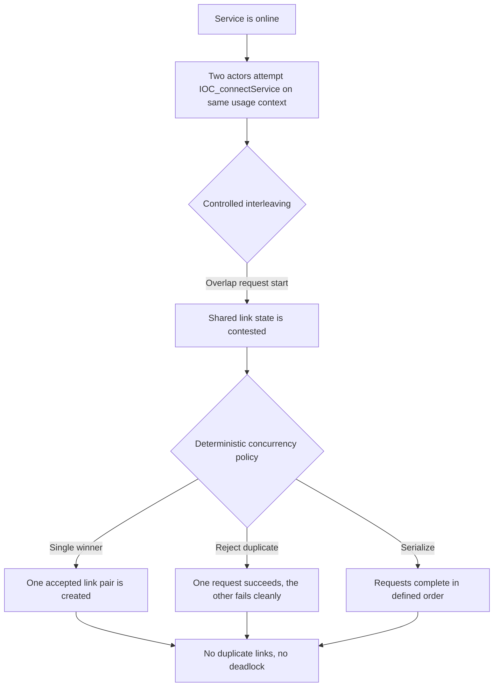

# Establish IOC Link Concurrency Safety

> **Story ID:** US-2 | **State:** todo | **Priority:** P2
> **Source:** `.catdd/spec/todoUS/20260618-EstablishedLink-UserStory.md`
> **Created:** 2026-06-21

---

## Story Statement

<!-- Technique: write-user-story -->

**As a** concurrent IOC API consumer,
**I want** duplicate or interleaved `IOC_connectService` attempts against the same service/client context to behave deterministically under contention,
**So that** link establishment never produces duplicate accepted links, lost requests, or deadlocks when operations overlap.

---

## Priority

<!-- Technique: prioritize-requirements -->

| Dimension | Score (1-9) | Rationale |
|---|---|---|
| Business Value | 6 | Concurrency safety matters once the basic link flow exists. |
| User Value | 7 | Integrators need predictable behavior when multiple actors hit the same link path. |
| Cost / Effort | 5 | Requires controlled interleavings, synchronization fixtures, and repeatable assertions. |
| Risk / Complexity | 6 | Duplicate-connect races are easy to miss without explicit concurrency coverage. |

**Priority Score:** (6 + 7) / (5 + 6) = **1.18** | **Priority:** **P2**

---

## Visual Model

<!-- Technique: elicit-requirements-models -->

### Model Gap Analysis

| # | Gap Found | Question |
|---|---|---|
| 1 | Duplicate-connect policy is not yet pinned down. | Should the second concurrent request be rejected, serialized, or deduplicated? |
| 2 | Shared-state ownership is not fully explicit. | Which internal resource must remain consistent during concurrent connect handling? |
| 3 | Observability for race diagnosis is still limited. | Do we need deterministic barriers, logs, or sanitizer support to make failures diagnosable? |

---

## Acceptance Criteria

<!-- Techniques: write-user-story + facilitate-example-mapping -->

### Scenario 1: Duplicate Connect Attempts Are Deterministic

**Rule:** Concurrent `IOC_connectService` calls targeting the same logical service/client context must not create duplicate accepted links.
**Given** Service App is online and two actors start `IOC_connectService()` for the same usage context under controlled synchronization
**When** the calls overlap at the connect boundary
**Then** IOC produces a deterministic outcome, with at most one accepted link pair created and the other request resolved cleanly

| Concrete Examples | Counter-Examples |
|---|---|
| Two threads race on the same client path and only one link pair is created | Both threads create separate accepted links for the same logical request |

**Open Questions:** Which deterministic policy is preferred: single-winner, serialize, or explicit duplicate rejection?

### Scenario 2: Concurrent Interleaving Preserves Final State

**Rule:** The shared link state must remain consistent after concurrent connect handling completes.
**Given** multiple actors attempt link establishment with a barrier that forces interleaving
**When** the concurrent operations finish
**Then** the final state contains no corruption, no lost request, no deadlock, and the observable link inventory matches the chosen policy

| Concrete Examples | Counter-Examples |
|---|---|
| Barrier-synchronized threads complete and final link count is stable | Final state contains duplicate or partially initialized link entries |

**Open Questions:** What invariant should be used to assert the final link inventory?

---

## Business Rules

<!-- Technique: extract-business-rules -->

| ID | Rule | Type | Implied Functional Requirement |
|---|---|---|---|
| BR-1 | Concurrent connect attempts must not corrupt shared link state. | Constraint | IOC shall protect the connect path against race-induced corruption. |
| BR-2 | Duplicate connect outcomes must be deterministic. | Constraint | IOC shall resolve contention using a defined policy. |
| BR-3 | Concurrent handling must not deadlock. | Constraint | IOC shall complete interleaved connect requests without blocking forever. |
| BR-4 | Concurrent outcomes must be observable. | Action Enabler | IOC shall expose enough diagnostics to distinguish success, rejection, serialization, or deduplication. |

---

## P2 Design Tests

<!-- CaTDD P2/P3 slice for design tests -->

### Concurrency (Design)

| # | Condition | Expected Behavior | AC Seed | TC Seed |
|---|---|---|---|---|
| C1 | Two actors call `IOC_connectService` concurrently for the same logical service/client context | At most one accepted link pair is created, and the other request is resolved cleanly | AS-1 | verifyConnect_byDualActorRace_expectDeterministicOutcome |
| C2 | Concurrent connect requests are synchronized at the request boundary | Shared state remains consistent and final link inventory matches the selected policy | AS-1 | verifyConnect_byBarrierInterleaving_expectStableLinkState |
| C3 | Contention repeats across many iterations | No deadlock, no duplicate accepted links, and no lost request across runs | AS-1 | verifyConnect_byRepeatedRaceIterations_expectNoDeadlockOrDuplication |

---

## Scope

**In scope:**

- Concurrency control around `IOC_connectService` for duplicate or overlapping connect attempts.
- Deterministic handling of interleavings that target the same logical link context.
- Final-state invariants for accepted link creation under contention.

**Non-goals:**

- Basic connect/accept/offline functional behavior already covered by the P0 Established Link story.
- Performance throughput benchmarking under load.
- Reconnection strategy after disconnect or timeout.

---

## Risks & Assumptions

| # | Risk / Assumption | Severity | Mitigation / Clarification Needed |
|---|---|---|---|
| 1 | The duplicate-connect policy is not yet defined. | High | Decide whether the policy is single-winner, serialized, or explicit rejection. |
| 2 | Race tests require deterministic synchronization. | Medium | Use barriers or latches instead of sleeps. |
| 3 | Diagnostics may be needed to make failures reproducible. | Medium | Add traces or counters around connect contention if needed. |

---

## Initial Acceptance Questions

<!-- Gate: story is NOT ready for SPEC_openUserStory if any question is open -->

| # | Question | Raised By | Status |
|---|---|---|---|
| 1 | Which duplicate-connect policy should IOC enforce under contention? | design decision | open |
| 2 | Which shared-state invariant defines success for concurrent connect handling? | design decision | open |
| 3 | Do we need sanitizer or repeated-run support in the first design slice? | design decision | open |

**Gate:** This story is **NOT READY** for `SPEC_openUserStory` until the concurrency policy and invariant are confirmed.

---

## Ambiguity Warnings

<!-- Technique: validate-requirements-criteria -->

| # | Ambiguous Term | Found In Section | Clarifying Question |
|---|---|---|---|
| 1 | "same logical service/client context" | Story Statement | What exact identity keys define the contention scope? |
| 2 | "deterministic outcome" | Acceptance Criteria | Should deterministic mean single-winner, serialize, or reject-duplicate? |
| 3 | "shared link state" | Acceptance Criteria | Which internal fields or objects are under contention? |
| 4 | "stable link state" | Scenario 2 | What final-state invariant should tests assert? |

---

## Traceability

| From → To | Link |
|---|---|
| This story → Parent functional story | `.catdd/spec/todoUS/20260618-EstablishedLink-UserStory.md` |
| This story → Raw functional source | `.catdd/spec/analyzedNews/20260617-EstablishedLink-Feature.md` |
| This story ID | `US-2` |