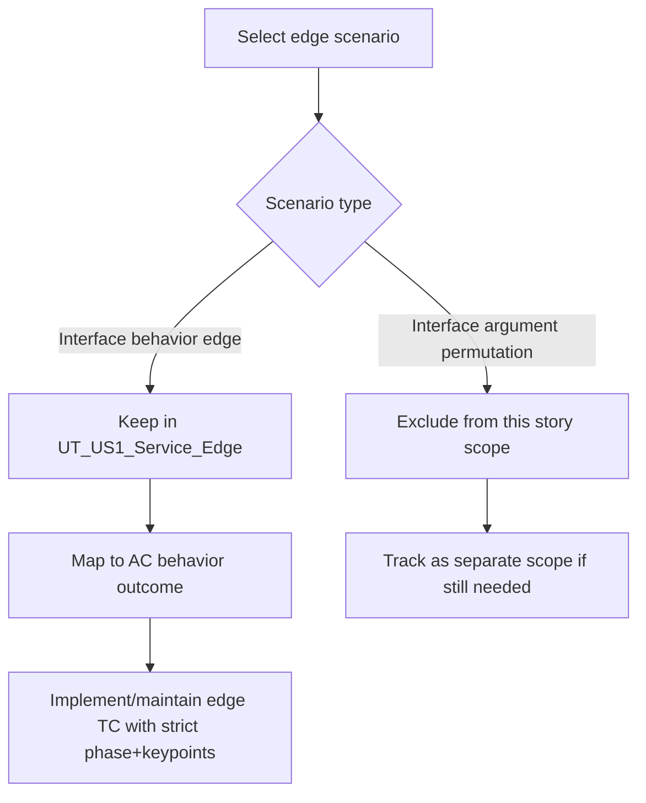

# Refine Interface Behavior Edge Coverage for UT_US1_Service_Edge

> **Story ID:** US-3 | **State:** todo | **Priority:** P1
> **Source:** `.catdd/spec/analyzedNews/20260703-UT_US1_Service_Edge-interfaceBehaviorEdge-Issue.md`
> **Parent Story:** `.catdd/spec/doneUS/20260618-EstablishedLink-UserStory.md`
> **CaTDD Class:** P0 Functional
> **Primary Category:** Edge
> **Created:** 2026-07-04

---

## Story Statement

<!-- Technique: write-user-story -->

**As a** developer maintaining IOC link-establishment tests,
**I want** `UT_US1_Service_Edge` to prioritize interface behavior edge scenarios while excluding interface-argument edge permutations,
**So that** edge verification stays focused, readable, and aligned with behavior-level acceptance intent.

---

## Priority

<!-- Technique: prioritize-requirements -->

| Dimension | Score (1-9) | Rationale |
|---|---|---|
| Business Value | 7 | Improves reliability of verification signal for a core IOC flow. |
| User Value | 8 | Developers get clearer failure diagnostics from behavior-focused edge tests. |
| Cost / Effort | 3 | Scope is test-design refinement of existing UT file boundaries. |
| Risk / Complexity | 4 | Moderate risk of regression if behavior-vs-argument boundaries are mixed. |

**Priority Score:** (7 + 8) / (3 + 4) = **2.14** | **Priority:** **P1**

---

## Visual Model

<!-- Technique: elicit-requirements-models -->

### Model Gap Analysis

| # | Gap Found | Question |
|---|---|---|
| 1 | Boundary examples between "behavior edge" and "argument edge" can be interpreted differently. | Should we publish a short classification checklist in `README_VerifyDesign.md` for future test routing consistency? |

---

## Acceptance Criteria

<!-- Techniques: write-user-story + facilitate-example-mapping -->

### Scenario 1: Behavior-Edge Scope Is Enforced

**Rule:** `UT_US1_Service_Edge` covers interface behavior edges, not argument permutation matrices.
**Given** an edge test candidate for IOC link-establishment interfaces
**When** the candidate is classified as behavior-edge or argument-edge
**Then** only behavior-edge candidates are included in `UT_US1_Service_Edge`

| Concrete Examples | Counter-Examples |
|---|---|
| offline keep/close behavior differences, timeout behavior resolution | exhaustive null/empty/path-variant argument permutation table |

**Open Questions:** None.

### Scenario 2: Existing Behavior-Edge TCs Stay Traceable to AC Outcomes

**Rule:** Every edge TC retained in this story must map to a behavior expectation from story acceptance criteria.
**Given** a retained `UT_US1_Service_Edge` TC
**When** reviewing its US/AC/TC and VERIFY keypoints
**Then** expected behavior outcome remains explicit and deterministic

| Concrete Examples | Counter-Examples |
|---|---|
| E2 timeout returns exact timeout result; E3/E4 offline behavior enforces keep/close semantics | edge TC with only argument-shape validation and no behavior outcome assertion |

**Open Questions:** None.

---

## Business Rules

<!-- Technique: extract-business-rules -->

| ID | Rule | Type | Implied Functional Requirement |
|---|---|---|---|
| BR-1 | Behavior-edge tests must prioritize lifecycle/result semantics at interface boundaries. | Constraint | Test design shall classify and keep behavior-edge scenarios in `UT_US1_Service_Edge`. |
| BR-2 | Interface argument permutation coverage is out of scope for this repair story. | Constraint | Argument-edge permutations shall not be added under this story scope. |
| BR-3 | Retained edge tests must assert deterministic outcomes through explicit verify keypoints. | Action Enabler | Edge test cases shall include behavior-oriented VERIFY assertions tied to expected results. |

---

## P0 Functional Second-Part Acceptance Criteria

### Edge (ValidFunc)

| # | Condition | Expected Behavior | AC Seed | TC Seed | Status |
|---|---|---|---|---|---|
| E1 | Candidate edge case affects interface behavior outcome | Keep in `UT_US1_Service_Edge` and assert behavior result deterministically | Scenario 1 | verifyEdgeScope_byBehaviorClassification_expectIncluded | draft |
| E2 | Candidate edge case is only argument permutation | Exclude from this story scope and track separately if needed | Scenario 1 | verifyEdgeScope_byArgumentPermutation_expectExcluded | draft |
| E3 | Retained edge test has US/AC/TC mapping and behavior VERIFY keypoints | Maintain explicit behavior traceability and deterministic assertion semantics | Scenario 2 | verifyEdgeTrace_byBehaviorOutcomeMapping_expectDeterministicChecks | draft |

### Misuse (InvalidFunc)

| # | Condition | Expected Behavior | AC Seed | TC Seed | Status |
|---|---|---|---|---|---|
| M1 | A behavior-edge test is rewritten into argument-only validation | Reject in review for this story scope | Scenario 1 | verifyEdgeScope_byArgumentOnlyRewrite_expectRejected | draft |

### Fault (InvalidFunc)

| # | Condition | Expected Behavior | AC Seed | TC Seed | Status |
|---|---|---|---|---|---|
| F1 | Scope classification drifts during implementation loop | Detect drift and route back to classification boundary review | Scenario 1 | verifyEdgeScope_byClassificationDrift_expectReviewFailure | draft |

---

## Scope

**In scope:**

- Behavior-edge classification and retention rules for `UT_US1_Service_Edge`.
- Behavior-outcome traceability and deterministic assertions for retained edge TCs.

**Non-goals:**

- Full interface argument permutation matrix coverage.
- Re-opening US-1 functional scope already closed in doneUS.

---

## Risks & Assumptions

| # | Risk / Assumption | Severity | Mitigation / Clarification Needed |
|---|---|---|---|
| 1 | Behavior-vs-argument classification may diverge across reviewers. | Medium | Add/maintain a concise classification checklist in verify design notes. |
| 2 | Existing edge TCs may contain mixed intent. | Medium | Re-review edge TCs against AC behavior outcome mapping before edits. |

---

## Initial Acceptance Questions

| # | Question | Raised By | Status |
|---|---|---|---|
| 1 | Should the behavior-vs-argument classification checklist be codified in `README_VerifyDesign.md` now or deferred to implementation review? | model gap | open |

**Gate:** This story is **READY** for `SPEC_openUserStory` because the open question is non-blocking and does not change the core repair scope.

---

## Ambiguity Warnings

<!-- Technique: validate-requirements-criteria -->

| # | Ambiguous Term | Found In Section | Clarifying Question |
|---|---|---|---|
| 1 | "interface behavior edge" | Story Statement | Which concrete scenario families are canonical behavior-edge examples for this module? |
| 2 | "argument permutation" | Scope | Which permutation classes are explicitly excluded vs allowed as behavior preconditions? |

---

## Traceability

| From → To | Link |
|---|---|
| This story → Raw input | `.catdd/spec/analyzedNews/20260703-UT_US1_Service_Edge-interfaceBehaviorEdge-Issue.md` |
| Project story index | `README_UserStories.md` |
| Parent story | `.catdd/spec/doneUS/20260618-EstablishedLink-UserStory.md` |
| This story ID | `US-3` |
