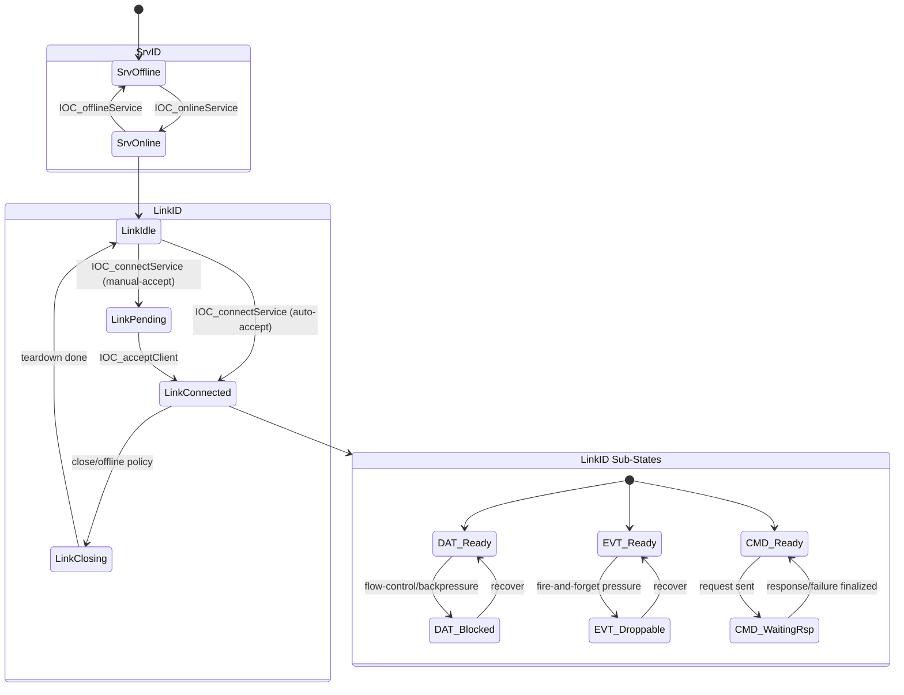

# Clarify IOC StateDesign Semantics for SrvID/LinkID and DAT/EVT/CMD Sub-States

> **Story ID:** US-5 | **State:** todo | **Priority:** P1
> **Source:** `.catdd/spec/analyzedNews/20260704-StateDesign-SrvID-LinkID-SubState-Issue.md`
> **CaTDD Class:** P1 Design
> **Primary Category:** State
> **Created:** 2026-07-05

---

## Story Statement

<!-- Technique: write-user-story -->

**As a** maintainer of IOC architecture and documentation,
**I want** StateDesign to explicitly model `SrvID` and `LinkID` lifecycle states plus `DAT/EVT/CMD` sub-state behavior over `LinkID`,
**So that** state semantics are unambiguous and future design/test work can trace state transitions deterministically.

---

## Priority

<!-- Technique: prioritize-requirements -->

| Dimension | Score (1-9) | Rationale |
|---|---|---|
| Business Value | 7 | Removes interpretation drift in core state semantics used by later design/test cycles. |
| User Value | 7 | Developers and reviewers get a shared, explicit state model for Service/Link behavior. |
| Cost / Effort | 4 | Primarily a design-clarification and traceability update, not full product-code rework. |
| Risk / Complexity | 5 | Medium risk if state boundaries are underspecified across multiple artifact surfaces. |

**Priority Score:** (7 + 7) / (4 + 5) = **1.56** | **Priority:** **P1**

---

## Visual Model

<!-- Technique: elicit-requirements-models -->

### Model Gap Analysis

| # | Gap Found | Question |
|---|---|---|
| 1 | Trigger-to-transition mapping for all `SrvID` and `LinkID` transitions is not yet listed in one canonical table. | Should `README_StateDesign.md` include an explicit transition table keyed by API/event/guard/action? |
| 2 | Sub-state interaction with parent `LinkID` state is implied but not yet bounded by invariant statements. | Which invariants are mandatory (for example, CMD_WaitingRsp only allowed when LinkConnected)? |

---

## Acceptance Criteria

<!-- Techniques: write-user-story + facilitate-example-mapping -->

### Scenario 1: Core State Objects and Boundaries Are Explicit

**Rule:** StateDesign must identify `SrvID` and `LinkID` as primary state objects, and place `DAT/EVT/CMD` as sub-states over `LinkID`.
**Given** IOC design artifacts including state design
**When** reviewing state object ownership and decomposition
**Then** `SrvID`, `LinkID`, and `DAT/EVT/CMD` sub-state layering over `LinkID` are explicit and unambiguous

| Concrete Examples | Counter-Examples |
|---|---|
| Separate sections/diagrams for `SrvID` and `LinkID`; sub-state diagram rooted at `LinkID` | Mixed single-state diagram without object boundary, or DAT/EVT/CMD modeled as independent top-level state objects |

**Open Questions:** None.

### Scenario 2: Transition Semantics Are Traceable to IOC Behaviors

**Rule:** State transitions must be traceable to IOC lifecycle and messaging behavior semantics.
**Given** documented state transitions for service/link and sub-states
**When** mapping transitions to API calls and behavior outcomes
**Then** transition triggers, guards, and expected outcomes are testable and traceable

| Concrete Examples | Counter-Examples |
|---|---|
| `IOC_onlineService` enters service-online state; `IOC_acceptClient` transitions pending to connected | Transition listed with no trigger/guard meaning, or behavior claims with no state mapping |

**Open Questions:** None.

---

## Business Rules

<!-- Technique: extract-business-rules -->

| ID | Rule | Type | Implied Functional Requirement |
|---|---|---|---|
| BR-1 | IOC StateDesign shall model both `SrvID` and `LinkID` as first-class state objects. | Constraint | State design docs must include explicit state decomposition by object identity. |
| BR-2 | `DAT/EVT/CMD` sub-state semantics shall be modeled as sub-states over `LinkID`, not detached global states. | Constraint | State diagrams/tables must define parent-child relation between LinkID and sub-state behavior. |
| BR-3 | State transitions shall be tied to observable IOC behaviors (API/event triggers and outcomes). | Action Enabler | Design artifacts must provide trigger/guard/outcome mapping that downstream tests can verify. |

---

## Scope

**In scope:**

- Clarify and normalize IOC StateDesign semantics around `SrvID`, `LinkID`, and `DAT/EVT/CMD` sub-state layering.
- Produce traceable state-model intent suitable for subsequent design review and test design conversion.

**Non-goals:**

- Full product-code implementation changes for all state-model implications.
- Introduction of new IOC API contract semantics beyond clarifying existing state intent.

---

## Risks & Assumptions

| # | Risk / Assumption | Severity | Mitigation / Clarification Needed |
|---|---|---|---|
| 1 | Ambiguous state-object ownership may cause inconsistent architecture/detail/test artifacts. | High | Enforce explicit object/state boundary notation and review with `SPEC_reviewDetailDesign`. |
| 2 | Sub-state semantics may conflict with existing DAT/EVT/CMD behavior descriptions. | Medium | Reconcile against `README_UserGuide.md` and `README_VerifyDesign.md` traces before implementation steps. |

---

## Initial Acceptance Questions

| # | Question | Raised By | Status |
|---|---|---|---|
| 1 | Should the first clarification slice update only `README_StateDesign.md`, or also `README_DetailDesign.md` in the same story? | model gap | open |
| 2 | Which minimal invariant set is mandatory for sub-states over `LinkID` in this story scope? | model gap | open |

**Gate:** This story is **NOT READY** for `SPEC_openUserStory` until blocking acceptance questions are answered.

---

## Ambiguity Warnings

<!-- Technique: validate-requirements-criteria -->

| # | Ambiguous Term | Found In Section | Clarifying Question |
|---|---|---|---|
| 1 | "sub state over LinkID" | Raw issue wording | Does "over" mean strict parent-child containment with allowed-entry invariants, or only conceptual relation? |
| 2 | "StateDesign means" | Issue scope | Is this a global repository convention change or limited to IOC service/link domain artifacts? |

---

## Traceability

| From → To | Link |
|---|---|
| This story → Raw input | `.catdd/spec/analyzedNews/20260704-StateDesign-SrvID-LinkID-SubState-Issue.md` |
| Project story index | `README_UserStories.md` |
| This story ID | `US-5` |
