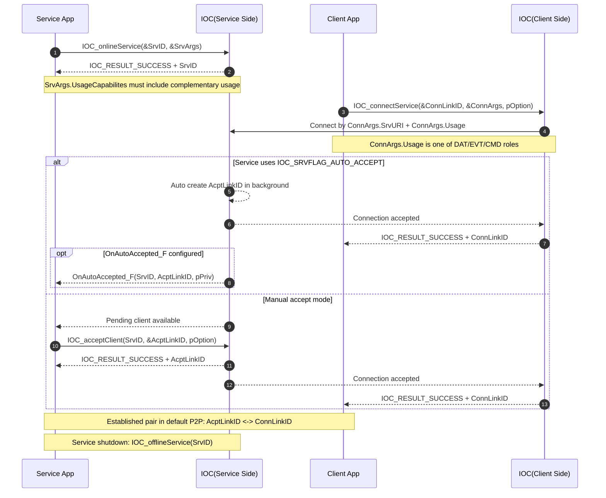
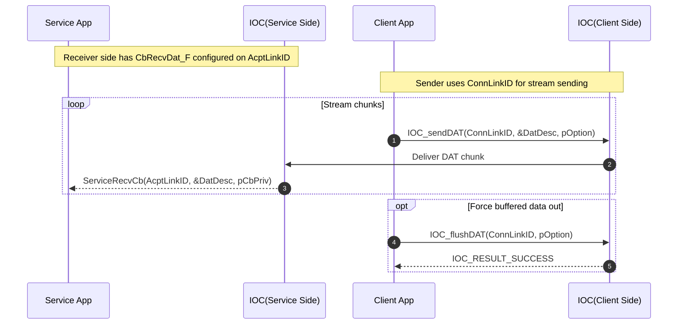
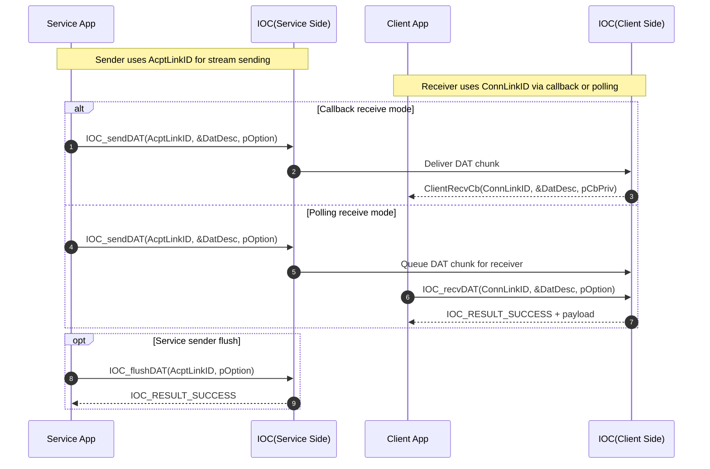
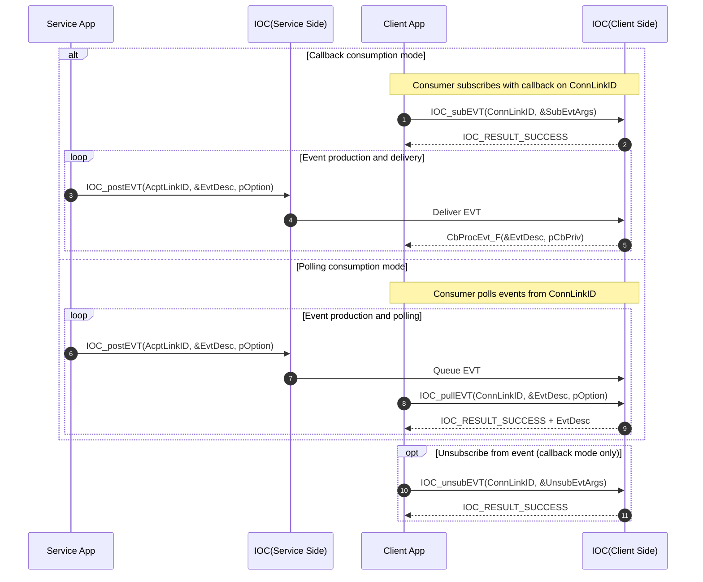
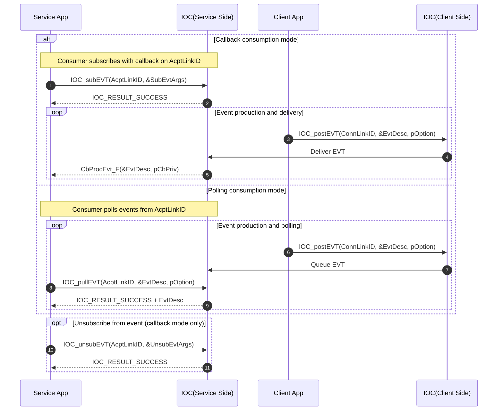
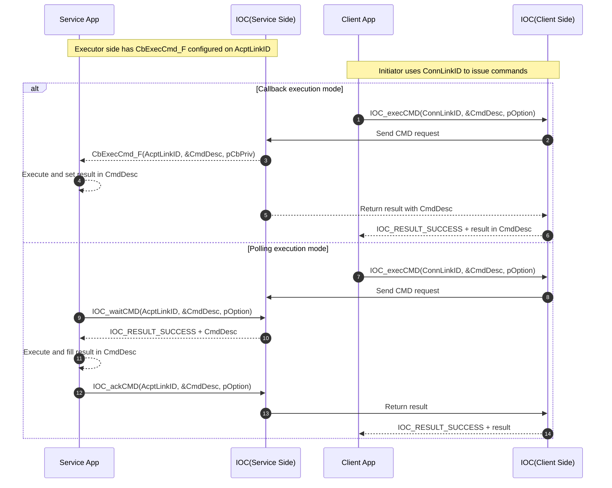
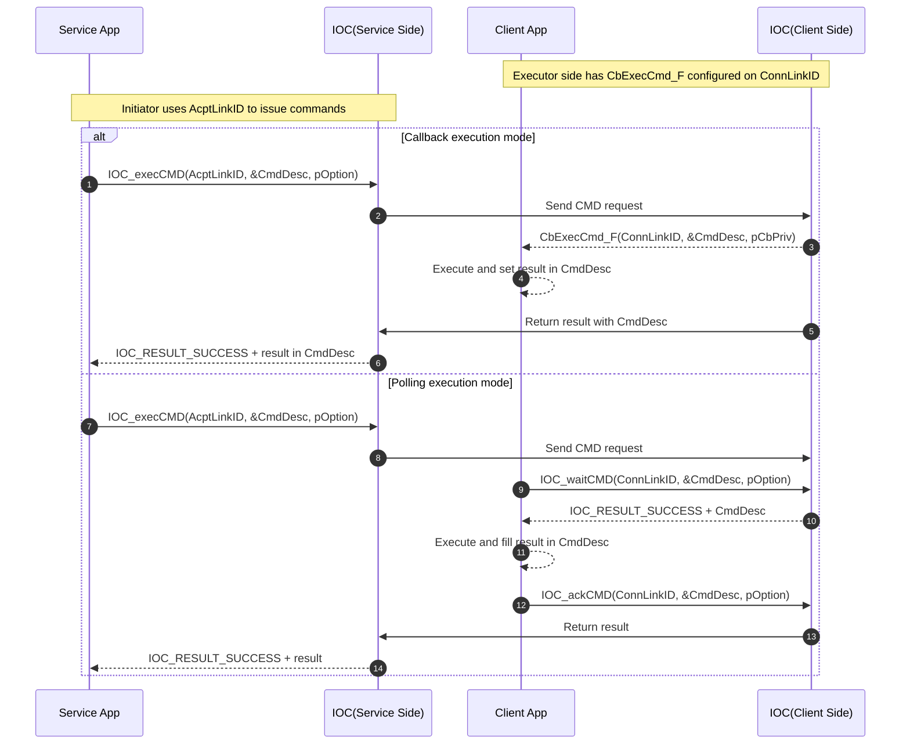

# IOC Usage Scenarios

> Notes
> - This document is scenario-oriented. It focuses on IOC usage semantics and interaction roles.
> - Sequence diagrams use current C APIs as semantic anchors, not as language constraints.
> - Equivalent wrappers/bindings in other languages are valid if they preserve the same IOC semantics.

- We can use `IOC` to establish a `Link` then both service and client can be one `Usage`, such as:
  - Link@Service-asDataSender <-> Link@Client-asDataReceiver
  - Link@Service-asDataReceiver <-> Link@Client-asDataSender
  - Link@Service-asEventProducer <-> Link@Client-asEventConsumer
  - Link@Service-asEventConsumer <-> Link@Client-asEventProducer
  - Link@Service-asCommandExecutor <-> Link@Client-asCommandInitiator
  - Link@Service-asCommandInitiator <-> Link@Client-asCommandExecutor

## Established Link

**Acceptance Criteria:**
- Given: Service App calls IOC_onlineService() with valid SrvID
- When: Client App calls IOC_connectService() with matching Usage
- Then: IOC establishes bidirectional LinkID pair (AcptLinkID <-> ConnLinkID)
- And: Both Service and Client can use their respective LinkID for messaging
- And: Service receives OnAutoAccepted_F callback (if configured) with AcptLinkID

## Data Send/Receive

### US-1: Service as DataReceiver, Client as DataSender

**Acceptance Criteria:**
- Given: Link established with Service.AcptLinkID and Client.ConnLinkID
- And: CbRecvDat_F callback configured on Service side
- When: Client calls IOC_sendDAT(ConnLinkID, &DatDesc) repeatedly
- Then: Service receives each DatDesc via CbRecvDat_F(AcptLinkID, &DatDesc)
- And: Order and completeness of data chunks guaranteed (NODROP + STREAM)
- And: Optional IOC_flushDAT() ensures buffered chunks delivered

Precondition: Link is already established as AcptLinkID <-> ConnLinkID.

### US-2: Service as DataSender, Client as DataReceiver

**Acceptance Criteria:**
- Given: Link established with Service.AcptLinkID and Client.ConnLinkID
- When: Service calls IOC_sendDAT(AcptLinkID, &DatDesc)
- Then: Client receives data either via:
  - Callback mode: CbRecvDat_F(ConnLinkID, &DatDesc), OR
  - Polling mode: IOC_recvDAT(ConnLinkID, &DatDesc) returns IOC_RESULT_SUCCESS
- And: All chunks delivered in order with no loss
- And: Service can flush with IOC_flushDAT(AcptLinkID) to force delivery

Precondition: Link is already established as AcptLinkID <-> ConnLinkID.

## Event Produce/Consume

### US-1: Service as EvtProducer, Client as EvtConsumer

**Acceptance Criteria:**
- Given: Link established with Service.AcptLinkID and Client.ConnLinkID
- When: Client subscribes via IOC_subEVT(ConnLinkID, &SubEvtArgs)
- And: Service posts event via IOC_postEVT(AcptLinkID, &EvtDesc)
- Then: Client receives event either via:
  - Callback mode: CbProcEvt_F(&EvtDesc) registered via subscription, OR
  - Polling mode: IOC_pullEVT(ConnLinkID, &EvtDesc) returns IOC_RESULT_SUCCESS
- And: May drop acceptable (ASYNC + MAYDROP semantics)
- And: Client can unsubscribe via IOC_unsubEVT() to stop receiving

Precondition: Link is already established as AcptLinkID <-> ConnLinkID.

### US-2: Service as EvtConsumer, Client as EvtProducer

**Acceptance Criteria:**
- Given: Link established with Service.AcptLinkID and Client.ConnLinkID
- When: Service subscribes via IOC_subEVT(AcptLinkID, &SubEvtArgs)
- And: Client posts event via IOC_postEVT(ConnLinkID, &EvtDesc)
- Then: Service receives event either via:
  - Callback mode: CbProcEvt_F(&EvtDesc) registered via subscription, OR
  - Polling mode: IOC_pullEVT(AcptLinkID, &EvtDesc) returns IOC_RESULT_SUCCESS
- And: Delivery may be dropped (fire-and-forget pattern)
- And: Service can unsubscribe via IOC_unsubEVT() to stop receiving

Precondition: Link is already established as AcptLinkID <-> ConnLinkID.

## Command Initiate/Execute

### US-1: Client as CmdInitiator, Service as CmdExecutor

**Acceptance Criteria:**
- Given: Link established with Service.AcptLinkID and Client.ConnLinkID
- And: CbExecCmd_F callback configured on Service side (callback mode)
- When: Client calls IOC_execCMD(ConnLinkID, &CmdDesc)
- Then: Service receives command via CbExecCmd_F(AcptLinkID, &CmdDesc)
- And: Service executes and sets result in CmdDesc
- And: Client always receives final result/status (SYNC + NODROP)
- And: Polling mode alternative: IOC_waitCMD() + IOC_ackCMD() for explicit control

Precondition: Link is already established as AcptLinkID <-> ConnLinkID.

### US-2: Service as CmdInitiator, Client as CmdExecutor

**Acceptance Criteria:**
- Given: Link established with Service.AcptLinkID and Client.ConnLinkID
- And: CbExecCmd_F callback configured on Client side (callback mode)
- When: Service calls IOC_execCMD(AcptLinkID, &CmdDesc)
- Then: Client receives command via CbExecCmd_F(ConnLinkID, &CmdDesc)
- And: Client executes and sets result in CmdDesc
- And: Service always receives final result/status (SYNC + NODROP)
- And: Polling mode alternative: IOC_waitCMD() + IOC_ackCMD() for explicit control

Precondition: Link is already established as AcptLinkID <-> ConnLinkID.

