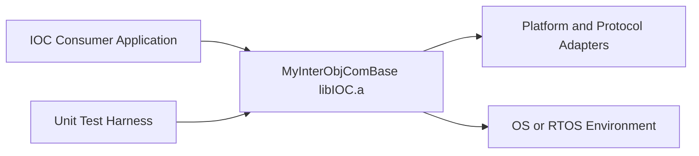
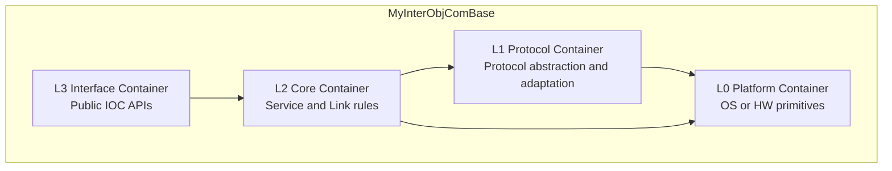
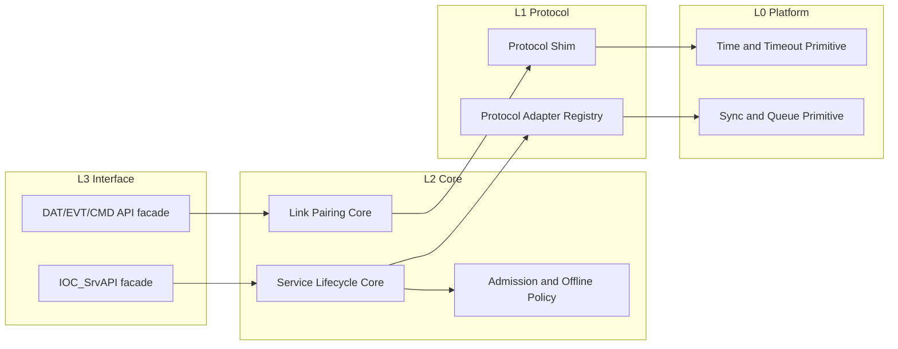
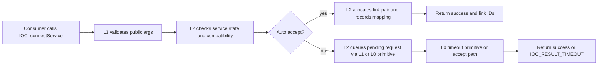
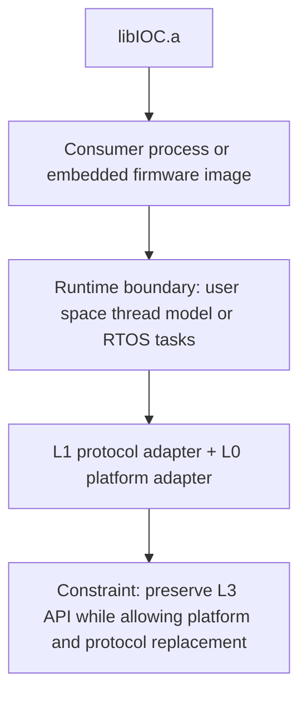
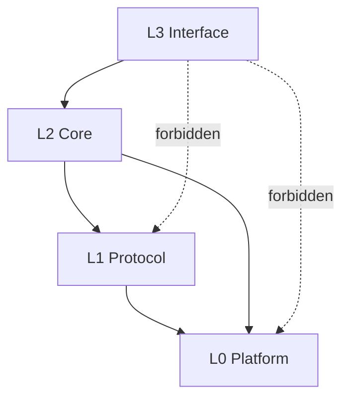

# MyInterObjComBase Architecture Design

This architecture baseline is produced by `SPEC_takeArchDesign` for the active architecture-changing story US-4.

## Context

- Story link: `.catdd/spec/doingUS/20260704-reArchDesign-LayeredArchitecture-UserStory.md`
- Related overview: [README.md](README.md)
- Related detail design: [README_DetailDesign.md](README_DetailDesign.md)
- Related state design: [README_StateDesign.md](README_StateDesign.md)

## Module Context

| Item | Description |
| --- | --- |
| Target module | `libIOC.a` |
| Module mission | Provide stable IOC interface and service/link semantics while isolating platform/protocol variability behind lower-layer adapters. |
| Public surface | `Include/IOC/*.h` headers, especially `IOC_SrvAPI.h`, `IOC_DatAPI.h`, `IOC_EvtAPI.h`, `IOC_CmdAPI.h`, and umbrella `IOC.h`. |
| Out-of-module responsibilities | OS/RTOS primitives, transport/device specifics, and environment-specific runtime wiring are not owned by L2/L3. |

## Consuming-System Context

| Consumer System | Interaction | Contract Boundary | Failure/Trust Boundary |
| --- | --- | --- | --- |
| IOC API Consumer (application/service) | Calls L3 API to online/connect/offline and exchange DAT/EVT/CMD payloads | C header/API contract in `Include/IOC/*.h` | Consumer must handle `IOC_Result_T`; IOC must not expose platform-specific types in L3. |
| Unit-Test Harness (GoogleTest) | Verifies lifecycle behavior and invariants through public/test hooks | Test boundary through public APIs and controlled test hooks | Test fault injection may force adapter failures but must not corrupt L3 contract. |
| Platform/Protocol Adapter Implementations | Provide L1/L0 capabilities used by L2 core | Adapter interface boundary (internal, non-public) | Adapter faults are translated into deterministic IOC result paths. |

## Architecture Goals

- Enforce dependency policy: `L3 -> L2` only at interface boundary, `L2 -> L1/L0` for core behavior, and `L1 -> L0` for protocol implementation details.
- Keep `Include/IOC/*.h` semantically stable while adding protocol/platform variants.
- Enable phased migration from current monolithic service API implementation to explicit layer ownership.
- Preserve US-1 validated behavior during every migration slice.

## Stakeholders and Concerns

| Stakeholder | Primary Concerns | Addressed By |
| --- | --- | --- |
| API Consumers | Stable IOC API and behavior compatibility | Context/Container/Component views, compatibility decisions |
| Maintainers/Developers | Clear ownership, low-coupling changes, migration safety | Layer ownership map, dependency rules, key decisions |
| Test/Quality Owners | Regression visibility and deterministic failure behavior | Runtime view, verification coverage mapping, risk controls |

## Px-SpecFlow Architecture-Oriented Coverage

| Surface | Handling | Follow-up Trigger |
| --- | --- | --- |
| `README_UsageDesign.md` | deferred | Create when public usage examples need architecture-specific API profile split by layer responsibilities. |
| `README_ErrorDesign.md` | deferred | Create when adapter fault taxonomy and recovery matrix expand beyond current `IOC_Result_T` paths. |
| `README_ResourceDesign.md` | deferred | Create when concurrency/resource ownership (US-2) requires explicit lock/memory/queue budgets. |
| `README_PerfDesign.md` | deferred | Create when latency/throughput budgets are added for DAT/EVT/CMD paths. |
| `README_CompatDesign.md` | covered | Compatibility direction is defined here: L3 interface remains stable while L1/L0 vary. |
| `README_DiagnosisDesign.md` | deferred | Create when production observability and diagnosis contract are introduced. |
| `README_VerifyDesign.md` | delegated | Existing verification strategy remains in `README_VerifyDesign.md`; extend after architecture review. |
| `README_StateDesign.md` or ArchDesign state chapter | delegated | Current lifecycle state-machine details remain in `README_StateDesign.md`. |

## Architecture Views

### C4 Level 1: System Context View



### C4 Level 2: Container View



### C4 Level 3: Component View



### Runtime Execution View



### Deployment View



## Layer Ownership Mapping (Mandatory Table Artifact)

| Artifact | Assigned Layer | Responsibility | Notes |
| --- | --- | --- | --- |
| `Include/IOC/IOC.h` and public `Include/IOC/*.h` APIs | L3 Interface | Stable public contract to consumers | L3 must not include L0 platform primitives directly. |
| `Source/IOC_SrvAPI.c` (current baseline) | Transitional L3+L2 (to split) | Currently mixed facade and core behavior | Migration target: split facade (L3) from lifecycle/policy core (L2). |
| Planned protocol adapter seam (new files under `Source/Protocol/`) | L1 Protocol | Protocol-specific behavior behind core contract | Deferred creation in later steps. |
| Planned platform adapter seam (new files under `Source/Platform/`) | L0 Platform | Time, sync, queue, and OS abstraction primitives | Deferred creation in later steps. |

## Dependency Direction Rules

Allowed:

- `L3 -> L2`
- `L2 -> L1`
- `L2 -> L0` (POSIX/platform primitives are allowed for core runtime behavior)
- `L1 -> L0`

Forbidden:

- `L3 -> L1` and `L3 -> L0`
- Any upward dependency (for example `L0 -> L1/L2/L3`)

Protocol behavior constraint:

- When L2 triggers protocol behavior, it must call ProtoMethods on a ProtoObject; those corresponding ProtoMethods behavior definitions are backed by L0 implementations.
- L2 must not bypass ProtoObject ProtoMethods for protocol-specific behavior.

## Dependency Graph (Mandatory Diagram Artifact)



## Manual Dependency Guard Checklist (First Phase)

1. Verify every changed L3 file depends only on L2-owned headers and symbols.
2. Verify no L3 file references platform headers, OS APIs, or protocol-private symbols.
3. Verify L2 protocol behavior calls go through ProtoObject ProtoMethods only.
4. Verify L2 to L0 direct calls are limited to allowed core POSIX/platform primitives and do not bypass ProtoObject for protocol-specific behavior.
5. Verify new adapter changes are isolated to L1/L0 plus registration seams.
6. Verify US-1 baseline behavior is rerun after each migration slice.

## Scripted Dependency Guard Hardening (Second Phase)

- Add a repository script (planned) that scans include/call patterns against a layer-map manifest.
- Fail CI when forbidden edges are detected.
- Keep manual checklist as fallback during initial script calibration.

## Data Flow

```text
IOC API call (L3) -> lifecycle and policy core (L2) -> ProtoObject ProtoMethods invocation (L2->L1 contract) -> behavior execution backed by L0 primitives (POSIX/platform) -> result and state transition reported back to L3.
```

## Quality Attribute Scenarios (ASRs)

| ID | Source | Stimulus | Environment | Response | Response Measure |
| --- | --- | --- | --- | --- | --- |
| QAS-1 Modifiability | Maintainer | Add a new protocol variant | Existing US-1 behavior baseline is passing | Implement changes primarily in L1/L0 seams | No public L3 header signature change required for the variant. |
| QAS-2 Reliability | Runtime fault from platform/protocol | Adapter operation fails during connect/offline path | Service may be online or offlining | L2 translates fault to deterministic IOC result and preserves invariants | No half-initialized link pair remains after fault path. |
| QAS-3 Testability | QA requests regression after migration slice | US-1 suite is executed in CI/local CTest | Ongoing phased refactor | Architecture supports deterministic verification boundary | All US-1 test targets remain PASS for each slice before next slice begins. |

## Key Decisions

| Decision | Rationale | Alternatives Considered | Status |
| --- | --- | --- | --- |
| Use explicit 4-layer architecture with controlled dual access `L3->L2`, `L2->L1/L0`, `L1->L0` | Preserves strict API layering while allowing L2 runtime use of POSIX and enforcing protocol calls through ProtoObject ProtoMethods | Keep strict adjacency-only layering; keep monolithic `Source/IOC_SrvAPI.c` | Accepted for US-4 baseline |
| Require both ownership table and dependency diagram as architecture evidence | Table gives auditability; diagram gives fast topology review and drift detection | Diagram-only or table-only evidence | Accepted for US-4 baseline |
| Start with manual dependency guard and then harden with scripted scan | Manual checklist unblocks immediate migration while scripted scan matures | Script-first (higher setup cost now), manual-only (lower long-term rigor) | Accepted for phased rollout |

## Sensitivity and Tradeoff Points

Sensitivity points:

- Placement of timeout and queue semantics is sensitive between L2 policy and L0 primitive boundaries.
- Layer ownership of `Source/IOC_SrvAPI.c` split is sensitive for both compatibility and migration risk.

Tradeoff points:

- Stronger isolation (more seams) improves modifiability but can increase indirection and short-term complexity.
- Scripted dependency enforcement improves consistency but increases initial tooling and maintenance effort.

## Inter-View Consistency Log

- Context vs Functional: all external actors in context view map to interface or adapter interactions in component view.
- Functional vs Development: layer components map to concrete file ownership plan and migration targets.
- Concurrency vs Deployment: runtime API paths and timeout/sync primitives map to deployment runtime boundary assumptions.

## Embedded and Digital Media Architecture Points

Embedded software points:

- Hardware boundary: represented via L0 platform adapters; direct hardware dependencies are excluded from L2/L3.
- RTOS or task boundary: modeled as deployment/runtime boundary; exact task model deferred until `README_ResourceDesign.md`.
- DMA/cache/bus path: not explicitly designed in this story, but reserved for L0 ownership when introduced.
- Power/clock/watchdog: deferred; not required for current IOC service/link architecture baseline.

Digital video/audio points:

- Media pipeline: not applicable to current IOC US-4 architecture scope.
- Buffer topology: only generic request/queue ownership is addressed; media-specific queues are not in scope.
- Format boundary: not applicable in current scope.
- Sync boundary: only generic timeout behavior applies; A/V sync concerns are not in scope.

## Risks and Constraints

- Risk: mixed baseline file ownership (`Source/IOC_SrvAPI.c`) may cause accidental boundary leakage during split.
- Risk: deferred scripted guard can allow temporary rule violations if manual review is weak.
- Constraint: preserve existing `Include/IOC/*.h` semantics unless explicitly changed by a future story.
- Constraint: US-1 verified behavior is a hard regression gate for each migration slice.

## Architecture Feedback Checklist (SPEC_updateArchDesign)

- [x] Addressed: normalized architecture-goal dependency statement to match approved rule set (`L3->L2`, `L2->L1/L0`, `L1->L0`).
- [x] Addressed: kept ProtoObject ProtoMethods constraint explicit for L2 protocol behavior.
- [x] Addressed: retained dependency rules/checklist text aligned with POSIX-as-L0 decision.
- [ ] Deferred: scripted dependency scan implementation is still pending (manual checklist remains first guard).
- [ ] Open: file-level ownership split of `Source/IOC_SrvAPI.c` into explicit L3/L2 files is pending later design/implementation steps.

## Remaining Risks

- Transitional mixed ownership in `Source/IOC_SrvAPI.c` can still leak boundaries until physical split is completed.
- Manual review quality can vary before scripted dependency checks are landed.

## Next Recommended Command

- `SPEC_takeDetailDesign`

## Review Checklist

- Architecture decisions are traceable to US-4 and project constraints.
- Mermaid-renderable context/container/component/runtime/deployment views are present.
- Px-SpecFlow architecture-oriented surfaces are classified as covered/delegated/deferred.
- Layer ownership table and dependency diagram are both present by explicit team decision.
- Dependency direction rules and migration risks are explicit before detailed design.
